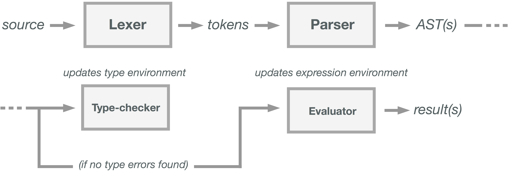

Translator architecture
-----------------------

**Ben Kogan**



Note that in the explanation below, the term "expression" is used to refer to both definitions and value-returning expressions in Apollo unless otherwise specified.

### Overview ###

The diagram shown above describes the process of interpreting a single source expression --- possibly containing nested expressions --- in Apollo.

In the repl interface, the process above is followed exactly since one top-level expression is evaluated per each input and the result, if any, is returned.

The process for source read from a file or through `stdin` is slightly different: an entire source program containing 0 or more expressions is read by the interpreter and proceeds through the lexing and parsing phases. This produces a sequence of ASTs representing expressions over which the `typecheck` function is mapped in order. After this stage, the `eval` function is mapped over the ASTs to produce a sequence of results for all top-level non-definition expressions.

These phases are described in detail below.

### Lexer ###

The lexer module Lex exports a single function, `scanTokens`, which accepts a source program as a string and produces a sequence of tokens from it of type Token. The lexer encodes the various syntactic tokens accepted by Apollo.

The Lex module is compiled by [`alex`][alex] into a generated Haskell module.

[alex]: https://www.haskell.org/alex/

### Parser ###

The parser module Parse exports a single function, `parse`, which accepts a string representing a source program and returns a sequence of expressions representing the ASTs for every top-level expression in the input. The `parse` function calls `scanTokens` to obtain a token stream and then parses the stream according to the Backus--Naur Form LR grammar specification in the Parse module.

The returned AST exists within the `ThrowsError` monad defined in the Error module. This monad is used for creating sequences of actions in the interpreter that have the potential to throw an exception. Throughout the rest of the interpreter pipeline, if an exception is throw, further actions are skipped and the error is handled monadically; otherwise, the actions proceed in order.

The AST itself is created using Haskell's algebraic datatype system. Instead of building an AST object (as might be done in an object-oriented language), the parser recursively constructs expressions of type Expr using the various type constructors it includes. The structure of Expr is show in {TODO see appendix}

The Parse module is compiled by [`happy`][happy] into a generated Haskell module.

[happy]: https://www.haskell.org/happy/

### Type-checker ###

The type-checker module Check exports a single function, `typecheck`, which accepts a type checking environment and a single expression representing an AST and returns the type of that AST. The type-checking environment is implemented as a table of id-to-type mappings with controlled mutability via the IORef monad. Because of this additional monad, the result of `typecheck` must be contained within a monad transformer, IOThrowsError, which combines error and IO moands. The details of this implementation can be viewed by looking at {TODO appendix ref}.

The type-checking function makes a recursive depth-first traversal of the given AST and begins evaluating type compatibility bottom-up. The operands of polymorphic operators like `+` are checked for compatibility and return the resultant type, literals like `Int` and `Bool` return their appropriate types, and so on. When definitions are encountered, the type of the right-hand-side is checked for compatibility with the declared type and then stored in the symbol table under the appropriate name. If a type mismatch is found, a type mismatch is triggered.

A special consideration was made for recursive functions such that they could obtain their own declared type. This was done by first adding the declared type to the type environment and then checking the actual type of the function.

The type-check phase does not alter the AST it is given nor does it communicate directly with the `eval` function that follows it. Instead, the original AST is passed to the next phase after type-checking. This can be seen in the line of code below, taken from the Check module:

```haskell
liftThrows (parse src) >>= \ast -> mapM_ (typecheck env) ast >> return ast
```

Source is parsed and then the resultant `ast` is passed on using the bind (`>>=`) operator. However, `typecheck` is used with a special case of the bind operator, `>>`, which ignores the returned value of the preceding action (but responds to monadic actions like termination of the action pipeline on error appropriately).

### Evaluator ###

The evaluator module Eval exports a single function, `eval`, that accepts an expression environment and a single expression representing an AST and returns the result of evaluating that AST. The expression environment uses the same implementation as the type environment and defined in the Env module. The result of `eval` is contained within the IOThrowsError monad.

The `eval` function makes a pass of the given AST in much the same form as done in the type-checker. Beginning at the bottom, subtrees are evaluated and their results are passed upward.

Again, recursive functions necessitated special consideration. In order to implement lexical scoping for functions when passed as parameters, the environment in which that function is originally defined must be passed with it as a closure. Thus, the representation of a function body (`VLam params body`) returns a new representation containing a closure (`Function params body closure`). However, the closure must include a binding for the function itself if recursion is to be possible. This is achieved by:

 1. evaluating the function body to populate the symbol table with all nested definitions,
 2. adding the name of the function to the environment,
 3. cloning that environment (creating a copy at a new memory reference),
 4. and then replacing the value for that function in the symbol table with one
    containing a reference to the cloned environment.

This can be seen in the following lines, taken from {TODO: appendix ref for this code}:

```haskell
Def name _ ex@(VLam p b) -> do
  _ <- eval env ex
  _ <- defineVar env name Empty
  env' <- clone env
  _ <- setVar env' name (Function p b env')
  return Empty  -- a definition does not return a result
```

The evaluator ignores the type fields of nodes in the AST except in cases where coercion must be preformed on definitions of Durations and Pitches.

### Listing of all modules and responsibilities ###

#### Check.hs

Static type-checking on an AST.

 - Ben: wrote initial type-checker, type-checking for functions, definitions,
   and operations on non-musical types.
 - Reza: added coersion and type-checking for atoms, head & tail operations.

#### Env.hs

An abstract implementation of name-to-value environments with controlled mutability.

 - Ben: wrote module.

#### Error.hs

A monad for representing and reporting errors in the Apollo language.

 - Ben: wrote module.

#### Eval.hs

Evaluation of an AST.

 - Ben: wrote initial evaluator, evaluation of functions and various non-musical
   operators.
 - Javier: added evaluation of typed lambdas.
 - Reza: evaluation for atoms, list operators, type-coersion for musical types.

#### Expr.hs

Representation of Apollo expressions as an algebraic datatype.

 - Javier: wrote initial implementation, added constructors for lambdas
 - Reza: added constructors for list operations
 - Ben: added constructors for functions with closures

#### Parse.hs

Parser.

 - Javier: wrote module.
 - Reza: added list operation parsing.

#### Lex.hs

Lexer.

 - Javier: wrote module.

#### Lib.hs

Standard library (prelude) for Apollo implemented in Apollo.

 - Prelude implemented by all teammates.

#### Main.hs

Functions for integrating and running Apollo source in an interpreted and repl environment.

 - Ben: wrote module.
 - Reza: added export of `main` to midi.
 - Souren: implemented handling of tempo pragma.

#### Midi.hs

Functions for converting and exporting Apollo results to midi.

 - Implemented by Souren and Reza.

#### Type.hs

Representation of Apollo's type-system as an algebraic datatype.

 - Ben: wrote module.

#### Util.hs

Utilities for type and data construction in Apollo expressions

 - Implemented by Javier and Reza.

#### Testing

 - Ben: wrote initial integration-test runner script.
 - Robert: expanded test runner to handle errors, special cases, proper
   reporting. Wrote comprehensive and detailed tests. Put up with Ben's esoteric
   opinions.
 - Souren: wrote comprehensive and detailed tests and fixed escaping errors in
   test script.
 - Various test cases added by all team members.

#### Overall

 - Javier: fixed all build warnings.
 - Ben: set up continuous integration, wrote Makefile and created documentation
   build process, set up Cabal build process and cofiguration.
   configuration, ordered lots of Roti Roll.


