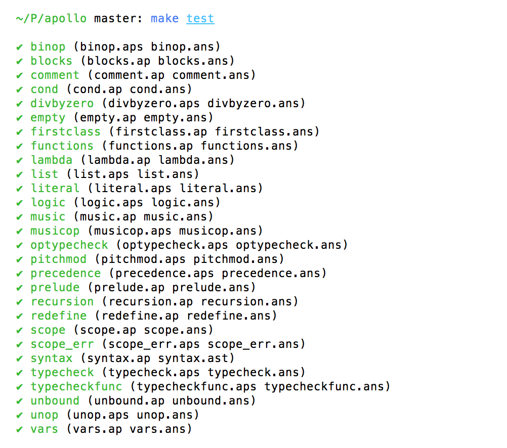

% Apollo Language Reference Manual
% **Team 8**
  **System Architect:** Benjamin Matthew Kogan (bmk2130)
  **Language & Tools Guru:** Javier Llaca (jl3960)
  **Project Manager:** Reza Nayebi (rn2324)
  **Tester & Validator:** Roberto Jose De Amorim (rja2139)
  **System Integrator:** Souren Sarkis Papazian (ssp2155)
% May 10, 2015

\pagebreak


Apollo Language Whitepaper
==========================

Team number 8. Contributors:

- **Tester & Validator:** Roberto Jose De Amorim (rja2139)
- **System Architect:** Benjamin Matthew Kogan (bmk2130)
- **Language & Tools Guru:** Javier Llaca (jl3960)
- **Project Manager:** Reza Nayebi (rn2324)
- **System Integrator:** Souren Sarkis Papazian (ssp2155)

Implementation language: Haskell.

Introduction
------------

Apollo is a functional programming language for algorithmic and musical composition. The language provides an interface to leverage functional paradigms in order to produce a target program that generates a musical output when run. Apollo is intended to be usable by a programmer with knowledge of basic functional constructs and no prior experience with music creation. The fine-details of synthesizing music are abstracted into a familiar typed-interface. Instead of direct note-manipulation, common programming types like integers are mapped to musical values when interpreted.

Rationale
---------

There are a number of extant music programming languages such as [RTcmix][] and [SuperCollider][]. Apollo shares with these languages an interest in providing an abstraction for music creation to the programmer. Apollo differs from these in the depth and the intent of its abstractions. Virtually all common music programming languages provide a direct interface to sonic manipulation on the level of notes and frequencies. This allows the programmer to *act* as a musician by writing code.

Apollo, in contrast, abstracts sonic details in favor of simplicity. The specifics of musical articulation are eschewed. In the place of deep --- but complex --- sonic articulation, the programmer should be able to interact with familiar data-values and combine them by assigning them to a `main` variable that will be translated into music. Apollo thus takes a more experimental approach where the programmer is able to *become* a musician through the act of programming.

[RTcmix]: http://rtcmix.org
[SuperCollider]: http://supercollider.sourceforge.net

Language features
-----------------

- Simple
- Abstract
- Statically-typed
- Functional
- Interpreted
- Easily usable by musicians and programmers alike with minimal learning curve
- Uses MIDI as a representation of music
- Single-threaded

Use case
--------

The algorithm for producing a number in the Fibonacci sequence given its index presents an interesting use case for Apollo. The algorithm is both simple and familiar; however, it yields interesting consequences when return values are translated to musical notes.


```
#tempo 160

fibonacci: (n: Int) -> Int =
    case (n <= 1) 1
    otherwise     fibonacci(n - 1) + fibonacci(n - 2)

fibSeq: (n: Int) -> [Int] = mapII(fibonacci, sequence(0, n))

mySeq: [Pitch] = mapII(\x: Int -> Int: x + 40, fibSeq(20))

notesA: [Pitch] = replicateP(mySeq, 20)

rhythm: [Duration] = uniform(\8, lengthP(notesA))

partA: [Atom] = zip(notesA, rhythm)

main: Music = [partA]
```

This example is very representative of the kind of programs that can be written in Apollo. First the global tempo is defined as `160` (BPM) using the global `#tempo`, which can only be defined once in a program. What follows is the implementation of the well-known `fib` function (returning the nth Fibonacci number) in Apollo. The function is simple but demonstrates the simplicity and readability of programs in Apollo. Next the function `fibSeq` is used to create a list by mapping the `fibonacci` function over `sequence(0,n)` (`[0,1,...,n-1]`) and stores the result as a list of pitches using the `mapII` function with a lambda expression to transpose these pitches by 20 semi-tones. Next a uniform rhythm of eigth notes is created using the `uniform` function. The list of pitches and our rhythm are zipped to form two lists of atoms (which are notes, chords or rests). Finally, `main` (a reserved word for a name that points to the music that is to be created) is defined as a list containing our notes. The result of executing the above code will be a MIDI file containing our music, namely the (transposed) first 20 numbers in the Fibonacci sequence, repeated 20 times.

We thus see the power provided by functional programming for music creation in Apollo. The ability to easily define functions to interact with musical types in an intuitive way makes Apollo easy to learn and understand. Despite its simplicity, Apollo can also produce a rich set of musical experiences and can therefore be used both by music-loving programmers and by musicians fascinated by the power of algorithms.

\pagebreak

Quick Start
===========

*Taken from the repository "readme.md" file.*

Getting the source
------------------

The source for Apollo is available as a Git repository on GitHub:

 * http://github.com/apollo-lang/apollo

Building
--------

Apollo requires [Haskell Platform][]. Once you have that installed, the
following series of commands will install all necessary dependencies and then
build and install the compiler:

~~~~~~~~~~~~~~~~~~~~~~~~~~~~~~~~~~~~~~~~~~~~~~~~~~~~~~~~~~~~~~~~~~~~~~~~~~~~~~
$ make config
$ cabal install happy alex
$ make install
~~~~~~~~~~~~~~~~~~~~~~~~~~~~~~~~~~~~~~~~~~~~~~~~~~~~~~~~~~~~~~~~~~~~~~~~~~~~~~

[haskell platform]: https://www.haskell.org/platform

Usage
-----

Use the `--help` flag to see all options.

\pagebreak

Apollo Language Tutorial
========================

Introduction
------------

Apollo is a functional programming language for algorithmic music composition. An Apollo source program produces as output a MIDI file, which is a standardized way to store a musical piece.

This document serves as a short tutorial for the language, showing the essential elements necessary to write and execute Apollo programs.

Hello world
-----------

*Compile and run your first program*

Let's look at a very basic program in Apollo, namely one that creates a MIDI file containing a single note.

~~~~~~~~~~~~~~~~~~~~~~~~~~~~~~~~~~~~~~~~~~~~~~~~~~~~~~~~~~~~~~~~~~~~~~~~~~~~~~
main: Music = [[(C5, \4 )]]
~~~~~~~~~~~~~~~~~~~~~~~~~~~~~~~~~~~~~~~~~~~~~~~~~~~~~~~~~~~~~~~~~~~~~~~~~~~~~~

Looking at this program a little more carefully, we see that it essentially initializes main, a special variable of type `Music` that contains what will eventually be written to our MIDI file. `Music` is in fact just a list of lists of `Atom`s. An `Atom`, in turn, is simply a note, a chord or a rest (here a single note `( C5, \4 )`), where the first element corresponds to the pitch C5 and the second one to the duration, here 1/4th of a beat. We could just use integers to initialize a note, but the macros presented here provide a more readable and intuitive notation. We will go more in detail about the different types available in Apollo in the following section.

You can put this source code in a file, say hello.ap. Assuming that you are in a UNIX environment, you would enter the following command:

~~~~~~~~~~~~~~~~~~~~~~~~~~~~~~~~~~~~~~~~~~~~~~~~~~~~~~~~~~~~~~~~~~~~~~~~~~~~~~
$ apollo hello.ap
~~~~~~~~~~~~~~~~~~~~~~~~~~~~~~~~~~~~~~~~~~~~~~~~~~~~~~~~~~~~~~~~~~~~~~~~~~~~~~

to get the file `main.mid`, the MIDI file containing your music. Now you can play this MIDI file, use it to control your MIDI-compatible instruments or anything else that crosses your mind!

Data types
----------

### Non-musical data types

There are three non-musical data types: `Int` and `Bool`, which are primitives, and `List`, which is derived.

 * `Int`: integer type, ranging from -2^29 to 2^29-1. For example:

~~~~~~~~~~~~~~~~~~~~~~~~~~~~~~~~~~~~~~~~~~~~~~~~~~~~~~~~~~~~~~~~~~~~~~~~~~
a: Int = 3
~~~~~~~~~~~~~~~~~~~~~~~~~~~~~~~~~~~~~~~~~~~~~~~~~~~~~~~~~~~~~~~~~~~~~~~~~~

 * `Bool`: boolean type, with value of either `True` or `False`. For example:

~~~~~~~~~~~~~~~~~~~~~~~~~~~~~~~~~~~~~~~~~~~~~~~~~~~~~~~~~~~~~~~~~~~~~~~~~~
b: Bool = False
~~~~~~~~~~~~~~~~~~~~~~~~~~~~~~~~~~~~~~~~~~~~~~~~~~~~~~~~~~~~~~~~~~~~~~~~~~

 * `List`: an ordered colleciton of elements of the same type. For example:

~~~~~~~~~~~~~~~~~~~~~~~~~~~~~~~~~~~~~~~~~~~~~~~~~~~~~~~~~~~~~~~~~~~~~~~~~~
a: [Int] = [1, 2, 3]
~~~~~~~~~~~~~~~~~~~~~~~~~~~~~~~~~~~~~~~~~~~~~~~~~~~~~~~~~~~~~~~~~~~~~~~~~~

### Musical data types

Apollo has a series of data types that are used to make music.

The most primitive types are `Pitch`es and `Duration`s.

A `Pitch` describes the frequency of a note. It can constructed using a pitch literal or an integer value.

Initializing a pitch with a pitch literal:

~~~~~~~~~~~~~~~~~~~~~~~~~~~~~~~~~~~~~~~~~~~~~~~~~~~~~~~~~~~~~~~~~~~~~~~~~~~~~~
sol: Pitch = G4   -- c in the fourth octave
mib: Pitch = Eb4  -- e flat in the fourth octave
~~~~~~~~~~~~~~~~~~~~~~~~~~~~~~~~~~~~~~~~~~~~~~~~~~~~~~~~~~~~~~~~~~~~~~~~~~~~~~

A pitch literal is: a single capitalized character indicating the note, followed by an optional `#` or `b` character indicating the accidental, followed by a number indicating the octave.

Alternatively, we can define the note using an integer that indicates its offset from the first (0th) note i.e. *c* in the zero octave (`` C0 ``):

~~~~~~~~~~~~~~~~~~~~~~~~~~~~~~~~~~~~~~~~~~~~~~~~~~~~~~~~~~~~~~~~~~~~~~~~~~~~~~
sol: Pitch = 55
mib: Pitch = 51
~~~~~~~~~~~~~~~~~~~~~~~~~~~~~~~~~~~~~~~~~~~~~~~~~~~~~~~~~~~~~~~~~~~~~~~~~~~~~~

\pagebreak

Here is a table of integer to pitch mapping:

|oct.| C   | C#/Db | D   | D#/Eb | E   | F   | F#/Gb | G   | G#/Ab | A   | A#/Bb | B   |
|----|-----|-------|-----|-------|-----|-----|-------|-----|-------|-----|-------|-----|
|**0** | 12  | 13    | 14  | 15    | 16  | 17  | 18    | 19  | 20    | 21  | 22    | 23  |
|**1** | 24  | 25    | 26  | 27    | 28  | 29  | 30    | 31  | 32    | 33  | 34    | 35  |
|**2** | 36  | 37    | 38  | 39    | 40  | 41  | 42    | 43  | 44    | 45  | 46    | 47  |
|**3** | 48  | 49    | 50  | 51    | 52  | 53  | 54    | 55  | 56    | 57  | 58    | 59  |
|**4** | 60  | 61    | 62  | 63    | 64  | 65  | 66    | 67  | 68    | 69  | 70    | 71  |
|**5** | 72  | 73    | 74  | 75    | 76  | 77  | 78    | 79  | 80    | 81  | 82    | 83  |
|**6** | 84  | 85    | 86  | 87    | 88  | 89  | 90    | 91  | 92    | 93  | 94    | 95  |
|**7** | 96  | 97    | 98  | 99    | 100 | 101 | 102   | 103 | 104   | 105 | 106   | 107 |
|**8** | 108 | 109   | 110 | 111   | 112 | 113 | 114   | 115 | 116   | 117 | 118   | 119 |
|**9** | 120 | 121   | 122 | 123   | 124 | 125 | 126   | 127 |       |     |       |     |

But a pitch can't be heard without a duration, so we need to define what a duration is. We will then combine the pitch and duration to construct a note.

A `Duration` quantifies the length of a note, chord or rest in time. It can be defined using a multiple of the smallest time division (1/64th of a beat) or a fraction of a whole note (defined in the context of a 4/4 time signature by default).

~~~~~~~~~~~~~~~~~~~~~~~~~~~~~~~~~~~~~~~~~~~~~~~~~~~~~~~~~~~~~~~~~~~~~~~~~~~~~~
short: Duration = \4  -- a quarter note (fraction notation)
long:  Duration = 64  -- a whole note   (multiple notation)
~~~~~~~~~~~~~~~~~~~~~~~~~~~~~~~~~~~~~~~~~~~~~~~~~~~~~~~~~~~~~~~~~~~~~~~~~~~~~~

Now we're ready to construct our first note!

An Atom is something that can be played. So let's put our note into an Atom. To do this we make a tuple consisting of a `Pitch` (or `Pitch`es or `_` indicating silence) and a `Duration`:

~~~~~~~~~~~~~~~~~~~~~~~~~~~~~~~~~~~~~~~~~~~~~~~~~~~~~~~~~~~~~~~~~~~~~~~~~~~~~~
n1: Atom = (sol, short)
n2: Atom = (mi, long)
~~~~~~~~~~~~~~~~~~~~~~~~~~~~~~~~~~~~~~~~~~~~~~~~~~~~~~~~~~~~~~~~~~~~~~~~~~~~~~

We could've alternatively done:

~~~~~~~~~~~~~~~~~~~~~~~~~~~~~~~~~~~~~~~~~~~~~~~~~~~~~~~~~~~~~~~~~~~~~~~~~~~~~~
n1: Atom = (G4, \4)
n2: Atom = (Eb4, 64)
~~~~~~~~~~~~~~~~~~~~~~~~~~~~~~~~~~~~~~~~~~~~~~~~~~~~~~~~~~~~~~~~~~~~~~~~~~~~~~

Or if we wanted to construct our pitch using an integer:

~~~~~~~~~~~~~~~~~~~~~~~~~~~~~~~~~~~~~~~~~~~~~~~~~~~~~~~~~~~~~~~~~~~~~~~~~~~~~~
n1: Atom = (55, \4)
n2: Atom = (51, 64)
~~~~~~~~~~~~~~~~~~~~~~~~~~~~~~~~~~~~~~~~~~~~~~~~~~~~~~~~~~~~~~~~~~~~~~~~~~~~~~

Let's make a MIDI out of our note!

~~~~~~~~~~~~~~~~~~~~~~~~~~~~~~~~~~~~~~~~~~~~~~~~~~~~~~~~~~~~~~~~~~~~~~~~~~~~~~
main: Music = [[n1]]
~~~~~~~~~~~~~~~~~~~~~~~~~~~~~~~~~~~~~~~~~~~~~~~~~~~~~~~~~~~~~~~~~~~~~~~~~~~~~~

We will explain what `Music` is soon. For now, let us talk about `Atom`s.

If we want to play both our notes simultaneously, we can construct a chord `Atom`. A chord `Atom` consists of a list of pitches and a single duration.

~~~~~~~~~~~~~~~~~~~~~~~~~~~~~~~~~~~~~~~~~~~~~~~~~~~~~~~~~~~~~~~~~~~~~~~~~~~~~~
c1: Atom = ([n1, n2], long)
~~~~~~~~~~~~~~~~~~~~~~~~~~~~~~~~~~~~~~~~~~~~~~~~~~~~~~~~~~~~~~~~~~~~~~~~~~~~~~

We can now play this chord:

~~~~~~~~~~~~~~~~~~~~~~~~~~~~~~~~~~~~~~~~~~~~~~~~~~~~~~~~~~~~~~~~~~~~~~~~~~~~~~
main: Music = [[c1]]
~~~~~~~~~~~~~~~~~~~~~~~~~~~~~~~~~~~~~~~~~~~~~~~~~~~~~~~~~~~~~~~~~~~~~~~~~~~~~~

You've probably realized by now that an `Atom` is either a note or a chord, but it can also be a rest.

~~~~~~~~~~~~~~~~~~~~~~~~~~~~~~~~~~~~~~~~~~~~~~~~~~~~~~~~~~~~~~~~~~~~~~~~~~~~~~
r1: Atom = (_, long)
~~~~~~~~~~~~~~~~~~~~~~~~~~~~~~~~~~~~~~~~~~~~~~~~~~~~~~~~~~~~~~~~~~~~~~~~~~~~~~

Now that we know how to make `Atoms`, we can put several `Atoms` in sequence to make a melody as a `[Atom]`.

~~~~~~~~~~~~~~~~~~~~~~~~~~~~~~~~~~~~~~~~~~~~~~~~~~~~~~~~~~~~~~~~~~~~~~~~~~~~~~~
p: [Atom] = [n1, n1, n1, n2]
~~~~~~~~~~~~~~~~~~~~~~~~~~~~~~~~~~~~~~~~~~~~~~~~~~~~~~~~~~~~~~~~~~~~~~~~~~~~~~~

And finally, we can use a list of `[Atom]`s to make `Music`!

~~~~~~~~~~~~~~~~~~~~~~~~~~~~~~~~~~~~~~~~~~~~~~~~~~~~~~~~~~~~~~~~~~~~~~~~~~~~~~~
sol: Pitch = G4              -- c in the fourth octave
mib: Pitch = Eb4             -- e flat in the fourth octave

short: Duration = \4          -- a quarter note
long: Duration = \1           -- a whole note

n1: Atom = (sol, short)
n2: Atom = (mib, long)

p1: [Atom] = [n1,n1,n1,n2]

main: Music = [p1]     -- Beethoven's Symphony No. 5
~~~~~~~~~~~~~~~~~~~~~~~~~~~~~~~~~~~~~~~~~~~~~~~~~~~~~~~~~~~~~~~~~~~~~~~~~~~~~~~

In the example above we only have one part, but if we had two parts in the list, they would be played simultaneously.

For example:

~~~~~~~~~~~~~~~~~~~~~~~~~~~~~~~~~~~~~~~~~~~~~~~~~~~~~~~~~~~~~~~~~~~~~~~~~~~~~~~
do: Pitch = C4
re: Pitch = D4
mi: Pitch = E4
fa: Pitch = F4
sol: Pitch = G4

n1: Atom = (do, \4)
n2: Atom = (re, \4)
n3: Atom = (mi, \4)

c1: Atom = ([do, mi, sol], 64)

p1: [Atom] = [n1, n2, n3]
p2: [Atom] = [c1]

main: Music = [p1, p2]
~~~~~~~~~~~~~~~~~~~~~~~~~~~~~~~~~~~~~~~~~~~~~~~~~~~~~~~~~~~~~~~~~~~~~~~~~~~~~~~

Conditionals
------------

Conditionals are expressed using case statements.

For example:

~~~~~~~~~~~~~~~~~~~~~~~~~~~~~~~~~~~~~~~~~~~~~~~~~~~~~~~~~~~~~~~~~~~~~~~~~~~~~~
i: Int = 0
j: Int = case(i == 0)
             1
         case(i == 1)
             i * 2
         otherwise
             2
~~~~~~~~~~~~~~~~~~~~~~~~~~~~~~~~~~~~~~~~~~~~~~~~~~~~~~~~~~~~~~~~~~~~~~~~~~~~~~

Here we illustrate another important principle in Apollo. A block has a value that is equal to the value of its last line. Therefore, this case statement returns `1` if `i` is `0`, `i*2` if `i` is `1` and `2` otherwise.

Functions
---------


Functions and values are declared using the same syntax. Functions, however, have different types --- they take one or more types and return another type. Like mathematical functions, they map elements in one or more sets to an element in another set. Let's define a function that takes an integer x and returns its square.

~~~~~~~~~~~~~~~~~~~~~~~~~~~~~~~~~~~~~~~~~~~~~~~~~~~~~~~~~~~~~~~~~~~~~~~~~~~~~~
square: (x: Int) -> Int = x * x
~~~~~~~~~~~~~~~~~~~~~~~~~~~~~~~~~~~~~~~~~~~~~~~~~~~~~~~~~~~~~~~~~~~~~~~~~~~~~~

A function consists of a declaration and definition. The declaration of square is

~~~~~~~~~~~~~~~~~~~~~~~~~~~~~~~~~~~~~~~~~~~~~~~~~~~~~~~~~~~~~~~~~~~~~~~~~~~~~~
square: (x: Int) -> Int
~~~~~~~~~~~~~~~~~~~~~~~~~~~~~~~~~~~~~~~~~~~~~~~~~~~~~~~~~~~~~~~~~~~~~~~~~~~~~~

which reads as "square is a function that takes an `Int` whose identifier is x and returns an `Int`".

The definition is whatever is to the right side of the assignment operator:

~~~~~~~~~~~~~~~~~~~~~~~~~~~~~~~~~~~~~~~~~~~~~~~~~~~~~~~~~~~~~~~~~~~~~~~~~~~~~~
x * x
~~~~~~~~~~~~~~~~~~~~~~~~~~~~~~~~~~~~~~~~~~~~~~~~~~~~~~~~~~~~~~~~~~~~~~~~~~~~~~

Note that declarations cannot exist on their own; they require a definition.

Functions in Apollo can be passed as parameters to other functions. Let's write a function that applies a function twice to an integer.

~~~~~~~~~~~~~~~~~~~~~~~~~~~~~~~~~~~~~~~~~~~~~~~~~~~~~~~~~~~~~~~~~~~~~~~~~~~~~~
twice: (f: (Int) -> Int, x: Int) -> Int = f(f(x))
~~~~~~~~~~~~~~~~~~~~~~~~~~~~~~~~~~~~~~~~~~~~~~~~~~~~~~~~~~~~~~~~~~~~~~~~~~~~~~

The twice function takes a function f and applies it twice to the argument `x`. Now we can use our two functions to declare a new function, `pow4`, which takes an integer `x` and returns `x^4`.

~~~~~~~~~~~~~~~~~~~~~~~~~~~~~~~~~~~~~~~~~~~~~~~~~~~~~~~~~~~~~~~~~~~~~~~~~~~~~~
pow4: (x: Int) -> Int = twice(square, x)
~~~~~~~~~~~~~~~~~~~~~~~~~~~~~~~~~~~~~~~~~~~~~~~~~~~~~~~~~~~~~~~~~~~~~~~~~~~~~~

Functions can be recursive, that is, they can call themselves. Consider the following function for computing the factorial of an `Int` *n*:

~~~~~~~~~~~~~~~~~~~~~~~~~~~~~~~~~~~~~~~~~~~~~~~~~~~~~~~~~~~~~~~~~~~~~~~~~~~~~~
factorial: (n: Int) -> Int =
    case (n == 0) 1 otherwise n * factorial(n - 1)
~~~~~~~~~~~~~~~~~~~~~~~~~~~~~~~~~~~~~~~~~~~~~~~~~~~~~~~~~~~~~~~~~~~~~~~~~~~~~~

As in all recursive functions, we need a base case to prevent infinite recursive calls. For this we use conditional statements. The function is reads as "the factorial of `n` is `1` if `n` is `0`, otherwise it is `n` times the factorial of `n - 1`."

Lists
-----

Lists are the essential data structure in Apollo. They provide an easy way to manipulate pitches, notes, chords and rhythms, making composition in Apollo very straightforward for the programmer. Apollo provides useful functions such as map, reduce, and zip that make manipulating lists easy.

For example:

~~~~~~~~~~~~~~~~~~~~~~~~~~~~~~~~~~~~~~~~~~~~~~~~~~~~~~~~~~~~~~~~~~~~~~~~~~~~~~
mult2: (x: Int) -> Int = x * 2
r: [Duration] = mapII(mult2, [16,32,32])
~~~~~~~~~~~~~~~~~~~~~~~~~~~~~~~~~~~~~~~~~~~~~~~~~~~~~~~~~~~~~~~~~~~~~~~~~~~~~~

In this example, the `mult2` function takes an integer and multiplies it by two. The mapII function (for map from `Int` to `Int`) then takes the `mult2` function and a list of integers and multiplies every integer by 2, effectively slowing down the rhythm by a half.

Compiling and running
---------------------

To compile a valid Apollo source code file (for example, main.ap), simply run the Apollo compiler with the path to the source file as its first command line argument:

~~~
$ apollo main.ap
~~~

*Note that the above assumed that the `apollo` executable is in the user's `$PATH` environment variable*

This will begin the Apollo interpreter, thereby converting Apollo source code into MIDI. If the program is free of runtime errors, terminates in a finite amount of time, and assigns `Music` to the variable `main` then a MIDI will be created. By default, this file will be named main.mid. The output file can then be played through any MIDI player.

To input source code into the Apollo compiler via stdin, use `-` as the only argument:

~~~
$ echo "main: Music = [[ (C5, \4 ) ]]" | apollo -
~~~

To specify a different name or location for the output MIDI file, use the `-o` flag:

~~~
$ apollo main.ap -o symphony.mid
~~~

To get more information on Apollo's options, use the `--help` flag:

~~~
$ apollo --help
~~~


Using the REPL
--------------

One of the easiest ways to experiment with Apollo is by using the read-evaluate-print loop. Fire it up as follows:

~~~
$ apollo --repl
Apollo repl, version 0.0.0.0: https://github.com/apollo-lang/apollo

Commands:
  :browse            See all current bindings and their types
  :export <name>     Export a name of type Music to `_repl.mid`
  :quit              Exit the repl

apollo>
~~~

At the `apollo>` prompt, you can enter an expression and it will be evaluated immediately:

~~~
apollo> 1 + 1
2
~~~

You can also define names and use functions from the prelude:

~~~
apollo> myList: [Int] = sequence(0,10)
apollo> mapII(\x: Int -> Int: x * x, myList)
[0,1,4,9,16,25,36,49,64,81]
~~~

To see a list of all bound names and their types, including the prelude, use the `:browse` command:

~~~
apollo> :browse
concatMapI : ([Int], (Int) -> Int, Int) -> [Int]
intercalateP : ([Pitch], [Pitch]) -> [Pitch]
intercalateI : ([Int], [Int]) -> [Int]
reverseP : ([Pitch]) -> [Pitch]
reverseI : ([Int]) -> [Int]
initP : ([Pitch]) -> [Pitch]
initI : ([Int]) -> [Int]
lastP : ([Pitch]) -> Pitch
lastI : ([Int]) -> Int
uniform : (Duration, Int) -> [Duration]
replicateP : ([Pitch], Int) -> [Pitch]
replicateI : ([Int], Int) -> [Int]
zip : ([Pitch], [Duration]) -> [Atom]
sequence : (Int, Int) -> [Int]
sumI : ([Int]) -> Int
foldrII : ((Int, Int) -> Int, Int, [Int]) -> Int
filterI : ((Int) -> Bool, [Int]) -> [Int]
concatP : ([Pitch], [Pitch]) -> [Pitch]
concatI : ([Int], [Int]) -> [Int]
lengthP : ([Pitch]) -> Int
lengthB : ([Bool]) -> Int
lengthI : ([Int]) -> Int
mapIB : ((Int) -> Bool, [Int]) -> [Bool]
mapID : ((Int) -> Duration, [Int]) -> [Duration]
mapIP : ((Int) -> Pitch, [Int]) -> [Pitch]
mapII : ((Int) -> Int, [Int]) -> [Int]
~~~

The export command allows you to export the contents of a Music-typed name to a file named "\_repl.mid":

~~~
apollo> myMusic: Music = [[ (A4, \4) ]]
apollo> :export myMusic
Music in `myMusic` exported to _repl.mid
~~~

The `:quit` command exits the repl.

\pagebreak

Apollo Language Reference Manual
================================

Introduction
------------

Apollo is a functional programming language for algorithmic music composition.
It is intended to be usable by a programmer with knowledge of basic functional
constructs and no prior experience with music creation. The fine-details of
synthesizing music are abstracted such that familiar programming types like
integers can be interpreted by the compiler as musical sequences. At the same
time, more experienced musicians can directly manipulate note and chord types
while leveraging Apollo's programming constructs to create novel compositions.
In effect, Apollo empowers the programmer to hear the sound of algorithms and
the musician to compose in code.  An Apollo source program produces as output a
MIDI file, which is a standardized way to store a musical piece.

### Origin of the Name and Logo

Apollo combines the power of source code, or Apollonian logic, with the art of
music, the domain of the god Apollo. The logo is derived from a combination of
the f in functional and the f-hole opening in the body of a cello.

Paradigm
--------

Apollo is a purely functional programming language, and thus incorporates the
following patterns.

### First-class functions

Functions are first-class citizens in Apollo. This means that functions, among
other things, can be passed as function parameters.

### Immutable data

Apollo does not have variables. In other words, once an identifier is bound to
a type and a value, this cannot be changed. As a result, Apollo programs are
easy to reason about and their outputs are deterministic.

Lexical elements
----------------

Apollo has five types of tokens: keywords, identifiers, constants, operators
and separators.

All language constructs are written in camel-case; user-defined names should
also follow this naming convention.

### Keywords

Keywords are reserved for the language and cannot be used as identifiers.

The list of keywords is:

 * `case`
 * `otherwise`
 * `where`
 * `Int`
 * `Bool`
 * `Pitch`
 * `Duration`
 * `Atom`
 * `Music`

### Identifiers

Identifiers are for naming variables and functions. An identifier is any
lowercase letter followed by any sequence of letters and digits that is not a
keyword.

### Constants

There are two types of constants: integer constants and boolean constants.

### Integer Constant

Any signed sequence of digits that is in the range of `Int` (see the section on
Data Types).

### Boolean Constant

Either `True` or `False`.

### Operators

Symbols that indicate operations, for example addition, multiplication, etc.

See Section 4 for more information on operators.

### Separators

Symbols that separate tokens:

 * `=`
 * `->`
 * `:`
 * `,`
 * `(`
 * `)`
 * `[`
 * `]`
 * `{`
 * `}`
 * `_`

Whitespace is ignored --- and hence is not considered a token --- but serves as
a token separator.

### Comments

 * `--` introuces a comment that terminates with the newline character.
 * `{-` introduces a mutli-line comment.
 * `-}` terminates a multi-line comment.

### Character Set

Apollo officially supports the ASCII character set. Because Haskell supports
UTF-8, non-ASCII characters may be usable in Apollo programs; however, their
behavior is undefined.

Data types
----------

All data types are named beginning with a capital letter, as to distinguish
them from identifiers.

### Primitive Data Types

 * `Int`: 29 bit signed integer (corresponding to Haskell's `Int` type).
 * `Bool`: boolean value; either `True` or `False`.
 * `Pitch`: integer ranging from 0 to 127, interpreted as a musical
   pitch, or the height of a note on a musical staff. `Pitch` values are
   constructed $mod 128$.
 * `Duration`: non-negative integer indicating a multiple of the smallest
   possible duration (a 64th note, or a 64th of a beat in 4/4 time). Negative
   `Duration` values are constructed as `0`.

Note that, although `Pitch` and `Duration` represent integers, they are not
equivalent to `Int`. In other words, they cannot be used interchangeably.
Type coercion is used in some instances to make the types uniform.

### Short-hand Notation for `Pitch` and `Duration`

When not constructed with integers, `Pitch`es and `Duration`s can be
conveniently expressed in a short-hand notation inspired by musical
conventions.

#### Pitch

A single upper-case letter from A to G indicating the pitch, followed by an
optional `#` or `b` character indicating the accidental (sharp or flat,
respectively), followed by a number from 0 to 9 indicating the octave.

For example:

~~~~~~~~~~~~~~~~~~~~~~~~~~~~~~~~~~~~~~~~~~~~~~~~~~~~~~~~~~~~~~~~~~~~~~~~~~~~~~
C4          -- C on the fourth octave.  Translates to 60
A#5         -- A# on the fifth octave. Translates to 82
~~~~~~~~~~~~~~~~~~~~~~~~~~~~~~~~~~~~~~~~~~~~~~~~~~~~~~~~~~~~~~~~~~~~~~~~~~~~~~

#### Pitch to Integer Table

The following table represents the mappings of pitches to integers, according
to the MIDI standard.

| octave| C   | C#/Db | D   | D#/Eb | E   | F   | F#/Gb | G   | G#/Ab | A   | A#/Bb | B   |
|-------|-----|-------|-----|-------|-----|-----|-------|-----|-------|-----|-------|-----|
| **0** | 12  | 13    | 14  | 15    | 16  | 17  | 18    | 19  | 20    | 21  | 22    | 23  |
| **1** | 24  | 25    | 26  | 27    | 28  | 29  | 30    | 31  | 32    | 33  | 34    | 35  |
| **2** | 36  | 37    | 38  | 39    | 40  | 41  | 42    | 43  | 44    | 45  | 46    | 47  |
| **3** | 48  | 49    | 50  | 51    | 52  | 53  | 54    | 55  | 56    | 57  | 58    | 59  |
| **4** | 60  | 61    | 62  | 63    | 64  | 65  | 66    | 67  | 68    | 69  | 70    | 71  |
| **5** | 72  | 73    | 74  | 75    | 76  | 77  | 78    | 79  | 80    | 81  | 82    | 83  |
| **6** | 84  | 85    | 86  | 87    | 88  | 89  | 90    | 91  | 92    | 93  | 94    | 95  |
| **7** | 96  | 97    | 98  | 99    | 100 | 101 | 102   | 103 | 104   | 105 | 106   | 107 |
| **8** | 108 | 109   | 110 | 111   | 112 | 113 | 114   | 115 | 116   | 117 | 118   | 119 |
| **9** | 120 | 121   | 122 | 123   | 124 | 125 | 126   | 127 |       |     |       |     |

This notation is described by the regular expression

~~~~~~~~~~~~~~~~~~~~~~~~~~~~~~~~~~~~~~~~~~~~~~~~~~~~~~~~~~~~~~~~~~~~~~~~~~~~~~
[A-G](#|b)?[0-9]
~~~~~~~~~~~~~~~~~~~~~~~~~~~~~~~~~~~~~~~~~~~~~~~~~~~~~~~~~~~~~~~~~~~~~~~~~~~~~~

#### Duration

~~~~~~~~~~~~~~~~~~~~~~~~~~~~~~~~~~~~~~~~~~~~~~~~~~~~~~~~~~~~~~~~~~~~~~~~~~~~~~
d: Duration = 32    -- 32 64th notes
~~~~~~~~~~~~~~~~~~~~~~~~~~~~~~~~~~~~~~~~~~~~~~~~~~~~~~~~~~~~~~~~~~~~~~~~~~~~~~

`Duration` types can be initialized using a short-hand notation, which consists
of three components:

 * A backslash `\`
 * An integer from 1 to 64, denoting the denominator of duration fraction
 * An optional dot `.`, denoting dotted-rhythms

These are some examples:

~~~~~~~~~~~~~~~~~~~~~~~~~~~~~~~~~~~~~~~~~~~~~~~~~~~~~~~~~~~~~~~~~~~~~~~~~~~~~~
\1    -- Whole note.          Translates to 64
\2    -- Half note.           Translates to 32
\4    -- Quarter note.        Translates to 16
\8      -- Eigth note.          Translates to 8
\16     -- Sixteenth note.      Translates to 4
\32     -- Thirtysecond note.   Translates to 2
\64     -- Sixtyfourth note.    Translates to 1
~~~~~~~~~~~~~~~~~~~~~~~~~~~~~~~~~~~~~~~~~~~~~~~~~~~~~~~~~~~~~~~~~~~~~~~~~~~~~~

Using this notation, one can declare a Duration in the following way:

~~~~~~~~~~~~~~~~~~~~~~~~~~~~~~~~~~~~~~~~~~~~~~~~~~~~~~~~~~~~~~~~~~~~~~~~~~~~~~
d: Duration = \4
~~~~~~~~~~~~~~~~~~~~~~~~~~~~~~~~~~~~~~~~~~~~~~~~~~~~~~~~~~~~~~~~~~~~~~~~~~~~~~

This notation can be described by the regular expression

~~~~~~~~~~~~~~~~~~~~~~~~~~~~~~~~~~~~~~~~~~~~~~~~~~~~~~~~~~~~~~~~~~~~~~~~~~~~~~
\[0-9]+\.?
~~~~~~~~~~~~~~~~~~~~~~~~~~~~~~~~~~~~~~~~~~~~~~~~~~~~~~~~~~~~~~~~~~~~~~~~~~~~~~

Note that for `Duration` and `Pitch`, initialization to a number outside of the
allowed range will result in a compile-time error.

### Derived Types

Derived types are declared using a constructor function of the same name. The
one exception is lists, which are declared using brackets: `[...]`.

 * `List`: an ordered collection of elements of the same type. The type of the
   list's elements must be declared between brackets in the type-annotation.
   For example, a list of `Int`s:

~~~~~~~~~~~~~~~~~~~~~~~~~~~~~~~~~~~~~~~~~~~~~~~~~~~~~~~~~~~~~~~~~~~~~~~~~~
a: [Int] = [1, 2, 3]
~~~~~~~~~~~~~~~~~~~~~~~~~~~~~~~~~~~~~~~~~~~~~~~~~~~~~~~~~~~~~~~~~~~~~~~~~~

 * `Atom`: a pair representing a musical sound unit. `Atom` values can be
   constructed in three ways:
    1. `(Pitch, Duration)` represents a note
    2. `([Pitch], Duration)` represents a chord
    3. `(Nil, Duration)` represents a rest

    These are some examples:

~~~~~~~~~~~~~~~~~~~~~~~~~~~~~~~~~~~~~~~~~~~~~~~~~~~~~~~~~~~~~~~~~~~~~~~~~~
note: Atom = (A5, \8)               -- An A5 note (eighth note duration)
chord: Atom = ([A5, C#6, E6], \2)   -- An A major chord (half note duration)
rest: Atom = (_, \4)                -- A Rest (quarter note duration)
~~~~~~~~~~~~~~~~~~~~~~~~~~~~~~~~~~~~~~~~~~~~~~~~~~~~~~~~~~~~~~~~~~~~~~~~~~

 * `Music`: a list of lists of `Atom`s. Each list of `Atom`s in a `Music` value
   represents a musical part -- a melodic line or a chordal accompaniment, for
   instance.

~~~~~~~~~~~~~~~~~~~~~~~~~~~~~~~~~~~~~~~~~~~~~~~~~~~~~~~~~~~~~~~~~~~~~~~~~~
aMajor: Atom = ([A5, C#5, E5], \4)
bMinor: Atom = ([B5, D#5, F#5], \4)
eMajor: Atom = ([E5, G#5, B5], \4)

back: [Atom] = [aMajor, bMinor, eMajor]
lead: [Atom] = [(A5, \4), (F#5, \4), (E4, \4)]

song: Music = [lead, back]
~~~~~~~~~~~~~~~~~~~~~~~~~~~~~~~~~~~~~~~~~~~~~~~~~~~~~~~~~~~~~~~~~~~~~~~~~~

\pagebreak

Operators
---------

### Arithmetic Operators

Arithmetic operators are only defined for numeric primitive data types (i.e.,
`Int`, `Pitch`, and `Duration`). They are undefined for `Bool`.

The behavior of each operator is defined based on the type(s) to which it is
applied. The following table outlines the possible combinations of arithmetic
operations:

| Operand A | Operator  | Operand B | Result    |
|-----------|-----------|-----------|-----------|
| Int       | +         | Int       | Int       |
| Int       | +         | Pitch     | Pitch     |
| Pitch     | +         | Int       | Pitch     |
| Duration  | +         | Duration  | Duration  |
| Int       | -         | Int       | Int       |
| Pitch     | -         | Int       | Pitch     |
| Duration  | -         | Duration  | Duration  |
| Int       | *         | Int       | Int       |
| Int       | *         | Duration  | Duration  |
| Duration  | *         | Int       | Duration  |
| Int       | /         | Int       | Int       |
| Duration  | /         | Int       | Duration  |
| Int       | %         | Int       | Int       |

When an operator is applied to a type with which it is not compatible, a
compile-time error is triggered.

### Comparison Operators

These are only defined for expressions whose types are the same.

#### `a == b`

Evaluates to `True` if `a` is equal to `b`.

#### `a != b`

Evaluates to `True` if `a` is not equal to `b`.

#### `a < b`

Evaluates to `True` if `a` is less than `b`.

#### `a > b`

Evaluates to `True` if `a` is greater than `b`.

#### `a <= b`

Evaluates to `True` if `a` is less than or equal to `b`.

#### `a >= b`

Evaluates to `True` if `a` is greater than or equal to `b`.

### Boolean Operators

These are only defined for `Bool`s.

#### `!a`

Evaluates to `True` if `a` is `False`. Evaluates to `False` if `a` is `True`.

#### `a && b`

Evaluates to `True` if `a` and `b` are `True`. Evaluates to `False` otherwise.

#### `a || b`

Evaluates to `True` if either `a` or `b` are `False`. Evaluates to `False`
otherwise.

### Operators on Derived Data Types

### List Operators

#### `!list`

Evaluates to `True` if `list` is empty and to `False` otherwise.

#### `h@list`

Evaluates to the head, or first element, of `list`.

#### `t@list`

Evaluates to the tail, or the rest, of `list`. The tail of a list is the list
containing every element except the head.

#### `a :: list`

Evaluates to a new list created by prepending `a` to `list`. For example:

~~~~~~~~~~~~~~~~~~~~~~~~~~~~~~~~~~~~~~~~~~~~~~~~~~~~~~~~~~~~~~~~~~~~~~~~~~~~~~
1 :: [2,3,4]                -- Evaluates to [1,2,3,4]
~~~~~~~~~~~~~~~~~~~~~~~~~~~~~~~~~~~~~~~~~~~~~~~~~~~~~~~~~~~~~~~~~~~~~~~~~~~~~~

\pagebreak

### Operator Precedence and Associativity

| Operator | Description           | Precedence | Associativity | Type          |
|----------|-----------------------|------------|---------------|---------------|
| `-`      | unary minus           | 7          | right         | Unary         |
| `!`      | negation              | 7          | right         | Unary         |
| `h@a`    | list head             | 7          | right         | Unary         |
| `t@a`    | list tail             | 7          | right         | Unary         |
| `*`      | multiplication        | 6          | left          | Binary        |
| `/`      | division              | 6          | left          | Binary        |
| `%`      | modulo                | 6          | left          | Binary        |
| `+`      | addition              | 5          | left          | Binary        |
| `-`      | subtraction           | 5          | left          | Binary        |
| `::`     | cons                  | 4          | right         | Binary        |
| `==`     | equality              | 3          | left          | Binary        |
| `!=`     | not equality          | 3          | left          | Binary        |
| `<`      | less than             | 3          | left          | Binary        |
| `>`      | greater than          | 3          | left          | Binary        |
| `<=`     | less than or equal    | 3          | left          | Binary        |
| `>=`     | greater than or equal | 3          | left          | Binary        |
| `&&`     | logical AND           | 2          | left          | Binary        |
| `||`     | logical OR            | 1          | left          | Binary        |
| `=`      | definition            | 0          | N/A[^assn]    | Binary        |

[^assn]: nested-definition is not allowed, so associativity rules are not
applicable to the definition operator.

Definitions
-----------

Definitions bind an identifier to a type and a value. The syntax for
definitions is the following:

~~~~~~~~~~~~~~~~~~~~~~~~~~~~~~~~~~~~~~~~~~~~~~~~~~~~~~~~~~~~~~~~~~~~~~~~~~~~~~
<id>: <type> = <expression>
~~~~~~~~~~~~~~~~~~~~~~~~~~~~~~~~~~~~~~~~~~~~~~~~~~~~~~~~~~~~~~~~~~~~~~~~~~~~~~

If, for example, we want to define an `Int` *x* whose value is 4, we would
write the following line:

~~~~~~~~~~~~~~~~~~~~~~~~~~~~~~~~~~~~~~~~~~~~~~~~~~~~~~~~~~~~~~~~~~~~~~~~~~~~~~
x: Int = 4
~~~~~~~~~~~~~~~~~~~~~~~~~~~~~~~~~~~~~~~~~~~~~~~~~~~~~~~~~~~~~~~~~~~~~~~~~~~~~~

Definitions have no value, that is, they do not return anything. Therefore,
nested definitions are invalid:

~~~~~~~~~~~~~~~~~~~~~~~~~~~~~~~~~~~~~~~~~~~~~~~~~~~~~~~~~~~~~~~~~~~~~~~~~~~~~~
y: Int = (x: Int = 4)       -- invalid
~~~~~~~~~~~~~~~~~~~~~~~~~~~~~~~~~~~~~~~~~~~~~~~~~~~~~~~~~~~~~~~~~~~~~~~~~~~~~~

Because names are immutable in Apollo, any name must be defined in the same
line that it is declared. Declaring a name without a value is not allowed, and
so the following is invalid:

~~~~~~~~~~~~~~~~~~~~~~~~~~~~~~~~~~~~~~~~~~~~~~~~~~~~~~~~~~~~~~~~~~~~~~~~~~~~~~
y: Int                      -- invalid
~~~~~~~~~~~~~~~~~~~~~~~~~~~~~~~~~~~~~~~~~~~~~~~~~~~~~~~~~~~~~~~~~~~~~~~~~~~~~~

Type coercion
-------------

Type coercion allows us to conveniently go from `Int` to `Pitch` or `Duration`,
without the need for an explicit conversion function. Coercion works
differently for a naked list expression and for a definition. In the case of
naked expressions, any list containing either one or more `Pitch` elements and
`Int`s is converted to a `[Pitch]` list:

~~~~~~~~~~~~~~~~~~~~~~~~~~~~~~~~~~~~~~~~~~~~~~~~~~~~~~~~~~~~~~~~~~~~~~~~~~~~~~
[1,C4, 5]                   -- Evaluates to [(1),(60),(5)]
~~~~~~~~~~~~~~~~~~~~~~~~~~~~~~~~~~~~~~~~~~~~~~~~~~~~~~~~~~~~~~~~~~~~~~~~~~~~~~

The same holds for a list containing `Int` and `Duration` elements:

~~~~~~~~~~~~~~~~~~~~~~~~~~~~~~~~~~~~~~~~~~~~~~~~~~~~~~~~~~~~~~~~~~~~~~~~~~~~~~
[1,\4, 5]                   -- Evaluates to [(1),(60),(5)]
~~~~~~~~~~~~~~~~~~~~~~~~~~~~~~~~~~~~~~~~~~~~~~~~~~~~~~~~~~~~~~~~~~~~~~~~~~~~~~

For definitions however, the compiler looks at the type of the list that is
being defined. If it is a `[Pitch]` any `Int` in the list is converted to a
`Pitch`, e.g.:

~~~~~~~~~~~~~~~~~~~~~~~~~~~~~~~~~~~~~~~~~~~~~~~~~~~~~~~~~~~~~~~~~~~~~~~~~~~~~~
a: [Pitch]  = [1,2,3]       -- Defines a as [(1),(2),(3)] ([Pitch])
a: [Duration] = [1,2,3]     -- Defines a as [(1),(2),(3)] ([Duration])
~~~~~~~~~~~~~~~~~~~~~~~~~~~~~~~~~~~~~~~~~~~~~~~~~~~~~~~~~~~~~~~~~~~~~~~~~~~~~~

However, if we remove the additional context (i.e., the expected type), the
list interpreted as `[Int]`:

~~~~~~~~~~~~~~~~~~~~~~~~~~~~~~~~~~~~~~~~~~~~~~~~~~~~~~~~~~~~~~~~~~~~~~~~~~~~~~
[1,2,3]                     -- Evaluates to [1,2,3]
~~~~~~~~~~~~~~~~~~~~~~~~~~~~~~~~~~~~~~~~~~~~~~~~~~~~~~~~~~~~~~~~~~~~~~~~~~~~~~

Functions
---------

Functions are first-class in Apollo and are treated like values of any other
type.

They are defined as follows:

~~~~~~~~~~~~~~~~~~~~~~~~~~~~~~~~~~~~~~~~~~~~~~~~~~~~~~~~~~~~~~~~~~~~~~~~~~~~~~
add: (x: Int, y: Int) -> Int = x + y
~~~~~~~~~~~~~~~~~~~~~~~~~~~~~~~~~~~~~~~~~~~~~~~~~~~~~~~~~~~~~~~~~~~~~~~~~~~~~~

This defines a function `add` which takes an `Int` `x` and an `Int` `y` and
returns the sum of `x` and `y`.

### Types

Functions take one or more types and return another type. Like functions in
mathematics, they map elements in one or more sets to an element in another
set. Consider the following function that takes an integer x and returns its
square.

~~~~~~~~~~~~~~~~~~~~~~~~~~~~~~~~~~~~~~~~~~~~~~~~~~~~~~~~~~~~~~~~~~~~~~~~~~~~~~
square: (x: Int) -> Int = x * x
~~~~~~~~~~~~~~~~~~~~~~~~~~~~~~~~~~~~~~~~~~~~~~~~~~~~~~~~~~~~~~~~~~~~~~~~~~~~~~

We say the type of `square` is `(Int) -> Int`. It maps from the set of integers
to the set of integers.

### Recursion

Functions can be recursive, that is, they can call themselves. Consider the
following function for computing the factorial of an integer `n`:

~~~~~~~~~~~~~~~~~~~~~~~~~~~~~~~~~~~~~~~~~~~~~~~~~~~~~~~~~~~~~~~~~~~~~~~~~~~~~~
factorial: (n: Int) -> Int = case (n == 0) 1 otherwise n * factorial(n - 1)
~~~~~~~~~~~~~~~~~~~~~~~~~~~~~~~~~~~~~~~~~~~~~~~~~~~~~~~~~~~~~~~~~~~~~~~~~~~~~~

This is a declarative implementation of factorial. In other words, instead of
specifying how to compute, it specifies what should be computed. The functions
reads as "The factorial of 0 is 1, otherwise it is n times the factorial of n -
1."

Recursive functions can be used to simulate looping. Consider the following
function, which adds an `Int` `x` to an `Int` `n`:

~~~~~~~~~~~~~~~~~~~~~~~~~~~~~~~~~~~~~~~~~~~~~~~~~~~~~~~~~~~~~~~~~~~~~~~~~~~~~~
addX: (n: Int, x: Int) = case (x == 0) n
                         otherwise     addX(a + 1, x - 1)
~~~~~~~~~~~~~~~~~~~~~~~~~~~~~~~~~~~~~~~~~~~~~~~~~~~~~~~~~~~~~~~~~~~~~~~~~~~~~~

### Higher-Order Functions

Functions in Apollo can be passed as parameters to other functions. Example:

~~~~~~~~~~~~~~~~~~~~~~~~~~~~~~~~~~~~~~~~~~~~~~~~~~~~~~~~~~~~~~~~~~~~~~~~~~~~~~
twice: (f: (Int) -> Int, x: Int) -> Int = f(f(x))
~~~~~~~~~~~~~~~~~~~~~~~~~~~~~~~~~~~~~~~~~~~~~~~~~~~~~~~~~~~~~~~~~~~~~~~~~~~~~~

The twice function takes a function `f`, which takes an `Int` and returns an
`Int`, and applies it twice to the argument x. Note how the parameters to `f`
in `twice` are not named, only the types are included. In general, When
defining a function `f` that takes a function `g` as a parameter, the
parameters to `g` need not be named.

Now we can use our two functions to declare a new function, pow4, which takes
an integer x and returns x^4.

~~~~~~~~~~~~~~~~~~~~~~~~~~~~~~~~~~~~~~~~~~~~~~~~~~~~~~~~~~~~~~~~~~~~~~~~~~~~~~
pow4: (x: Int) -> Int = twice(square, x)
~~~~~~~~~~~~~~~~~~~~~~~~~~~~~~~~~~~~~~~~~~~~~~~~~~~~~~~~~~~~~~~~~~~~~~~~~~~~~~

### Anonymous Functions and Lambda Expressions

Apollo supports typed lambda expressions as anonymous functions. Consider the
following example:

~~~~~~~~~~~~~~~~~~~~~~~~~~~~~~~~~~~~~~~~~~~~~~~~~~~~~~~~~~~~~~~~~~~~~~~~~~~~~~
(\x: Int -> Int: x)(3)                     -- Evaluates to 3
~~~~~~~~~~~~~~~~~~~~~~~~~~~~~~~~~~~~~~~~~~~~~~~~~~~~~~~~~~~~~~~~~~~~~~~~~~~~~~

The lambda expression on the left maps an Int to itself. Calling it on 3,
evaluates, as expected, to 3.

Lambda expressions can be passed as arguments to other functions. Recall the
`twice` function, which takes a function `f` that maps an `Int` to an `Int` and
an `Int` `x` and applied `f` twice to `x`. Whereas before we implemented `pow4`
by calling `twice` on a `square` function, with lambda expressions, we can
avoid implementing `square` to achieve the same result:

~~~~~~~~~~~~~~~~~~~~~~~~~~~~~~~~~~~~~~~~~~~~~~~~~~~~~~~~~~~~~~~~~~~~~~~~~~~~~~
pow4: (x: Int) -> Int = twice(\x: Int -> Int: x * x, x)
~~~~~~~~~~~~~~~~~~~~~~~~~~~~~~~~~~~~~~~~~~~~~~~~~~~~~~~~~~~~~~~~~~~~~~~~~~~~~~

Lambda expressions can take multiple parameters. For example:

~~~~~~~~~~~~~~~~~~~~~~~~~~~~~~~~~~~~~~~~~~~~~~~~~~~~~~~~~~~~~~~~~~~~~~~~~~~~~~
(\x: Int, y: Int -> Int: x + y)(3, 4)       -- Evaluates to 7
~~~~~~~~~~~~~~~~~~~~~~~~~~~~~~~~~~~~~~~~~~~~~~~~~~~~~~~~~~~~~~~~~~~~~~~~~~~~~~

Expressions
-----------

Expressions are statements with a value. Because Apollo imposes functional
purity, a value expression can always be replaced with its value.

The following are examples of expressions in Apollo:

~~~~~~~~~~~~~~~~~~~~~~~~~~~~~~~~~~~~~~~~~~~~~~~~~~~~~~~~~~~~~~~~~~~~~~~~~~~~~~
3 + 4
x * x
y > 18
[1,2,3]
~~~~~~~~~~~~~~~~~~~~~~~~~~~~~~~~~~~~~~~~~~~~~~~~~~~~~~~~~~~~~~~~~~~~~~~~~~~~~~

### Blocks

A block is an expression delimited by curly braces. Using the `where` keyword,
blocks can be used to declare local-scope auxiliary values or functions. In
other words, blocks consist of an expression followed by a list of definitions.

The value of a block is the value of the expression it contains.

Consider the following two versions of a function that computes the surface
area of a cylinder:

#### One --- using a block:

~~~~~~~~~~~~~~~~~~~~~~~~~~~~~~~~~~~~~~~~~~~~~~~~~~~~~~~~~~~~~~~~~~~~~~~~~~~~~~
cylinderArea: (r: Int, h: Int) -> Int = {
    sideArea + 2 * baseArea
    where
        sideArea: Int = 2 * pi * r * h
        baseArea: Int = pi * r * r
}
~~~~~~~~~~~~~~~~~~~~~~~~~~~~~~~~~~~~~~~~~~~~~~~~~~~~~~~~~~~~~~~~~~~~~~~~~~~~~~

#### Two --- without a block:

~~~~~~~~~~~~~~~~~~~~~~~~~~~~~~~~~~~~~~~~~~~~~~~~~~~~~~~~~~~~~~~~~~~~~~~~~~~~~~
cylinderArea: (r: Int, h: Int) -> Int = (2 * pi * r * h) + 2 * (pi * r * r)
~~~~~~~~~~~~~~~~~~~~~~~~~~~~~~~~~~~~~~~~~~~~~~~~~~~~~~~~~~~~~~~~~~~~~~~~~~~~~~

Both versions produce the same result, but the first one is arguably more
readable and modular.

Consider the following implementation of factorial that uses a block to
define a tail-recursive auxiliary function:

~~~~~~~~~~~~~~~~~~~~~~~~~~~~~~~~~~~~~~~~~~~~~~~~~~~~~~~~~~~~~~~~~~~~~~~~~~~~~~
factorial: (n: Int) -> Int = {
    aux(n, 1)
    where
        aux: (n: Int, acc: Int) -> Int = {
            case (n == 0)   acc
            otherwise       aux(n - 1, acc * n)
        }
}
~~~~~~~~~~~~~~~~~~~~~~~~~~~~~~~~~~~~~~~~~~~~~~~~~~~~~~~~~~~~~~~~~~~~~~~~~~~~~~

Control flow
------------

A conditional expression is a series of one or more `case` statements, followed
by an `otherwise` statement. A case statement must be followed by a single
parenthesis-enclosed expression that must evaluate to a `Bool`. The first
`case` statement whose condition evaluates to `True` will be evaluated and the
value it returns will be the value for the entire conditional statement. If no
preceding case condition evaluates to `True`, the `otherwise` expression will
be evaluated. Note that this means if multiple case conditions evaluate to
`True`, only the first of these case expressions will be evaluated.

Consider the following example:

~~~~~~~~~~~~~~~~~~~~~~~~~~~~~~~~~~~~~~~~~~~~~~~~~~~~~~~~~~~~~~~~~~~~~~~~~~~~~~
foo: Int = case (1 > 2) 1
           case (False) 2
           case (True)  3
           case (True)  4
           otherwise    5
~~~~~~~~~~~~~~~~~~~~~~~~~~~~~~~~~~~~~~~~~~~~~~~~~~~~~~~~~~~~~~~~~~~~~~~~~~~~~~

Here `foo` is an integer whose value is determined by a case statement. The first
two case statements evaluate to `False` and their return value is ignored. The
third statement is the first one to evaluate to `True` and `foo` is therefore
bound to the value `3`.

Program structure
-----------------

A program in Apollo is consists of one or more valid statements. A statement in
Apollo is either an expression or a definition.

The lifetime of an Apollo program begins in the main value, which is of type
Music and is required for a program to compile. For example:

~~~~~~~~~~~~~~~~~~~~~~~~~~~~~~~~~~~~~~~~~~~~~~~~~~~~~~~~~~~~~~~~~~~~~~~~~~~~~~
main: Music = [[(A5, \4)]]
~~~~~~~~~~~~~~~~~~~~~~~~~~~~~~~~~~~~~~~~~~~~~~~~~~~~~~~~~~~~~~~~~~~~~~~~~~~~~~

This program will compile to a MIDI file containing a single note -- an A in the
fifth octave with a quarter-note duration.

### MIDI

Apollo outputs MIDI files that adhere to the standard MIDI protocol.

### Tempo

The default tempo for an Apollo MIDI output file is 120 beats per minute.
However, the user can specify any other value in the Apollo program by using a
`#tempo` mark followed by an integer value. For instance, we could modify the
previous program in the following way:

~~~~~~~~~~~~~~~~~~~~~~~~~~~~~~~~~~~~~~~~~~~~~~~~~~~~~~~~~~~~~~~~~~~~~~~~~~~~~~
#tempo 160

main: Music = [[(A5, \4)]]
~~~~~~~~~~~~~~~~~~~~~~~~~~~~~~~~~~~~~~~~~~~~~~~~~~~~~~~~~~~~~~~~~~~~~~~~~~~~~~

The new program will compile to file with a 160 beats per minute tempo.

### Meter

The default meter for an Apollo MIDI output file is 4 / 4. As of now, this
cannot be changed.

### Velocity (Volume)

The default value for the velocity, or volume, of notes in an Apollo MIDI
output file is 80, which, in musical terms, is roughly equivalent to mezzo
forte. As of now, this cannot be changed.

Scoping
-------

### Blocks

An execution block is a list of statements enclosed between the starting curly
brace `{` and the respective closing brace `}`. Blocks can be nested. Names
defined within a block have a scope limited to that block. Names defined in a
scope within which a given block is contained are accessible within that block
as long as that block does not redefine the same name. If the given block
redefines a name defined in a containing block, the former shadows the latter
(i.e. the former is unaffected by the later, but it is not accessible within
the block in which the later is accessible).

### Functions

Since a function is effectively a parameterized name assigned to a block, the
body of a function follows the rules of block scoping. This means that a
function defined within a function creates a new block inside the parent
function's block.

~~~~~~~~~~~~~~~~~~~~~~~~~~~~~~~~~~~~~~~~~~~~~~~~~~~~~~~~~~~~~~~~~~~~~~~~~~~~~~
f: (x: Int) -> Int = {
    g(x) + 3                        -- x refers to parameter of f
    where
        g: (x: Int) -> Int = x * x  -- x refers to parameter of g
}
~~~~~~~~~~~~~~~~~~~~~~~~~~~~~~~~~~~~~~~~~~~~~~~~~~~~~~~~~~~~~~~~~~~~~~~~~~~~~~

### Lambda Expressions

Scoping for lambda expressions in Apollo behaves according to the free and
bound variables of the expression. Consider the following example:

~~~~~~~~~~~~~~~~~~~~~~~~~~~~~~~~~~~~~~~~~~~~~~~~~~~~~~~~~~~~~~~~~~~~~~~~~~~~~~
\x: Int -> Int: x + y
~~~~~~~~~~~~~~~~~~~~~~~~~~~~~~~~~~~~~~~~~~~~~~~~~~~~~~~~~~~~~~~~~~~~~~~~~~~~~~

Since `x` is the argument of the expression, `x` is a bound variable. `y`, on
the other hand, is a free variable. In Apollo, `y` will be evaluated by
considering the nearest binding of a value to the name `y`, if there is any.
Consider the following program:

~~~~~~~~~~~~~~~~~~~~~~~~~~~~~~~~~~~~~~~~~~~~~~~~~~~~~~~~~~~~~~~~~~~~~~~~~~~~~~
y: Int = 3

(\x: Int -> Int: x * y)(4)              -- Evaluate to 12
~~~~~~~~~~~~~~~~~~~~~~~~~~~~~~~~~~~~~~~~~~~~~~~~~~~~~~~~~~~~~~~~~~~~~~~~~~~~~~

The last value to be bound to the name `y` is an `Int` with value 3. Therefore,
the lambda expression will use this value to evaluate `y`.

Standard library
----------------

The Apollo standard library, or prelude, contains functions that can be called
by the user in any program. These include canonical list functions like `map`,
`reduce`, `fold`, and `zip` that can be used to leverage the power of
functional programming for music composition.

Every time an Apollo program is run, the prelude is loaded into the runtime
environment.

\pagebreak

Project plan and organization
=============================

**Reza Nayebi**

Many of our initial meetings were dedicated to deciding what features to include in our language. In particular, we tried our best to make the language as simple and easy to use as possible. We wanted a musical language that does away with complicated and overly technical details to allow users to have fun and let their curiosity roam free. Our meetings in the month of February thus concentrated on coming up with data types and a syntax for our language that would answer these needs.

## Project management

### Planning

Our team met weekly, usually on Friday for two hours. The first meetings were dedicated to specifying requirements and tackling important design decisions. Later in the semester, we met more regularly to the different parts of the language. We used GitHub for the language white paper, tutorial and reference manual as well as other documents such as the stylesheet so they would be easily accessible to everyone during the development process. We set up an online Google chat so we could freely discuss problems, features left to implement and assign remaining tasks.


### Specification

We took a fairly long time to clarify what our language would look like. Having to write the reference manual and tutorial helped immensely as it forced us to come up with a consistent way to combine our many different ideas. The weeks following the submission of the reference manual allowed us to refine our vision and decide on the necessary changes to make. The language was ultimately made both simpler to use and provided with more powerful elements such as lambda expressions and type coercion. Thus, although the specification in the original reference manual was used as a guide throughout the development process, our concern was always convenience and ease of use of our language.


### Development

To be able to effectively work on a project of this scale, we used Git for distributed version control and set up a repository on GitHub. Each team member was assigned a feature to work on either at our team meetings, through our online chat or using GitHub. We also used GitHub to create issues, signaling either bugs in the language, features left to implement, documentation to be added or design questions. Each team member worked on his own branch. Once they were satisfied and after running the unit tests, they would create a pull request. In addition to the continuous integration testing suite that runs for every pull request, other team members would have to review the code and point out any problems with it.

### Testing

As said above, we used both local unit tests and continuous integration tests on GitHub with Travis CI. The former allowed us to verify that new features or fixes did not break the language and that everything worked as expected. A test would be added for every new feature in the language. Features to be implemented would be added in a special folder for future testing, allowing us to plan ahead and have a reference while implementing them. Travis CI was used for continuous integration and allowed us to detect any problem when trying to merge branches into master.

Style guide used in development
-------------------------------

When something isn't covered by this guide you should stay consistent with the
code in the other modules.[^fork]

[^fork]: Forked from https://github.com/tibbe/haskell-style-guide

### Line Length

Maximum line length is *90 characters*. Occasional exceptions are okay for
readability (see Error.hs) --- use your judgement.

### Indentation

Tabs are illegal. Use spaces for indenting. Indent your code blocks with *2
spaces*. Indent the `where` keyword two spaces from the parent block and write
bindings beginning on the next line in most cases, but exceptions can be made
for highly-nested sub-blocks. Some examples:

```haskell
sayHello :: IO ()
sayHello = do
  name <- getLine
  putStrLn $ greeting name
    where
      greeting name = "Hello, " ++ name ++ "!"

filter :: (a -> Bool) -> [a] -> [a]
filter _ []   = []
filter p (x:xs)
  | p x       = x : filter p xs
  | otherwise = filter p xs
```

### Blank Lines

One blank line between top-level definitions. No blank lines between type
signatures and function definitions. Add one blank line between
functions in a type class instance declaration, cases of a `case` statement, or
pattern-matched function cases if the functions bodies are large and. Use your
judgement.

### Whitespace

Surround binary operators with a single space on either side. Use
your better judgement for the insertion of spaces around arithmetic
operators but always be consistent about whitespace on either side of
a binary operator. Don't insert a space after a lambda.

### Data Declarations

Align the constructors in a data type definition. Example:

```haskell
data Tree a = Branch !a !(Tree a) !(Tree a)
            | Leaf
```

For long type names the following formatting is also acceptable:

```haskell
data HttpException
  = InvalidStatusCode Int
  | MissingContentHeader
```

Format records as follows:

```haskell
data Person = Person
  { firstName :: !String
  , lastName  :: !String
  , age       :: !Int
  } deriving (Eq, Show)
```

### List Declarations

Align the elements in the list. Example:

```haskell
exceptions =
  [ InvalidStatusCode
  , MissingContentHeader
  , InternalServerError
  ]
```

Optionally, you can skip the first newline. Use your judgement.

```haskell
directions = [ North
             , East
             , South
             , West
             ]
```

### Pragmas

Put pragmas in the first line of their source file.

### Hanging Lambdas

You may or may not indent the code following a "hanging" lambda. Use
your judgement. Some examples:

```haskell
bar :: IO ()
bar = forM_ [1, 2, 3] $ \n -> do
      putStrLn "Here comes a number!"
      print n

foo :: IO ()
foo = alloca 10 $ \a ->
      alloca 20 $ \b ->
      cFunction a b
```

### Export Lists

Format export lists as follows:

```haskell
module Data.Set (
  MyType(..)
, empty
, singleton
, member
) where
```

### If-then-else clauses

Generally, guards and pattern matches should be preferred over if-then-else
clauses, where possible. Short cases should usually be put on a single line
(when line length allows it).

Align `if`, `then`, `else`:

```haskell
foo = if ...
      then ...
      else ...

foo2 = bar $ \qux -> if predicate qux
                     then doSomethingSilly
                     else someOtherCode
```

### Case expressions

The alternatives in a case expression can be indented using either of
the two following styles:

```haskell
foobar = case something of
  Just j  -> foo
  Nothing -> bar
```

or as

```haskell
foobar = case something of
           Just j  -> foo
           Nothing -> bar
```

Align the `->` arrows when it helps readability.

### Imports

Imports should be grouped in the following order:

1. standard library imports
2. related third party imports
3. local application/library specific imports

Do not put a blank line between each group of imports.

Always use explicit import lists or `qualified` imports for standard and third
party libraries but not for local libraries. This makes the code more robust
against changes in these libraries. Exception: The Prelude.

### Comment punctuation

Write proper sentences; start with a capital letter and use proper
punctuation.

### Top-Level Definitions

Every top-level definitions should have a type-signature, but comments are not
strictly necessary. A brief comment may be added if deemed necessary:

```haskell
-- Create a copy of an IORef
clone :: MonadIO m => IORef a -> m (IORef a)
clone e = liftIO (readIORef e >>= newIORef)
```

### End-of-Line Comments

Separate end-of-line comments from the code using 2 spaces. Align
comments for data type definitions. Some examples:

```haskell
data Types = VInt   -- Integer value
           | VBool  -- Boolean value


foo :: Int -> Int
foo n = salt * 32 + 9
  where
    salt = 453645243 -- Magic hash salt.
```

### Naming

Use camel case (e.g. `functionName`) when naming functions and upper
camel case (e.g. `DataType`) when naming data types.

For readability reasons, don't capitalize all letters when using an
abbreviation. For example, write `HttpServer` instead of
`HTTPServer`. Exception: Two letter abbreviations, e.g. `IO`.

### Modules

Use singular when naming modules e.g. use `Data.Map` and
`Data.ByteString.Internal` instead of `Data.Maps` and
`Data.ByteString.Internals`.

### Misc

#### Point-free style ####

Avoid over-using point-free style. For example, this is hard to read:

```haskell
-- Bad:
f = (g .) . h
```

#### Warnings ####

Code should be compilable with `-Wall -Werror`. There should be no
warnings.

#### Errors ####

If a total function is not possible, it is often a good idea to add a final
case matching errors. Use the `error` function here (and only here), and add a
descriptive message prefixed with "Bug:":

```haskell
extractValue :: Either ApolloError a -> a
extractValue (Right val) = val
extractValue (Left _)    = error $ "Bug: extractValue called with Left"
```

\pagebreak

Timeline
--------


*Git commit history*

* February 25: Language white paper
* March 25: LRM and tutorial
* March 27: Compiler front-end working
* March 30: Basic evaluation and AST set up
* April 12: Back-end (MIDI generation) implemented, REPL working
* April 19: Continuous Integration testing with Travis
* April 26: Initial implementation of Type checking
* May 2: Able to generate MIDI from Apollo
* May 8: Type coercion implemented
* May 10: Final report

Roles and responsibilities
--------------------------

* Roberto Jose de Amorim --- Tester & Validator
* Benjamin Matthew Kogan --- System Architect
* Javier Llaca --- Language & Tools Guru
* Reza Nayebi --- Project Manager
* Souren Sarkis Papazian --- System Integrator

For a detailed breakdown of responsibilities see the corresponding section in Translation Architecture.

Project log
-----------

For a summary of the git log, please see Appendix C.

\pagebreak

# Language Design

**Javier Llaca**

## Language Evolution

Our purpose with Apollo was fairly well-defined at the onset of the project --
we wanted it to be a convenient tool for functionally composing music. Apollo
was to be very simple and minimal, having only a small number of features with
which the user could build more complex programs. We purposely delayed making
very specific decisions in order to allow ourselves sufficient space for
molding and refactoring the language at later stages.

### Syntax

We wanted Apollo to be statically typed, and this made us consider different
patterns for the syntax of the language. In the end, we found the syntax of
languages like Scala and Swift to strike a good balance between expressivity
and aesthetics.

Perhaps the syntactic feature that changed the most was the declaration of
derived data types. When writing the first version of the language reference
manual, we decided to use Java-like constructors for these. Throughout the
course of the semester, however, this syntax was heavily simplified into a form
which we found to be very expressive.

### Features

At the beginning of the semester, we considered building Apollo around a `play`
function, which would play a note or chord at any point in the program. This
involved making use of either a global mutable list or dealing with IO
extensively. It later became evident that doing either would contradict the
purpose of a purely functional language.

Our type system also underwent several transformations as we tried to get rid
of unnecessary layers of complexity. The `Atom` data type, for instance,
ended up encapsulating notes, chords, and rests altogether. We found this to be
a feature very elegantly tied to Apollo's broader purpose of making music
composition minimal and formal.

Towards the end of the project, we added more features (e.g., typed lambda
expressions, closures, unnamed higher-order functions, etc.). Core features of
the language like primitive data types and arithmetic operators remained
constant throughout.

## Compiler Tools and Components

We originally intended to develop Apollo as a compiled language that was translated
from Apollo to Haskell and then from Haskell to MIDI. As we drafted initial
versions of the front-end, we wanted a quick and convenient way to test our
results. We ended up writing a REPL (Read-Evaluate-Print-Loop) for Apollo. This
effectively removed the intermediate Apollo to Haskell translation removing
another layer of complexity. Keeping things simple was always one of our main
objectives.

Haskell, the implementation language, was the most crucial tool for building
Apollo. The constraints that Haskell imposes really forced us to think about
the design patterns we were using and made us refactor anything that would not
be highly modular and modifiable. Haskell modules, like HCodecs for working
with MIDI, were crucial for writing the backend of the compiler. Alex and
Happy, the Haskell equivalents of Lex and Yacc, were also very fun to use and
integrated beautifully with Haskell's elegant type system.

## Reference Manual and Compiler

We started working on the compiler front-end slightly before completing the first
draft of our reference manual. However, we tried not to adhere too closely to
the initial reference manual; we changed the language pretty liberally
throughout the course of the semester. This flexibility was great for crafting
Apollo into something that we liked. Granted, we had to heavily update the
reference manual after having a semi-final version of Apollo up and running.


\pagebreak

Translator architecture
=======================

**Ben Kogan**


*Apollo interpreter block architecture*

Note that in the explanation below, the term "expression" is used to refer to both definitions and value-returning expressions in Apollo unless otherwise specified.

## Overview ##

The diagram shown above describes the process of interpreting a single source expression --- possibly containing nested expressions --- in Apollo.

In the REPL interface, the process above is followed exactly. One top-level expression is evaluated per each input and the result, if any, is returned.

The process for reading source from a file or through `stdin` is slightly different. An entire source program containing zero or more expressions is read by the interpreter and proceeds through the lexing and parsing phases. This produces a sequence of ASTs representing expressions over which the `typecheck` function is mapped in order. After this stage, the `eval` function is mapped over the ASTs to produce a sequence of results for all top-level non-definition expressions.

These phases are described in detail below.

## Lexer ##

The lexer module Lex exports a single function, `scanTokens`, which accepts a source program as a string and produces a sequence of tokens from it of type Token. The lexer encodes the various syntactic tokens accepted by Apollo.

The Lex module is compiled by [`alex`][alex] into a generated Haskell module.

[alex]: https://www.haskell.org/alex/

## Parser ##

The parser module Parse exports a single function, `parse`, which accepts a string representing a source program and returns a sequence of expressions representing the ASTs for every top-level expression in the input. The `parse` function calls `scanTokens` to obtain a token stream and then parses the stream according to the Backus--Naur Form LR grammar specification in the Parse module.

The returned AST exists within the `ThrowsError` monad defined in the Error module. This monad is used for creating sequences of actions in the interpreter that have the potential to throw an exception. Throughout the rest of the interpreter pipeline, if an exception is throw, further actions are skipped and the error is handled monadically; otherwise, the actions proceed in order.

The AST itself is created using Haskell's algebraic datatype system. Instead of building an AST object (as might be done in an object-oriented language), the parser recursively constructs expressions of type Expr using the various type constructors it includes. The structure of Expr is show in "src/Expr.hs" in Appendix A.

The Parse module is compiled by [`happy`][happy] into a generated Haskell module.

[happy]: https://www.haskell.org/happy/

## Type-checker ##

The type-checker module Check exports a single function, `typecheck`, which accepts a type checking environment and a single expression representing an AST and returns the type of that AST. The type-checking environment is implemented as a table of id-to-type mappings with controlled mutability via the IORef monad. Because of this additional monad, the result of `typecheck` must be contained within a monad transformer, IOThrowsError, which combines error and IO moands. The details of this implementation can be viewed by looking at "src/Check.hs" in Appendix A.

The type-checking function makes a recursive depth-first traversal of the given AST and begins evaluating type compatibility bottom-up. For example, if the `+` operator is encountered, its operands are checked for compatibility and the appropriate type for the operation is returned. Literals like `Int` and `Bool` return their appropriate types, and so on. When definitions are encountered, the type of the right-hand-side is checked for compatibility with the declared type and then stored in the symbol table under the appropriate name. If a type mismatch is found, a type mismatch error is triggered.

A special consideration was made for recursive functions so they can obtain their own declared type. This was done by first adding the declared type to the type environment and then checking the actual type of the function. Checking the type before adding the declaration would fail since the function's type would not be found in the symbol table when its recursive call is typechecked.

The type-check phase does not alter the AST it is given nor does it communicate directly with the `eval` function that follows it. Instead, the original AST is passed to the next phase after type-checking. This can be seen in the line of code below, taken from the Check module:

```haskell
liftThrows (parse src) >>= \ast -> mapM_ (typecheck env) ast >> return ast
```

Source is parsed and then the resultant `ast` is passed on using the bind (`>>=`) operator. However, `typecheck` is used with a special case of the bind operator, `>>`, which ignores the returned value of the preceding action (but responds to monadic actions like termination of the action pipeline on error appropriately).

## Evaluator ##

The evaluator module Eval exports a single function, `eval`, that accepts an expression environment and a single expression representing an AST and returns the result of evaluating that AST. The expression environment uses the same implementation as the type environment and defined in the Env module. The result of `eval` is contained within the IOThrowsError monad.

The `eval` function makes a pass of the given AST in much the same form as done in the type-checker. Beginning at the bottom, subtrees are evaluated and their results are passed upward.

Again, recursive functions necessitated special consideration. In order to implement lexical scoping for functions when passed as parameters, the environment in which that function is originally defined must be passed with it as a closure. Thus, the representation of a function body (`VLam params body`) returns a new representation containing a closure (`Function params body closure`). However, the closure must include a binding for the function itself if recursion is to be possible. This is achieved by:

 1. evaluating the function body to populate the symbol table with all nested definitions,
 2. adding the name of the function to the environment,
 3. cloning that environment (creating a copy at a new memory reference),
 4. and then replacing the value for that function in the symbol table with one
    containing a reference to the cloned environment.

\pagebreak

This can be seen in the following lines, taken from "src/Eval.hs" in Appendix A.

```haskell
Def name _ ex@(VLam p b) -> do
  _ <- eval env ex
  _ <- defineVar env name Empty
  env' <- clone env
  _ <- setVar env' name (Function p b env')
  return Empty  -- a definition does not return a result
```

The evaluator ignores the type fields of nodes in the AST except in cases where coercion must be preformed on definitions of Durations and Pitches.

## Listing of all modules and responsibilities ##

### Check.hs

Static type-checking on an AST.

 - Ben: wrote initial type-checker, type-checking for functions, definitions,
   and operations on non-musical types.
 - Reza: added coercion and type-checking for atoms, head & tail operations.

### Env.hs

An abstract implementation of name-to-value environments with controlled mutability.

 - Ben: wrote module.

### Error.hs

A monad for representing and reporting errors in the Apollo language.

 - Ben: wrote module.

### Eval.hs

Evaluation of an AST.

 - Ben: wrote initial evaluator, evaluation of functions and various non-musical
   operators.
 - Javier: added evaluation of typed lambdas.
 - Reza: added evaluation for atoms, list operators, type-coercion for musical types.

### Expr.hs

Representation of Apollo expressions as an algebraic datatype.

 - Javier: wrote initial implementation, added constructors for lambdas.
 - Reza: added constructors for list operations.
 - Ben: added constructors for functions with closures.

### Parse.hs

Parser.

 - Javier: wrote module.
 - Reza: added list operation parsing.

### Lex.hs

Lexer.

 - Javier: wrote module.

### Lib.hs

Standard library (prelude) for Apollo implemented in Apollo.

 - Prelude implemented by all teammates.

### Main.hs

Functions for integrating and running Apollo source in an interpreted and REPL environment.

 - Ben: wrote module.
 - Reza: added export of `main` to midi.
 - Souren: implemented handling of tempo pragma.

### Midi.hs

Functions for converting and exporting Apollo results to midi.

 - Implemented by Souren and Reza.

### Type.hs

Representation of Apollo's type-system as an algebraic datatype.

 - Ben: wrote module.

### Util.hs

Utilities for type and data construction in Apollo expressions

 - Implemented by Javier and Reza.

### Testing

 - Ben: wrote initial integration-test runner script.
 - Robert: expanded test runner to handle errors, special cases, proper
   reporting. Wrote comprehensive and detailed tests. Put up with Ben's esoteric
   opinions.
 - Souren: wrote comprehensive and detailed tests and fixed escaping errors in
   test script.
 - Various test cases added by all team members.

### Overall

 - Javier: fixed all build warnings.
 - Ben: set up continuous integration, wrote Makefile, created documentation
   build-process, and set up Cabal build-process, configuration file, and
   sandboxing.

\pagebreak

Development and run-time environment
====================================

**Souren Papazian**

## Development environment

Apollo was developed in the Unix environment. [Git][] was used for version control, while [GitHub][] was used for repository hosting, management, and code review. [Travis Ci][] was used for continuous integration and monitored via its integration with GitHub.

The interpreter itself is written in Haskell and targeted to GHC 7.8.3. [Cabal][] is used to create a sandboxed environment for dependencies, install required packages, and build the interpreter executable.

[git]: http://git-scm.com
[github]: https://github.com
[travis ci]: https://travis-ci.org
[cabal]: https://www.haskell.org/cabal/


## Makefile commands

### `make config`

Installs all dependencies using the Cabal config. Cabal is a Haskell package-manager and build system. We used a Cabal sandbox to avoid any conflicts with existing Haskell packages and to install any missing or outdated packages. The sandbox essentially builds all packages in isolation much like Python's `virtualenv`. This makes compiling the source code on different systems much simpler not only for the user, but also for ourselves during development.

### `make`

Compiles the source code using `cabal build`. All the dependencies and their acceptable version ranges are stored in a file called "apollo.cabal." This also includes all the information needed to compile the Apollo interpreter such as dependencies, build tools, the compiler flags, and other metadata.

### `make test`

Runs the integration test-suite. This target depends on the executable. If called with an outdated build of `apollo` --- or is missing it entirely --- the executable will be compiled first.

### `make install`

This will copy the `apollo` executable into /usr/local/bin.

### `make uninstall`

This will remove the apollo executable from /usr/local/bin.

*Makefile:*

```make
EXE     := apollo
BUILD   := ./dist/build/$(EXE)
SOURCES := $(wildcard src/*)
PREFIX  ?= /usr/local


.PHONY: all
all: $(EXE)

.PHONY: config
config:
    cabal sandbox init
    cabal install --only-dependencies

.PHONY: install
install: $(EXE)
    cp $(BUILD)/$(EXE) $(PREFIX)/bin/$(EXE)

.PHONY: uninstall
uninstall:
    rm -f $(PREFIX)/bin/$(EXE)

.PHONY: test
test: $(EXE)
    @./tests/run.sh

$(EXE): $(SOURCES)
    cabal build
    ln -s -f $(BUILD)/$(EXE) ./$(EXE)

```


*apollo.cabal:*

```cabal
name:                apollo
version:             0.0.0.0
category:            Language
build-type:          Simple
extra-source-files:  README.md
cabal-version:       >=1.10
homepage:            https://github.com/apollo-lang/apollo
license:             MIT
license-file:        LICENSE

synopsis:            A programming language for algorithmic and musical composition.

author:              Ben Kogan
                   , Javier Llaca
                   , Reza Nayebi
                   , Roberto Jose De Amorim
                   , Souren Papazian

executable apollo
  main-is:             Main.hs

  other-modules:       Check
                     , Env
                     , Error
                     , Eval
                     , Expr
                     , Lex
                     , Parse
                     , Util
                     , Midi
                     , Type

  build-depends:       base           >=4.6  && <4.8
                     , regex-posix    >=0.95 && <0.96
                     , mtl            >=2.1  && <2.2
                     , array          >=0.5  && <0.6
                     , transformers   >=0.3  && <0.4
                     , containers     >=0.5  && <0.6
                     , HCodecs        >=0.5  && <0.6

  other-extensions:    CPP
  hs-source-dirs:      src
  build-tools:         alex          >= 3.1  && <3.2
                     , happy         >= 1.19 && <1.20
  default-language:    Haskell2010
  ghc-options:         -Wall

```

Once all the source code is in place, these commands should compile `apollo` and run the test suite.

```
$ make config
$ cabal install happy alex
$ make test
```

If there are any global packages already installed on the user's machine, cabal will not reinstall them.

If you run into the following error message when you run `make config`:

```
cabal: The following packages are likely to be broken by
the reinstalls: <packages omitted>
```

you may have globally-installed packages that conflict with Apollo's dependencies. Unregister the indicated global packages with the following command:

```
ghc-pkg unregister --global <package_name>
```

## Runtime environment

The `apollo` executable provides several options:

```
$ apollo --help
Apollo: a language for algorithmic music composition

Usage: apollo [options|-] <source file> [-o <output>]

Options:
       --repl      Start Read-Evaluate-Print-Loop
       --ast       Print a program's abstract syntax tree
    -h|--help      Print this message
    -o <output>    Output midi to specified filename if source file present
       -           Read from stdin
```

`apollo --repl` will run the read-evaluate-print loop. This provides an environment for interactively evaluating single expressions.

`apollo --ast` prints the abstract syntax tree of an expression input through `stdin`.

You can pass a valid Apollo file into the interpreter with `apollo filename.ap`. If `main` is defined a midi file will be output. The `-o` option is used to specify the midi filename.

Since Apollo is implemented in Haskell as an interpreter, no intermediate source code is generated and all the memory allocation is dealt with by Haskell.

The midi file must be run with any external program. Apollo does not provide a midi player.

## Prelude

Apollo includes a standard library called the prelude. The prelude is implemented in native Apollo code.

Before interpreting a program, Apollo interprets the contents of the prelude through the evaluation stage and discards the results. This populates the type environment and expression environment with the prelude's types and function definitions, respectively. These environments are then used in interpreting user code and so the prelude's contents are made available to the user.

\pagebreak

# Testing

**Roberto Jose de Amorim**

Testing for Apollo was performed using a set of handwritten code snippets that
represent the breadth of language constructs available to the user. The
snippets tested expected behaviour from the language - both when dealing with
valid code and invalid constructs, in the latter case the tests verified if the
correct error message was produced.

The main purpose of these tests is to guarantee that no regressions happened
between builds. By the nature of such complex projects as Apollo, it is likely
that a change in one part of the code affects another, seemingly unrelated,
part of it. The tests immediately identify bugs when changes are made. This way
the programmer will be aware of what they broke and can address it early on,
rather than later.

To provide the programmer with quick testing as soon as a new features is
implemented, test snippets were generated ahead of time and stored in a
different folder (/future). That way, as soon as the functionality was
ready, the programmer could copy the test into the tests folder and run the
script to validate it.

## Test script

To automate testing all code snippets a shell (bash) script was developed. It
works by selecting the test files (`*.ap` and `*.aps`), running their contents
against Apollo and comparing the Apollo output against the expected output,
stored in answer files (`*.ans` and `*.ast`).  The differences in file
extensions represent different working modes for the script. `*.ap` files are
tested as a single source file that is processed by Apollo in its entirety.
`*.aps` files are processed line by line - each line is
echoed and piped into Apollo, and the Apollo output is compared against the
respective line in the answers file. `*.ans` files are files containing the
expected Apollo output for each test, and `*.ast` files contain the Annotated
Syntax Trees output by `apollo --ast` parameter (which was mostly used for
debugging).

Tools such as `diff` (to compare `apollo` output and expected output) and `Awk` (to
extract specific lines from the answers files) are also leveraged within the
script.

The output consists of a color-coded list of all tests, where the ones that
passed are printed in green, script warning are printed in yellow and tests
that failed are printed in red. Tests that failed also print the output
generated by Apollo and the expected output. This last information can be
suppressed using the `-q` command line switch.

To automate testing on continuous integration services (Travis CI) the test
script keeps information about errors: if a single error happened, the script
exits with an error code (1) instead of a code showing successful operation (0)

Typical output of a test-run is shown below:



A failing test will show a `diff`:


Conclusions
===========

## Team members

### Roberto Jose De Amorim

I learned a lot as the tester in my first significant group programming project
in my masters course at Columbia University.

1. Creating test suites is crucial. They allow users to detect bugs early, and
   when an update breaks lots of things, the developer can iterate on fixes and
   testing until the code gets back to a consistent state.
2. Small changes can break the entire language. Or break a small corner case.
   Therefore, tests must be comprehensive and as exhaustive as possible.
3. Branch the code often. Test the branch, and only then merge it with master.
   That guarantees master is always at an usable state.
4. Code must be thoroughly commented, not only for your teammates, but for
   yourself a few weeks down the line.

### Ben Kogan

I learned more than a significant amount about translators during this process. This in turn has helped me better understand programming languages --- both in theory and in implementation. Before this course, compilers were a black box: intimidating, mysterious, and near-magical among system tools. I now not only understand the fundamental concepts behind translators but have helped implement what I consider a fairly interesting toy language.

Writing a pure functional compiler in a language I didn't know four months ago has been no small feat, at least personally. I think I invested equal time working towards productivity and comprehension in Haskell as I did in learning to write a compiler. (I also spent very little time on other classes or sleeping, but that's probably expected behavior.) Haskell proved to be formidable in many regards --- it forced me to understand what I was trying to create much more thoroughly and I think the results were more concise and perhaps even more elegant. Implementing functional staples like recursion and closures was similarly challenging and rewarding. When we reached the stage where we could write our own standard library in Apollo, the team's excitement was palpable.

I got extremely lucky with my team. We picked together by chance but proved to be remarkably compatible for a programming group, let alone one that began as total strangers. I'm grateful that they put up with me to the end.

As far as practical takeaways, you can never start early enough. That said, starting does not necessarily mean writing code. I wish I had a better understanding of functional compilers before beginning. The further we progressed, the more I regrets I accumulated with regard to my earlier architectural decisions. But a semester goes all too quickly --- sometimes one needs to finish what one has and leave a more refined concept for version two.

### Javier Llaca

Working on Apollo was very rewarding. Designing and building a compiler seemed
like an incredibly daunting task at the beginning of the semester. However,
working incrementally allowed me to understand the complex system that we were
building and in turn make smarter design decisions. Finishing early version of
the lexer and parser gave me enough time to make changes and polish the
front-end as much as possible.

Working with Haskell was a blast. Although I had played around with it
before PLT, using Haskell to build Apollo proved to be an exciting challenge
and an amazing learning experience. Haskell itself taught me a lot about
language design and forced me to think very closely about how I program in
general.

I was extremely happy with our team. Although we had several debates on
important decision for the language, we ended up getting along really well by
the end of the semester. Working together was really fun and time flew by
during late-night coding sessions. Before PLT, I had mostly worked on software
projects individually, so learning to work collaboratively is probably one of
the biggest takeaways that I'll get from this class.

Perhaps the most exciting part of this project was seeing Apollo in action once
all the parts of our project started to come together. The experience of
writing our first Apollo programs and listening to the cool music that could be
written with it was super exciting. I think I speak for all of us when I say
that there are few things as empowering as writing music with a tool that was
built from the ground up in only a couple of months.

### Reza Nayebi

I learned a lot as the project manager of the team. Our team is very diverse in a lot of ways (age, ethnicity...) and while this has some great advantages, it also requires special attention in order to ensure mutual understanding and healthy group dynamics. I also learned that, while debate and exchange of ideas is great, decisions must be eventually taken in order to be able to deliver in time. That often means that the project manager must come in to take the final decision, particularly when the issue at hand is only a detail. However, one always needs to be mindful and listen to all the ideas before deciding upon anything. Another important lesson I learned was that a manager must understand what every group member is working on to have a sense of what stage the project is in and have a clear view of what is left to implement. This means doing a lot of research to understand the interpreter at a high level and potentially being involved in several parts of the project in order to provide assistance and help for the development. Finally, I found that coming together and working as a group is a great way to get things done and get to know one another better.

### Souren Papazian

It is natural for members to know and understand every single line of code in the project, since it is often more efficient for each person to work on their part independently. This can cause problems later when piecing together the different parts but with enough communication in the team along with code documentation these issues can be avoided. It is very important for members to update one another on what they implemented and also read each others code for code review. This way everyone's on the same page and many opinions are considered when making a design decision.

Having tests as soon as possible is extremely important. The sooner your teammates have tests, the sooner they will catch bugs. Stacking bugs can get very messy in the long run.

Another thing I learned is that if you're writing code that will use someone else's code, you shouldn't wait until they are done to start writing your part. "I can't really write my part because it requires your part" is a really easy excuse to make. In reality you could just write your part assuming that your teammate's part is already complete and then simply piece them together when both of you are done. This avoids pressure on other teammates and makes the team much more efficient.

## Advice for future teams

By now it is probably obvious that tests and version control are vital to your team's success. Using Travis CI with GitHub was a great help. It was definitely a boon to see green or red before every merge. Sometimes you mess up and forget to check the tests. To err is human --- that's why they made continuous integration.

That said, we created only integration tests without any native Haskell unit tests. We didn't miss them. Thanks for this go entirely to Haskell's type system. We found that writing our code in Haskell, though difficult, made it almost impossible to create a runtime error. Dynamic languages may prove fast to prototype in, but we definitely didn't regret choosing a static and purely functional one.

With regard to Haskell, working in such a unique language was a massive challenge but we don't regret it. If there's a language you've been waiting to learn, now may be the time to try. The fun of learning functional programming kept long work sessions interesting.

The more you understand the high-level ideas behind translator architecture and design, the better your own translator will turn out. It isn't a bad idea to make a toy compiler for a Lisp or something similarly simple before starting on your own project.

Start small and refine the basic principles behind your language. It's easier --- and more fun --- to grow your language than to reduce it.

## Advice for instructor

We may be biased in this regard, but we were all very appreciative of the lambda calculus lectures. We wish functional programming concepts were even more deeply integrated into PLT. Our final interpreter proved to be somewhat of a hybrid in that it used a mutable symbol table and multi-argument functions. We were intrigued to read that Haskell's own GHC is mostly symbol-table free, relying instead on AST traversals. Similarly, we were excited to later discover example languages that hewed much more closely to the lambda calculus, implementing multiple-argument functions via currying. We wish some discussion of purely functional compilers had been present early in the course so that we might have known to try a similar tack early-on.

\pagebreak

Thank you
=========

Thank you first and foremost to Professor Aho. You have been a wonderful instructor in so many regards --- thorough in explanation, humorous and distinct in character, and above all kind and compassionate towards your students.

Thank you to Livi, our TA. We hope you enjoy our language and forgive us the long final report.

Another thank you goes to our mothers. It's Mother's Day today after all.

Finally, we owe a big thank you to Roti Roll. Without your timely deliveries, spicy aloo fries, and goat rolls, we would all still be counting shrimp.

\pagebreak

Appendix A: Source code listings
================================

Interpreter source
------------------

### src/Check.hs

```{.haskell .numberLines}

-------------------------------------------------------------------------------
-- Check: module for static typechecking an Apollo expression
-------------------------------------------------------------------------------

module Check (
  typecheck
) where

import Control.Monad.Error (throwError, liftIO, liftM)
import Data.IORef (newIORef, readIORef)
import Error
import Type
import Expr
import Env

typecheck :: Env Type -> Expr -> IOThrowsError Type
typecheck env expr = case expr of

  VInt{}      -> return TInt
  VBool{}     -> return TBool
  VPitch{}    -> return TPitch
  VDuration{} -> return TDuration

  VAtom a b -> do
    ta <- typecheck env a
    tb <- typecheck env b
    if (ta == TNil
     || ta == TInt
     || ta == TPitch
     || ta == TList TPitch
     || ta == TList TInt )
     && (tb == TInt || tb == TDuration)
    then return TAtom
    else throwError $ TypeExcept "Atom must contain Pitch and Duration"

  VMusic m -> do
    t <- mapM (typecheck env) m
    if null t
    then throwError $ TypeExcept "Music cannot be empty"
    else
      if uniform t && head t == TList TAtom
      then return TMusic
      else throwError $ TypeExcept "Music only takes lists of Atoms"

  VList xs -> do
    t <- mapM (typecheck env) xs
    if null t
    then return TListEmpty
    else
      if uniform t
      then return $ TList (head t)
      else
        if pitchOrInt t
        then return $ TList TPitch
        else
          if durOrInt t
          then return $ TList TDuration
          else throwError $ TypeExcept "list is irregular"

  If test tr fl -> do
    t <- typecheck env test
    case t of
      TBool -> do
        t1 <- typecheck env tr
        t2 <- typecheck env fl
        if t1 == t2 || bothList t1 t2
           then return (isNotEmptyOf t1 t2)
           else throwError $ TypeExcept "If: case mismatch"
      _ -> throwError $ TypeExcept "If: bool-cond not bool"
   where
     bothList TList{} TListEmpty = True
     bothList TListEmpty TList{} = True
     bothList _ _                = False
     isNotEmptyOf TListEmpty x = x
     isNotEmptyOf x TListEmpty = x
     isNotEmptyOf x _ = x

  Not e -> do
    t <- typecheck env e
    if t == TBool || isList t
    then return TBool
    else
      case t of
        (TList _) -> return t
        _         -> throwError (TypeUMismatch "!" t)
   where
    isList TListEmpty = True
    isList (TList _)  = True
    isList _          = False

  Neg e -> do
    t <- typecheck env e
    if t == TInt
    then return TInt
    else throwError (TypeUMismatch "-" t)

  Head l -> do
    tl <- typecheck env l
    case tl of
      (TList t) -> return t
      _         -> throwError (TypeUMismatch "h@" tl)

  Tail l -> do
    tl <- typecheck env l
    case tl of
      (TList _) -> return tl
      _         -> throwError (TypeUMismatch "t@" tl)

  BoolOp op a b -> do
    ta <- typecheck env a
    tb <- typecheck env b
    case (ta, tb) of
      (TBool, TBool) -> return TBool
      _              -> throwError (TypeMismatch (show op) ta tb)

  CompOp op a b -> do
    ta <- typecheck env a
    tb <- typecheck env b
    case (ta, tb) of
      (TInt, TInt)            -> return TBool
      (TPitch, TPitch)        -> return TBool
      (TDuration, TDuration)  -> return TBool
      (TBool, TBool)          -> return TBool
      (TList t, TList t')     -> if (t == t') && (op == Eq || op == NEq)
                                 then return TBool
                                 else throwError (TypeMismatch (show op) ta tb)
      (TList _, TListEmpty)   -> return TBool
      (TListEmpty, TList _)   -> return TBool
      (TListEmpty, TListEmpty) -> return TListEmpty
      _ -> throwError (TypeMismatch (show op) ta tb)

  IntOp op a b -> do
    ta <- typecheck env a
    tb <- typecheck env b
    case (ta, tb) of
      (TInt, TInt)           -> return TInt
      (TPitch, TInt)         -> if op == Add || op == Sub
                                then return TPitch
                                else throwError (TypeMismatch (show op) ta tb)
      (TInt, TPitch)         -> if op == Add
                                then return TPitch
                                else throwError (TypeMismatch (show op) ta tb)
      (TInt, TDuration)      -> if op == Mul || op == Div
                                then return TDuration
                                else throwError (TypeMismatch (show op) ta tb)
      (TDuration, TInt)      -> if op == Mul || op == Div
                                then return TDuration
                                else throwError (TypeMismatch (show op) ta tb)
      (TDuration, TDuration) -> if op == Add || op == Sub
                                then return TDuration
                                else throwError (TypeMismatch (show op) ta tb)
      _ -> throwError (TypeMismatch (show op) ta tb)

  ArrOp op a l -> do
    ta <- typecheck env a
    tl <- typecheck env l
    case tl of
      (TList t)  -> if ta == t
                    then return (TList ta)
                    else throwError (TypeMismatch (show op) ta (TList t))
      TListEmpty -> return (TList ta)
      _ -> throwError $ TypeExcept ("Expected list; got " ++ show tl)

  Block body ret -> do
    env' <- clone' env
    mapM_ (typecheck env') body
    typecheck env' ret
      where
        clone' e = liftIO (readIORef e >>= newIORef . removeNames)
        removeNames = filter (\(n,_) -> n `notElem` names)
        names = map (\(Def name _ _) -> name) body

  FnCall (Name name) args -> do
    (TFunc tps tr) <- getVar env name
    if length tps /= length args
    then throwError (TypeArgCount name (length tps) (length args))
    else do
      ta <- mapM (check env) (zip tps args)
      if ta == tps
      then return tr
      else throwError (TypeArgMismatch name tps ta)
   where
     check _ (param, arg) = if isTFunc param && isName arg
                            then getVar env (getName arg)
                            else typecheck env arg
     isTFunc TFunc{}  = True
     isTFunc _        = False
     isName Name{}    = True
     isName _         = False
     getName (Name a) = a
     getName _        = ""

  -- To enable recursive functions, env-bindings must be made before
  -- typchecking, then updated with the result. (below)

  Def name t@(TFunc pTypes rType) (VLam params body) -> do
    _ <- defineVar env name t
    e <- bindVars env (zip params pTypes)
    r <- typecheck e body
    if rType == r
    then return TEmpty
    else throwError (TypeRMismatch name rType t)

  Def name t ex -> do
    t' <- typecheck env ex
    if t == t' || t == TMusic && t' == (TList $ TList TAtom) || match t t'
    then defineVar env name t >> return TEmpty
    else throwError (TypeDMismatch t t')

  Name name -> liftM getType (getVar env name)
    where
      getType (TFunc _ returnType) = returnType
      getType other                = other

  VTLam pTypes rType params body -> do
    e <- bindVars env (zip params pTypes)
    r <- typecheck e body
    if rType == r
    then return (TFunc pTypes rType)
    else throwError (TypeRMismatch "<lambda>" rType r)

  Nil -> return TNil

  other -> error $ "bug: `typecheck` received" ++ show other


uniform :: Eq a => [a] -> Bool
uniform ys = all (== head ys) ys

match :: Type -> Type -> Bool
match TPitch TInt                    = True
match TDuration TInt                 = True
match (TList TPitch) (TList TInt)    = True
match (TList TDuration) (TList TInt) = True
match _ _                            = False

pitchOrInt :: [Type] -> Bool
pitchOrInt = foldr (\x -> (&&) (x == TPitch || x == TInt)) True

durOrInt :: [Type] -> Bool
durOrInt = foldr (\ x -> (&&) (x == TDuration || x == TInt)) True

```

\pagebreak

### src/Env.hs

```{.haskell .numberLines}
{-# OPTIONS_GHC -fno-warn-orphans #-}

-------------------------------------------------------------------------------
-- Env: module for representing an environment in a mutable symbol-table
-------------------------------------------------------------------------------

module Env (
  Env
, nullEnv
, IOThrowsError
, liftThrows
, runIOThrows
, getVar
, setVar
, defineVar
, bindVars
, isBound
, clone
) where

import Control.Monad.Error (ErrorT, throwError, runErrorT, liftM, liftIO)
import Control.Monad.IO.Class (MonadIO)
import Data.IORef (IORef, newIORef, readIORef, writeIORef)
import Data.Maybe (isJust)
import Error

type Id = String

type Env a = IORef [(String, IORef a)]

instance Show (IORef a) where
  show _ = "<ioref>"

instance Ord (IORef a) where
  compare _ _ = EQ

nullEnv :: IO (Env a)
nullEnv = newIORef []

type IOThrowsError = ErrorT ApolloError IO

liftThrows :: ThrowsError a -> IOThrowsError a
liftThrows (Left err)  = throwError err
liftThrows (Right val) = return val

runIOThrows :: IOThrowsError String -> IO String
runIOThrows action = liftM extractValue (runErrorT (trapError action))

getVar :: Env a -> Id -> IOThrowsError a
getVar envRef var = do
  env <- liftIO $ readIORef envRef
  maybe (throwError $ UnboundVar "Getting" var)
        (liftIO . readIORef)
        (lookup var env)

setVar :: Env a -> Id -> a -> IOThrowsError ()
setVar envRef var value = do
  env <- liftIO $ readIORef envRef
  maybe (throwError $ UnboundVar "Setting" var)
        (liftIO . flip writeIORef value)
        (lookup var env)
  return ()

isBound :: Env a -> String -> IO Bool
isBound env var = liftM (isJust . lookup var) (readIORef env)

defineVar :: Env a -> Id -> a -> IOThrowsError ()
defineVar envRef var value = do
     alreadyDefined <- liftIO $ isBound envRef var
     if alreadyDefined
        then throwError $ RedefVar var
        else liftIO $ do
             valueRef <- newIORef value
             env <- readIORef envRef
             writeIORef envRef ((var, valueRef) : env)
             return ()

bindVars :: Env a -> [(String, a)] -> IOThrowsError (Env a)
bindVars envRef bindings =
  liftIO (readIORef envRef >>= extendEnv bindings >>= newIORef)
    where
      extendEnv bndgs env = liftM (++ env) (mapM addBinding bndgs)
      addBinding (var, value) = liftM ((,) var) (newIORef value)

clone :: MonadIO m => IORef a -> m (IORef a)
clone e = liftIO (readIORef e >>= newIORef)
```

\pagebreak

### src/Error.hs

```{.haskell .numberLines}

------------------------------------------------------------------------------
-- Error: monad for representing errors in the Apollo language
------------------------------------------------------------------------------

module Error (
  ApolloError (..)
, ThrowsError
, trapError
, extractValue
) where

import Control.Monad.Error (Error(noMsg,strMsg), MonadError, catchError)

import Type

type ThrowsError = Either ApolloError

data ApolloError
  = TypeMismatch String Type Type
  | TypeDMismatch Type Type
  | TypeUMismatch String Type
  | TypeRMismatch String Type Type
  | TypeArgCount String Int Int
  | TypeArgMismatch String [Type] [Type]
  | TypeExcept String
  | UnboundVar String String
  | RedefVar String
  | ParseErr String
  | DivByZero
  | Default String

instance Error ApolloError where
  noMsg  = Default "an error has occured"
  strMsg = Default

instance Show ApolloError where
  show (TypeMismatch  op a b)  =
    "Type error: " ++ show a ++ " and " ++ show b
	++ " are wrong operand types for `" ++ op ++ "`"
  show (TypeUMismatch op a)    =
    "Type error: " ++ show a ++ " is wrong operand type for unary `"
	++ op ++ "`"
  show (TypeDMismatch a b)     =
    "Type error: definition of " ++ show a ++ ", but assigned to "
	++ show b
  show (TypeRMismatch f a b)   =
    "Type error: `" ++ f ++ "` defined with return-type of " ++ show a ++
	", but actual return-type is " ++ show b
  show (TypeExcept msg)        =
    "Type error: " ++ show msg
  show (TypeArgCount f a b)    =
    "Type error: for `" ++ f ++ "` expected " ++ show a ++ " arguments; received "
	++ show b
  show (TypeArgMismatch f a b) =
    "Type error: for `" ++ f ++ "` expected aguments of type (" ++ showArgs a ++
	"); received (" ++ showArgs b ++ ")"
  show (UnboundVar action var) =
    action ++ " an unbound variable: " ++ var
  show (RedefVar var)          =
    "Multiple declaration: redefining variable " ++ var
  show (ParseErr val)          =
    "Parse error: unexpected " ++ val
  show (DivByZero)             =
    "Zero-division error: division or modulo by zero"
  show (Default msg)           =
    msg

showArgs :: [Type] -> String
showArgs = init . init . concatMap ((++", ") . show)

trapError :: (MonadError e m, Show e) => m String -> m String
trapError action = catchError action (return . show)

extractValue :: Either ApolloError a -> a
extractValue (Right val) = val
extractValue (Left _)    = error $ "bug: extractValue called with Left"

```

\pagebreak

### src/Eval.hs

```{.haskell .numberLines}

--------------------------------------------------------------------------
-- Eval: module for evaluating an Apollo expression
--------------------------------------------------------------------------

module Eval (
  eval
) where

import Control.Monad (liftM)
import Control.Monad.Error (throwError, liftIO)
import Data.IORef (newIORef, readIORef)
import Error
import Expr
import Env
import Type

eval :: Env Expr -> Expr -> IOThrowsError Expr
eval env expr = case expr of

  VInt i      -> return $ VInt i
  VBool b     -> return $ VBool b
  VPitch p    -> return $ VPitch (p `mod` 128)
  VDuration d -> return $ VDuration d

  VAtom a b -> do
    a' <- eval env a
    b' <- eval env b
    case (a', b') of
      (Nil, d)           -> return $ VAtom Nil (toVDuration d)
      (VList pitches, d) -> return $ VAtom (VList (map toVPitch pitches)) (toVDuration d)
      _                  -> return $ VAtom (toVPitch a') (toVDuration b')

  VMusic m -> liftM VMusic (mapM (evalM env) m)

  If test tr fl -> do
    VBool b <- eval env test
    if b
    then eval env tr
    else eval env fl

  Not e -> do
    e' <- eval env e
    case e' of
      VBool b -> return . VBool $ not b
      VList l -> return . VBool $ null l
      _       -> error "Error: expected Bool, Part or List"

  Neg e -> do
    VInt i <- eval env e
    return . VInt $ negate i

  Head l -> do
    l' <- eval env l
    case l' of
      VList ll -> return (head ll)
      _        -> error "Error: expected Part or List"

  Tail l -> do
    l' <- eval env l
    case l' of
      VList (_:xs) -> return (VList xs)
      _            -> error "Error: expected Part or List"

  BoolOp op a b -> do
    VBool a' <- eval env a
    VBool b' <- eval env b
    return . VBool $ applyB op a' b'

  CompOp op a b -> do
    a' <- eval env a
    b' <- eval env b
    return . VBool $ applyC op a' b'

  IntOp op a b -> do
    a' <- eval env a
    b' <- eval env b
    if restricted op && isZero b'
    then throwError DivByZero
    else matchI op a' b'
      where
        restricted Div = True
        restricted Mod = True
        restricted _   = False
        isZero (VInt x)      = x == 0
        isZero (VPitch x)    = x == 0
        isZero (VDuration x) = x == 0
        isZero _             = False

  ArrOp _ a l -> do
    a' <- eval env a
    l' <- eval env l
    case l' of
      VList ll -> return . VList $ a' : ll
      _        -> error "Error: expected Part or List"

  VList xs -> do
    xs' <- mapM (eval env) xs
    if pitchOrInt xs' 0
    then liftM VList (mapM (eval env . toVPitch) xs')
    else
      if durOrInt xs' 0
      then liftM VList (mapM (eval env . toVDuration) xs')
      else liftM VList (mapM (eval env) xs')

  Block body ret -> do
    env' <- clone' env
    mapM_ (eval env') body
    eval env' ret
      where
        clone' e = liftIO (readIORef e >>= newIORef . removeNames)
        removeNames = filter (\(n,_) -> n `notElem` names)
        names = map (\(Def name _ _) -> name) body

  VLam params body -> clone env >>= \closure ->
                      return (Function params body closure)

  VTLam _ _ params body -> clone env >>= \closure ->
                           return (Function params body closure)

  Def name TPitch ex -> do
    val <- eval env ex
    case val of
      VInt i   -> defineVar env name (VPitch (i `mod` 128)) >> return Empty
      VPitch p -> defineVar env name (VPitch (p `mod` 128)) >> return Empty
      _        -> return Empty

  Def name (TList TPitch) ex -> do
    val <- eval env ex
    case val of
      VList xs -> defineVar env name (VList (map toVPitch xs)) >> return Empty
      _        -> error "Error: expected List"

  Def name (TList TDuration) ex -> do
    val <- eval env ex
    case val of
        VList xs -> defineVar env name (VList (map toVDuration xs)) >> return Empty
        _        -> error "Error: expected List"

  Def name TDuration ex -> do
    val <- eval env ex
    case val of
      VInt i      -> defineVar env name (VDuration (nonneg i)) >> return Empty
      VDuration p -> defineVar env name (VDuration (nonneg p)) >> return Empty
      _           -> return Empty

  -- For recursion, binding names must be initialized
  -- before they are stored. (below)

  Def name _ ex@(VLam p b) -> do
    _ <- eval env ex
    _ <- defineVar env name Empty
    env' <- clone env
    _ <- setVar env' name (Function p b env')
    return Empty

  Def name _ ex -> eval env ex >>= defineVar env name >> return Empty

  Name name -> getVar env name

  FnCall (Name name) args -> do
    Function p b closure <- getVar env name
    args' <- mapM (eval env) args
    apply p b closure args'

  FnCall (VTLam _ _ is e) args -> do
    args' <- mapM (eval env) args
    apply is e env args'

  Nil -> return Nil

  other -> error $ "bug: `eval` called on " ++ show other

evalP :: Env Expr -> Expr -> IOThrowsError Expr
evalP env expr = case expr of
  VAtom a b  -> eval env $ VAtom a b
  Name name  -> getVar env name >>= evalP env
  _          -> throwError $ Default "Error: expected Note, Rest or Chord"

evalM :: Env Expr -> Expr -> IOThrowsError Expr
evalM env expr = case expr of
  VList p   -> liftM VList (mapM (evalP env) p)
  Name name -> getVar env name >>= evalM env
  _         -> throwError $ Default "Error: expected Part"

applyB :: BOpr -> Bool -> Bool -> Bool
applyB op a b = case op of
  And -> a && b
  Or  -> a || b

applyC :: COpr -> Expr -> Expr -> Bool
applyC op a b = case op of
  Eq  -> a == b
  NEq -> a /= b
  Le  -> a < b
  Gr  -> a > b
  LEq -> a <= b
  GEq -> a >= b

matchI :: IOpr -> Expr -> Expr -> IOThrowsError Expr
matchI op (VInt a) (VInt b) =
  return . VInt $ applyI op a b

matchI op (VPitch a) (VPitch b) =
  return . VPitch . (`mod` 128) $ applyI op a b

matchI op (VInt a) (VPitch b) =
  return . VPitch . (`mod` 128) $ applyI op a b

matchI op (VPitch a) (VInt b) =
  return . VPitch . (`mod` 128) $ applyI op a b

matchI op (VDuration a) (VDuration b) =
  return . VDuration $ applyI op a b

matchI op (VDuration a) (VInt b) =
  return . VDuration $ applyI op a b

matchI op (VInt a) (VDuration b) =
  return . VDuration $ applyI op a b

matchI _ _ _ = error "bug: matchI called with invalid operand types"

applyI :: IOpr -> Int -> Int -> Int
applyI op a b = case op of
  Add -> a + b
  Mul -> a * b
  Sub -> a - b
  Div -> a `div` b
  Mod -> a `mod` b

apply :: [Id] -> Expr -> Env Expr -> [Expr] -> IOThrowsError Expr
apply params body closure args =
  createEnv args >>= flip eval body
    where
      createEnv = bindVars closure . zip params

toVPitch :: Expr -> Expr
toVPitch (VPitch p) = VPitch $ p `mod` 128
toVPitch (VInt i)   = VPitch $ i `mod` 128
toVPitch _          = error "Expected VInt or VPitch"

toVDuration :: Expr -> Expr
toVDuration (VDuration d) = VDuration d
toVDuration (VInt i)      = VDuration i
toVDuration _             = error "Expected VInt or VPitch"

nonneg :: Int -> Int
nonneg n | n >= 0    = n
         | otherwise = 0

pitchOrInt :: [Expr] -> Int -> Bool
pitchOrInt [] 0            = False
pitchOrInt [] _            = True
pitchOrInt (VPitch _:xs) n = pitchOrInt xs (n + 1)
pitchOrInt (VInt _:xs)   n = pitchOrInt xs n
pitchOrInt _ _             = False

durOrInt :: [Expr] -> Int -> Bool
durOrInt [] 0               = False
durOrInt [] _               = True
durOrInt (VDuration _:xs) n = durOrInt xs (n + 1)
durOrInt (VInt _:xs) n      = durOrInt xs n
durOrInt _ _                = False

```

\pagebreak

### src/Expr.hs

```{.haskell .numberLines startFrom="100"}

--------------------------------------------------------------------------
-- Expr: types for representing Apollo expressions
--------------------------------------------------------------------------

module Expr (
  Id
, Param(..)
, Expr(..)
, IOpr(..)
, BOpr(..)
, COpr(..)
, AOpr(..)
, Pitch(..)
, Duration(..)
, Rest(..)
, Note(..)
, Chord(..)
, Atom(..)
, Music(..)
, showPP
) where

import Type
import Env

type Id = String

data Param = Param Id Type
  deriving (Eq, Ord, Show)

data Expr = VInt Int                      -- An integer
          | VBool Bool                    -- A boolean
          | VDuration Int                 -- A duration
          | VPitch Int                    -- A pitch
          | VAtom Expr Expr               -- An atom
          | VMusic [Expr]                 -- Music
          | VList [Expr]                  -- A list
          | Name Id                       -- A name
          | Def Id Type Expr              -- Definition of a name
          | VLam [Id] Expr                -- Untyped lambdas
          | VTLam [Type] Type [Id] Expr   -- Typed lambdas
          | Function [Id] Expr (Env Expr) -- A function with its closure
          | Block [Expr] Expr             -- Block
          | If Expr Expr Expr             -- Conditional
          | FnCall Expr [Expr]            -- Function call on a name or typed-lambda
          | Neg Expr                      -- Unary neg op
          | Not Expr                      -- Unary not op
          | Head Expr                     -- Unary head op
          | Tail Expr                     -- Unary tail op
          | IntOp IOpr Expr Expr          -- Infix Int op
          | BoolOp BOpr Expr Expr         -- Infix Bool op
          | CompOp COpr Expr Expr         -- Infix comparison op
          | ArrOp AOpr Expr Expr          -- Infix List op
          | Empty                         -- Value of definitions
          | Nil                           -- Value of '_' token
          deriving (Eq, Ord)

instance Show Expr where
  show (VInt  i)      = show i
  show (VBool b)      = show b
  show (VDuration d)  = "(" ++ show d ++ ")"
  show (VPitch p)     = "(" ++ show p ++ ")"
  show (VAtom p d)    = "(Atom " ++ show p ++ " " ++ show d ++ ")"
  show (VMusic m)     = "(Music " ++ strDelim " " show m ++ ")"
  show (VList es)     = "(List" ++ (strDelim " " id . map show) es  ++ ")"
  show (Name n)       = n
  show (Def i _ e)    = "(Def " ++ i ++ " " ++ show e ++ ")"
  show (VLam is e)    = "(Lambda " ++ strDelim " " id is ++ " . " ++ show e ++ ")"
  show (Block es e)   = "(Block " ++ (strDelim " " id . map show) es
                        ++ " " ++ show e ++ ")"
  show (VTLam _ _ i e)= "(Lambda " ++ strDelim " " id i ++ " . " ++ show e ++ ")"
  show (If e1 e2 e3)  = "(If " ++ show e1 ++ " " ++ show e2 ++ " " ++ show e3 ++ ")"
  show (FnCall e1 e2) = "(" ++ show e1 ++ " " ++ strDelim " " show e2 ++ ")"
  show (Neg e)        = "(Neg " ++ show e ++ ")"
  show (Not e)        = "(Not " ++ show e ++ ")"
  show (Head e)       = "(Head " ++ show e ++ ")"
  show (Tail e)       = "(Tail " ++ show e ++ ")"
  show (IntOp o a b)  = "(" ++ show o ++ " " ++ show a ++ " " ++ show b ++ ")"
  show (BoolOp o a b) = "(" ++ show o ++ " " ++ show a ++ " " ++ show b ++ ")"
  show (CompOp o a b) = "(" ++ show o ++ " " ++ show a ++ " " ++ show b ++ ")"
  show (ArrOp o a b)  = "(" ++ show o ++ " " ++ show a ++ " " ++ show b ++ ")"
  show Nil            = "Nil"
  show _              = "<?>"

-- showPP is used for pretty-printing values after evaluation,
-- whereas the derived Show for Expr is used to print the AST

showPP :: Expr -> String
showPP (VInt  i)      = show i
showPP (VBool b)      = show b
showPP (VDuration d)  = "(" ++ show d ++ ")"
showPP (VPitch p)     = "(" ++ show p ++ ")"
showPP (VAtom p d)    = "(Atom " ++ showPP p ++ " " ++ showPP d ++ ")"
showPP (VMusic m)     = "(Music " ++ strDelim " " showPP m ++ ")"
showPP (VList l)      = "[" ++ commaDelim l  ++ "]"
showPP (Name n)       = n
showPP (Def i _ e)    = "(Def " ++ i ++ " " ++ showPP e ++ ")"
showPP (VLam is e)    = "(Lambda " ++ strDelim " " id is ++ " . " ++ showPP e ++ ")"
showPP (VTLam _ _ i e)= "(Lambda " ++ strDelim " " id i ++ " . " ++ show e ++ ")"
showPP (Block es e)   = "(Block " ++ strDelim " " showPP es ++ " " ++ showPP e ++ ")"
showPP (If e1 e2 e3)  = "(If " ++ showPP e1 ++ " " ++ showPP e2 ++ " " ++ showPP e3 ++ ")"
showPP (FnCall e1 e2) = "(" ++ show e1 ++ " " ++ strDelim " " showPP e2 ++ ")"
showPP (Neg e)        = "(Neg " ++ showPP e ++ ")"
showPP (Not e)        = "(Not " ++ showPP e ++ ")"
showPP (Head e)       = "(Head " ++ show e ++ ")"
showPP (Tail e)       = "(Tail " ++ show e ++ ")"
showPP (IntOp o a b)  = "(" ++ show o ++ " " ++ showPP a ++ " " ++ showPP b ++ ")"
showPP (BoolOp o a b) = "(" ++ show o ++ " " ++ showPP a ++ " " ++ showPP b ++ ")"
showPP (CompOp o a b) = "(" ++ show o ++ " " ++ showPP a ++ " " ++ showPP b ++ ")"
showPP (ArrOp o a b)  = "(" ++ show o ++ " " ++ show a ++ " " ++ show b ++ ")"
showPP Nil            = "Nil"
showPP _              = "<?>"

data IOpr = Add | Sub | Mul | Div | Mod
  deriving (Eq, Ord)

instance Show IOpr where
  show Add = "+"
  show Sub = "-"
  show Mul = "*"
  show Div = "/"
  show Mod = "%"

data AOpr = Cons
  deriving (Eq, Ord)

instance Show AOpr where
  show Cons = "::"

data BOpr = And | Or
  deriving (Eq, Ord)

instance Show BOpr where
  show And = "&&"
  show Or  = "||"

data COpr = Eq | NEq | Le | Gr | LEq | GEq
  deriving (Eq, Ord)

instance Show COpr where
  show Eq  = "=="
  show NEq = "!="
  show Le  = "<"
  show Gr  = ">"
  show LEq = "<="
  show GEq = ">="

data Pitch    = Pitch Int              deriving (Eq, Ord, Show)
data Duration = Duration Int           deriving (Eq, Ord, Show)
data Note     = Note Pitch Duration    deriving (Eq, Ord, Show)
data Chord    = Chord [Pitch] Duration deriving (Eq, Ord, Show)
data Rest     = Rest Duration          deriving (Eq, Ord, Show)
data Atom     = AtomNote Note
              | AtomChord Chord
              | AtomRest Rest          deriving (Eq, Ord, Show)
data Music    = Music [[Atom]]         deriving (Eq, Ord, Show)

strDelim :: (Show a) => String -> (a -> String) -> [a] -> String
strDelim _ _ [] = ""
strDelim s f xs = init . concatMap ((++ s) . f) $ xs

commaDelim :: [Expr] -> String
commaDelim [] = ""
commaDelim xs = init . concatMap ((++ ",") . showPP) $ xs

```

\pagebreak

### src/Lex.x

```{.haskell .numberLines startFrom="100"}
{
{-# OPTIONS_GHC -w #-}

module Lex (
  Token(..)
  , scanTokens
) where

import Expr
import Type
}

%wrapper "basic"

$digit          = 0-9
$alpha          = [a-zA-Z]

tokens :-

    $white+                         ;

    -- Single-line comments
    "--".*                          ;

    -- Multi-line comments
    \{\- ([^\-] | [\r\n] | (\-+ ([^ \- \}] | [\r\n])))* \-+ \} ;

    -- Duration literal
    \\[0-9]+\.?                     { \s -> TokenDur s }

    -- Pitch literal
    [A-G](\#|b)?[0-9]               { \s -> TokenPitch s }

    -- Integer Constants
    $digit+                         { \s -> TokenNum (read s) }

    -- Boolean Constants
    "True"                          { \s -> TokenBool (True) }
    "False"                         { \s -> TokenBool (False) }

    -- Reserved words
    "case"                          { \s -> TokenCase }
    "otherwise"                     { \s -> TokenOtherwise }
    "where"                         { \s -> TokenWhere }


    -- Markers
    "#tempo"                        { \s -> TokenTempo }

    -- Identifiers
    [a-z][$alpha $digit \']*        { \s -> TokenId s }

    -- Type / Type Instance
    "Int"                           { \s -> TokenType TInt }
    "Bool"                          { \s -> TokenType TBool }
    "Duration"                      { \s -> TokenType TDuration }
    "Pitch"                         { \s -> TokenType TPitch }
    "Atom"                          { \s -> TokenType TAtom }
    "Music"                         { \s -> TokenType TMusic }

    -- Operators
    \+                              { \s -> TokenPlus }
    \-                              { \s -> TokenMinus }
    \*                              { \s -> TokenMult }
    \/                              { \s -> TokenDiv }
    \%                              { \s -> TokenMod }
    "=="                            { \s -> TokenEq }
    "!="                            { \s -> TokenNEq }
    \<                              { \s -> TokenLe }
    \>                              { \s -> TokenGr }
    "<="                            { \s -> TokenLEq }
    ">="                            { \s -> TokenGEq }
    "&&"                            { \s -> TokenAnd }
    "||"                            { \s -> TokenOr }
    \!                              { \s -> TokenNot }
    "::"                            { \s -> TokenCons }
    \\                              { \s -> TokenLambda }
    "h@"                            { \s -> TokenHead }
    "t@"                            { \s -> TokenTail }
    \?                              { \s -> TokenRandom }

    -- Separators
    \=                              { \s -> TokenDef }
    "->"                            { \s -> TokenArrow }
    \:                              { \s -> TokenColon }
    \,                              { \s -> TokenComma }
    \(                              { \s -> TokenLParen }
    \)                              { \s -> TokenRParen }
    \[                              { \s -> TokenLBrack }
    \]                              { \s -> TokenRBrack }
    \{                              { \s -> TokenLBrace }
    \}                              { \s -> TokenRBrace }
    \_                              { \s -> TokenUScore }

{

data Token = TokenId String
           | TokenNum Int
           | TokenBool Bool
           | TokenType Type
           | TokenDur String
           | TokenPitch String
           | TokenCase
           | TokenOtherwise
           | TokenWhere
           | TokenTempo
           | TokenPlus
           | TokenMinus
           | TokenMult
           | TokenDiv
           | TokenMod
           | TokenEq
           | TokenNEq
           | TokenLe
           | TokenGr
           | TokenLEq
           | TokenGEq
           | TokenAnd
           | TokenOr
           | TokenNot
           | TokenCons
           | TokenLambda
           | TokenHead
           | TokenTail
           | TokenRandom
           | TokenDef
           | TokenArrow
           | TokenColon
           | TokenComma
           | TokenLParen
           | TokenRParen
           | TokenLBrack
           | TokenRBrack
           | TokenLBrace
           | TokenRBrace
           | TokenUScore
           deriving (Eq,Show)

scanTokens = alexScanTokens

}

```

\pagebreak

### src/Lib.hs

```{.haskell .numberLines startFrom="100"}
--------------------------------------------------------------------------
-- Lib: Apollo standard library prelude
--------------------------------------------------------------------------

module Lib (
  prelude
) where

prelude :: String
prelude = unlines
  [ "  mapII: (f: (Int) -> Int, a: [Int]) -> [Int] ="
    ++ " case (!a) [] otherwise f(h@a) :: mapII(f, t@a)"

  , "  mapIP: (f: (Int) -> Pitch, a: [Int]) -> [Pitch] ="
    ++ " case (!a) [] otherwise f(h@a) :: mapIP(f, t@a)"

  , "  mapID: (f: (Int) -> Duration, a: [Int]) -> [Duration] ="
    ++ " case (!a) [] otherwise f(h@a) :: mapID(f, t@a)"

  , "  mapIB: (f: (Int) -> Bool, a: [Int]) -> [Bool] ="
    ++ " case (!a) [] otherwise f(h@a) :: mapIB(f, t@a)"

  , "  lengthI: (xs: [Int]) -> Int ="
    ++ " case(xs == []) 0 otherwise 1 + lengthI(t@xs)"

  , "  lengthB: (xs: [Bool]) -> Int ="
    ++ " case(xs == []) 0 otherwise 1 + lengthB(t@xs)"

  , "  lengthP: (xs: [Pitch]) -> Int ="
    ++ " case(xs == []) 0 otherwise 1 + lengthP(t@xs)"

  , "  concatI: (x1: [Int], x2: [Int]) -> [Int] ="
    ++ " case (!x1) x2 otherwise (h@x1 :: concatI(t@x1, x2))"

  , "  concatP: (x1: [Pitch], x2: [Pitch]) -> [Pitch] ="
    ++ " case (!x1) x2 otherwise (h@x1 :: concatP(t@x1, x2))"

  , "  filterI: (f: (Int) -> Bool, a: [Int]) -> [Int] ="
    ++ " case (!a) []"
	++ " otherwise { case (f(h@a)) h@a :: filterI(f, t@a) otherwise filterI(f, t@a) }"

  , "  foldrII: (f: (Int, Int) -> Int, a: Int, xs: [Int]) -> Int ="
    ++ " case (!xs) a otherwise { foldrII(f, acc, t@xs) where acc: Int = f(a, h@xs) }"

  , "  sumI: (xs: [Int]) -> Int ="
    ++ " foldrII(\\x: Int, y: Int -> Int: x + y, 0, xs)"

  , "  sequence: (start: Int, end: Int) -> [Int] ="
    ++ " case (start >= end) [] otherwise start :: sequence(start + 1, end)"

  , "  zip: (a: [Pitch], b: [Duration]) -> [Atom] ="
    ++ " case (!a || !b) [] otherwise (h@a, h@b) :: zip(t@a, t@b)"

  , "  replicateI: (xs: [Int], n: Int) -> [Int] ="
    ++ " case (n == 0) [] otherwise concatI(xs, replicateI(xs, n - 1))"

  , "  replicateP: (xs: [Pitch], n: Int) -> [Pitch] ="
    ++ " case (n == 0) [] otherwise concatP(xs, replicateP(xs, n - 1))"

  , "  uniform: (d: Duration, n: Int) -> [Duration] ="
    ++ " case (n == 0) [] otherwise d :: uniform(d, n - 1)"

  , "  lastI: (xs: [Int]) -> Int ="
    ++ " case (lengthI(xs) == 1) h@xs otherwise lastI(t@xs)"

  , "  lastP: (xs: [Pitch]) -> Pitch ="
    ++ " case (lengthP(xs) == 1) h@xs otherwise lastP(t@xs)"

  , "  initI: (xs: [Int]) -> [Int] ="
    ++ " case (lengthI(xs) == 1) [] otherwise h@xs :: initI(t@xs)"

  , "  initP: (xs: [Pitch]) -> [Pitch] ="
    ++ " case (lengthP(xs) == 1) [] otherwise h@xs :: initP(t@xs)"

  , "  reverseI: (xs: [Int]) -> [Int] ="
    ++ " case (!xs) [] otherwise lastI(xs) :: reverseI(initI(xs))"

  , "  reverseP: (xs: [Pitch]) -> [Pitch] ="
    ++ " case (!xs) [] otherwise lastP(xs) :: reverseP(initP(xs))"

  , "  intercalateI: (a: [Int], b: [Int]) -> [Int] ="
    ++ " case (!a || !b) [] otherwise concatI([h@a, h@b], intercalateI(t@a, t@b))"

  , "  intercalateP: (a: [Pitch], b: [Pitch]) -> [Pitch] ="
    ++ " case (!a || !b) [] otherwise concatP([h@a, h@b], intercalateP(t@a, t@b))"

  , "  concatMapI: (xs: [Int], f: (Int) -> Int, c: Int) -> [Int] ="
    ++ " case (c <= 0) xs otherwise concatI(xs, concatMapI(mapII(f, xs), f, c-1))"

  ]
```

\pagebreak

### src/Main.hs

```{.haskell .numberLines startFrom="100"}

--------------------------------------------------------------------------
-- Main: interpreter, repl, and command-line interfaces
--------------------------------------------------------------------------

module Main (
  main
) where

import Control.Monad (liftM, unless, when)
import Control.Monad.Error (throwError, liftIO, runErrorT)
import System.Environment (getArgs)
import System.IO (hFlush, stdout, isEOF)
import Data.IORef (readIORef)
import Parse
import Check
import Error
import Type
import Expr
import Eval
import Env
import Util
import Midi
import Lib

main :: IO ()
main = getArgs >>= \args ->
       case args of
         ["--ast"]  -> putAst
         ["--repl"] -> runRepl
         ["--help"] -> usage
         ["-h"]     -> usage
         ["-"]      -> getContents >>= interpret "main.mid"
         [fname]    -> readFile fname >>= interpret "main.mid"
         [fname, "-o", ofile] -> readFile fname >>= interpret ofile
         _          -> putStrLn "Invalid arguments"

-- Parse and evaluate a program ---------------------------------------------

interpret :: String -> String -> IO ()
interpret ofile src = do
  env <- nullEnv
  typeEnv <- nullEnv
  _ <- loadPrelude typeEnv env
  results <- runIOThrows (interp typeEnv env)
  put results
    where
      interp t e = toAst t src >>=
                   execAst e >>= \r ->
                   handleExport e ofile "main" >>
                   return r

loadPrelude :: Env Type -> Env Expr -> IO String
loadPrelude typeEnv env = runIOThrows $ toAst typeEnv prelude >>= execAst env

handleExport :: Env Expr -> String -> String -> IOThrowsError ()
handleExport env filename mainName = do
  mainExists <- liftIO (isBound env mainName)
  tempo <- getTempo env
  liftIO $ when mainExists (export tempo >> putStrLn ("Music in `" ++ mainName
                                                       ++ "` exported to " ++ filename))
    where
      export tempo = getMain >>= \m -> exportMusic tempo filename (makeMusic m)
      getMain = runUnchecked (getVar env mainName)
      runUnchecked action = liftM extractValue (runErrorT action)

getTempo :: Env Expr -> IOThrowsError Int
getTempo env = do
  tempoExists <- liftIO (isBound env "#tempo")
  VInt tempo <- if tempoExists
                then getVar env "#tempo"
                else return defaultTempo
  return tempo
    where
      defaultTempo = VInt 120

toAst :: Env Type -> String -> IOThrowsError [Expr]
toAst env src = liftThrows (parse src) >>= \ast -> mapM_ (typecheck env) ast >> return ast

execAst :: Env Expr -> [Expr] -> IOThrowsError String
execAst env ast = liftM (unlines . map showPP . filter notEmpty) (exec env ast)
  where
    notEmpty Empty = False
    notEmpty _     = True
    exec _   []         = return []
    exec envr (e:exprs) = do
      x <- eval envr e
      y <- exec envr exprs
      return (x:y)

put :: String -> IO ()
put r | r == ""          = putStr r
      | '\n' `notElem` r = putStrLn r
      | otherwise        = putStr r

-- Parse a program's syntax tree --------------------------------------------

putAst :: IO ()
putAst = getContents >>= \x -> putStrLn $ case parse x of
                                 Left  err -> show err
                                 Right ast -> show ast

-- Read-Evaluate-print Loop -------------------------------------------------

runRepl :: IO ()
runRepl = do
  env  <- nullEnv
  tEnv <- nullEnv
  _ <- loadPrelude tEnv env
  _ <- replUsage
  until_ (== ":quit") (readPrompt "apollo> ") (interpretLine env tEnv)

until_ :: Monad m => (a -> Bool) -> m a -> (a -> m ()) -> m ()
until_ prdc prompt action = do
  result <- prompt
  unless (prdc result)
         (action result >> until_ prdc prompt action)

readPrompt :: String -> IO String
readPrompt prompt = do
  _ <- flushStr prompt
  end <- isEOF
  if end
  then return ":quit"
  else getLine
  where
    flushStr str = putStr str >> hFlush stdout

interpretLine :: Env Expr -> Env Type -> String -> IO ()
interpretLine env tEnv inp = case inp of
  ":browse" -> getBindings >>= putStr . unlines
  (':':'e':'x':'p':'o':'r':'t':' ':name) ->
    runUnchecked (handleExport env "_repl.mid" name)
  src -> runIOThrows (toAst tEnv src >>= astCheck >>= execAst env) >>= put
 where
  astCheck ast = liftThrows $ if length ast == 1
                              then return ast
                              else
                                if null ast
                                then throwError $ Default ""
                                else throwError $ Default "REPL received >1 expression"
  getBindings = do
    e <- readIORef tEnv
    mapM listing e
  listing (name, typ) = readIORef typ >>= \t -> return (name ++ " : " ++ show t)
  runUnchecked action = liftM extractValue (runErrorT action)

-- Help interface -----------------------------------------------------------

usage :: IO()
usage = do
  putStrLn "Apollo: a language for algorithmic music composition"
  putStrLn ""
  putStrLn "Usage: apollo [options|-] <source file> [-o <output>]"
  putStrLn ""
  putStrLn "Options:"
  putStrLn "       --repl      Start Read-Evaluate-Print-Loop"
  putStrLn "       --ast       Print the abstract syntax tree of source "
           ++ "input through stdin"
  putStrLn "    -h|--help      Print this message"
  putStrLn "    -o <output>    Output midi to specified filename if source file present"
  putStrLn "       -           Read from stdin"

replUsage :: IO ()
replUsage = do
  putStrLn $ "Apollo repl, version " ++ showVersion
          ++ ": https://github.com/apollo-lang/apollo"
  putStrLn   ""
  putStrLn   "Commands:"
  putStrLn   "  :browse            See all current bindings and their types"
  putStrLn   "  :export <name>     Export a name of type Music to `_repl.mid`"
  putStrLn   "  :quit              Exit the repl"
  putStrLn   ""
    where
      showVersion = init (concatMap ((++ ".") . show) version)
      version = [0,0,1,0] :: [Int]

```

\pagebreak

### src/Midi.hs

```{.haskell .numberLines startFrom="100"}

--------------------------------------------------------------------------
-- Midi: module for creating and exporting to a midi file
--------------------------------------------------------------------------

module Midi (
  exportMusic
) where

import Codec.Midi (Message(..), Midi(..), FileType(MultiTrack), TimeDiv(TicksPerBeat),
                   Ticks, Key, Channel, Velocity, exportFile)
import Expr

musicToTrack :: Music -> Int -> [[(Ticks, Message)]]
musicToTrack (Music m) tempo = map (addTM tempo) (concatMap partToTrack m)

addTM :: Int -> [(Ticks, Message)] -> [(Ticks, Message)]
addTM tempo tracks' = (0, TempoChange tempo) : tracks'

midiFromMusic :: Music -> Int -> Midi
midiFromMusic m tempo = Midi
    { fileType = MultiTrack
    , timeDiv = TicksPerBeat 16  -- depends on how we convert durations i think
    , tracks = musicToTrack m $ quot 60000000 tempo}

export :: Midi -> String -> IO ()
export themidi filename = exportFile filename themidi

-- Best function
exportMusic :: Int -> String -> Music -> IO ()
exportMusic tempo filename music = export (midiFromMusic music tempo) filename

-- Returns lenght of longest atom
longestAtom :: [Atom] -> Int
longestAtom p = maximum $ map sizeOfAtom p
  where
    sizeOfAtom (AtomChord (Chord a _)) = length a
    sizeOfAtom _ = 1

-- Returns a [[Track]] of length l and takes care of rest padding if Atom is
-- not of length l
appendRests :: Int -> Atom -> [[(Ticks, Message)]]
appendRests l (AtomNote n@(Note (Pitch _) d))
    = noteToTrack n : replicate (l - 1) (restToTrack (Rest d))
appendRests l (AtomRest r@(Rest _))
    = restToTrack r : replicate (l - 1) (restToTrack r)
appendRests l (AtomChord c@(Chord a d))
    = chordToTrack c ++ replicate (l - length a) (restToTrack (Rest d))

-- Takes a part and outputs [[Track]] with padding using partToTracKHelp
partToTrack :: [Atom] -> [[(Ticks, Message)]]
partToTrack atoms = partToTrackHelp (replicate (longestAtom atoms) []) atoms

-- Appends all Atoms to a list of tracks with Rest padding
partToTrackHelp :: [[(Ticks, Message)]] -> [Atom] -> [[(Ticks, Message)]]
partToTrackHelp container []
    = zipWith (++) container $ replicate (length container) [(0, TrackEnd)]
partToTrackHelp container (x:xs)
    = partToTrackHelp (zipWith (++) container (appendRests (length container) x)) xs

-- Takes Chord and outputs a list of Tracks with its notes
chordToTrack :: Chord -> [[(Ticks, Message)]]
chordToTrack (Chord pitches (Duration d)) = chords
  where
    chords = [ckvtToTrack 0 p 80 d  | (Pitch p) <- pitches] -- ++ [(0, TrackEnd)]

-- Takes Note and outputs a Track with the note
noteToTrack :: Note -> [(Ticks, Message)]
noteToTrack (Note (Pitch p) (Duration d)) = ckvtToTrack 0 p 80 d

-- Takes Rest and outputs a Track with the rest
restToTrack :: Rest -> [(Ticks, Message)]
restToTrack (Rest (Duration d)) = ckvtToTrack 0 0 0 d

-- Takes Channel Pitch Velocity Ticks and outputs a Track with the note
-- constructed from them
ckvtToTrack :: Channel -> Key -> Velocity -> Ticks -> [(Ticks, Message)]
ckvtToTrack chan pitch vel dur
    = [(0, NoteOn chan pitch vel), (dur, NoteOff chan pitch vel)]

```

\pagebreak

### src/Parse.y

```{.haskell .numberLines startFrom="100"}
{
module Parse (
  parse
) where

import Control.Monad.Error (liftM, throwError)
import Error
import Type
import Expr
import Util
import Lex
}

%name           program
%monad          { ThrowsError }
%tokentype      { Token }
%error          { parseError }

%token
    ID          { TokenId $$ }
    NUM         { TokenNum $$ }
    BOOL        { TokenBool $$ }
    TYPE        { TokenType $$ }
    DUR         { TokenDur $$ }
    PITCH       { TokenPitch $$ }
    CASE        { TokenCase }
    OTHERWISE   { TokenOtherwise }
    WHERE       { TokenWhere }
    TEMPO       { TokenTempo }
    '+'         { TokenPlus }
    '-'         { TokenMinus }
    '*'         { TokenMult }
    '/'         { TokenDiv }
    '%'         { TokenMod }
    '=='        { TokenEq }
    '!='        { TokenNEq }
    '<'         { TokenLe }
    '>'         { TokenGr }
    '<='        { TokenLEq }
    '>='        { TokenGEq }
    '&&'        { TokenAnd }
    '||'        { TokenOr }
    '!'         { TokenNot }
    '::'        { TokenCons }
    '\\'        { TokenLambda }
    'h@'        { TokenHead }
    't@'        { TokenTail }
    '?'         { TokenRandom }
    '='         { TokenDef }
    '->'        { TokenArrow }
    ':'         { TokenColon }
    ','         { TokenComma }
    '('         { TokenLParen }
    ')'         { TokenRParen }
    '['         { TokenLBrack }
    ']'         { TokenRBrack }
    '{'         { TokenLBrace }
    '}'         { TokenRBrace }
    '_'         { TokenUScore }

%nonassoc '='
%left '||'
%left '&&'
%left '==' '!=' '<' '>' '<=' '>='
%right '::'
%left '+' '-'
%left '*' '/' '%'
%right NEG '!' 'h@' 't@'

%%

Program     : {- empty -}                   { [] }
            | Statements                    { $1 }

Statements  : Statement                     { [$1] }
            | Statement Statements          { $1:$2 }

Statement   : Definition                    { $1 }
            | Expression                    { $1 }

Definitions : Definition                    { [$1] }
            | Definition Definitions        { $1:$2 }

Definition  : ID ':' Type '=' Expression    { Def $1 $3 $5 }

            | ID ':'
              '(' Params ')' '->' Type
              '=' Expression                { def $1 $4 $7 $9 }

            | TEMPO Expression              { Def "#tempo" TInt $2}

Type        : TYPE                          { $1 }
            | '[' Type ']'                  { TList $2 }

Param       : ID ':' Type                   { Param $1 $3 }
            | ID ':'
              '(' AnonParams ')' '->'
              Type                          { param $1 $4 $7 }

Params      : Param                         { [$1] }
            | Param ',' Params              { $1:$3 }

AnonParam   : Type                          { Param "" $1 }

AnonParams  : AnonParam                     { [$1] }
            | AnonParam ',' AnonParams      { $1:$3 }

Expressions : Expression                    { [$1] }
            | Expression ',' Expressions    { $1:$3 }

Expression  : Primitive                     { $1 }
            | Derived                       { $1 }
            | Lambda                        { $1 }
            | FnCall                        { $1 }
            | Conditional                   { $1 }
            | Block                         { $1 }
            | UnOp                          { $1 }
            | BinOp                         { $1 }
            | '(' Expression ')'            { $2 }
            | ID                            { Name $1 }
            | Macro                         { $1 }

Primitive   : NUM                           { VInt $1 }
            | BOOL                          { VBool $1 }
            | PITCH                         { VPitch $ parsePitch $1 }
            | DUR                           { VDuration $ parseDuration $1 }
            | '_'                           { Nil }

Derived     : '(' Expression
              ',' Expression ')'            { VAtom $2 $4 }
            | '(' '_' ',' Expression ')'    { VAtom Nil $4 }
            | '[' Expressions ']'           { VList $2 }
            | '[' ']'                       { VList [] }

Lambda      : '\\' Params '->' Type ':'
              Expression                    { lambda $2 $4 $6 }

FnCall      :  ID '(' Expressions ')'       { FnCall (Name $1) $3 }
            | '(' Lambda ')'
              '(' Expressions ')'           { FnCall $2 $5 }

Conditional : CASE '(' Expression ')'
                Expression
              OTHERWISE
                Expression                  { If $3 $5 $7 }
            | CASE '(' Expression ')'
                Expression
              Conditional                   { If $3 $5 $6 }

UnOp        : '-' Expression  %prec NEG     { Neg $2 }
            | '!' Expression                { Not $2 }
            | 'h@' Expression               { Head $2 }
            | 't@' Expression               { Tail $2 }

BinOp       : Expression '+'  Expression    { IntOp  Add $1 $3 }
            | Expression '-'  Expression    { IntOp  Sub $1 $3 }
            | Expression '*'  Expression    { IntOp  Mul $1 $3 }
            | Expression '/'  Expression    { IntOp  Div $1 $3 }
            | Expression '%'  Expression    { IntOp  Mod $1 $3 }
            | Expression '==' Expression    { CompOp Eq  $1 $3 }
            | Expression '!=' Expression    { CompOp NEq $1 $3 }
            | Expression '<'  Expression    { CompOp Le  $1 $3 }
            | Expression '>'  Expression    { CompOp Gr  $1 $3 }
            | Expression '<=' Expression    { CompOp LEq $1 $3 }
            | Expression '>=' Expression    { CompOp GEq $1 $3 }
            | Expression '&&' Expression    { BoolOp And $1 $3 }
            | Expression '||' Expression    { BoolOp Or  $1 $3 }
            | Expression '::' Expression    { ArrOp Cons $1 $3 }

Macro       : NUM '?' NUM                   { VInt $ randomRange $1 $3 }

Block       : '{' Expression '}'            { Block [] $2 }
            | '{' Expression
              WHERE Definitions '}'         { Block $4 $2 }

{
parseError (t:ts) = throwError . ParseErr $ "token " ++ show t
parseError []     = throwError . ParseErr $ "end of input"

parse :: String -> ThrowsError [Expr]
parse = program . scanTokens
}
```

\pagebreak

### src/Type.hs

```{.haskell .numberLines startFrom="100"}

--------------------------------------------------------------------------
-- Type: representation of Apollo's type-system
--------------------------------------------------------------------------

module Type (
  Type(..)
) where

data Type = TInt
          | TBool
          | TDuration
          | TPitch
          | TAtom
          | TMusic
          | TList Type
          | TListEmpty
          | TNil
          | TFunc [Type] Type
          | TEmpty
          deriving (Eq, Ord)

instance Show Type where
  show TInt            = "Int"
  show TBool           = "Bool"
  show TDuration       = "Duration"
  show TPitch          = "Pitch"
  show TAtom           = "Atom"
  show TMusic          = "Music"
  show (TList t)       = "[" ++ show t ++ "]"
  show TListEmpty      = "[]"
  show (TFunc p t)     = "(" ++ strDelim ", " show p ++ ") -> " ++ show t
  show _               = "<!>"

strDelim :: (Show a) => String -> (a -> String) -> [a] -> String
strDelim _ _ []  = ""
strDelim s f xs = init . init . concatMap ((++ s) . f) $ xs

```

\pagebreak

### src/Util.hs

```{.haskell .numberLines startFrom="100"}

--------------------------------------------------------------------------
-- Util: utilities for type and data construction in Apollo expressions
--------------------------------------------------------------------------

module Util (
  def
, param
, lambda
, parsePitch
, parseDuration
, makeMusic
, randomRange
) where

import System.Random
import Text.Regex.Posix
import Expr
import Type

def :: Id -> [Param] -> Type -> Expr -> Expr
def i p t e = Def i (TFunc (snd p') t) (VLam (fst p') e)
  where
    p' = unpackParams p

param :: Id -> [Param] -> Type -> Param
param i p t = Param i (TFunc (snd p') t)
  where
    p' = unpackParams p

lambda :: [Param] -> Type -> Expr -> Expr
lambda p t e = VTLam (snd p') t (fst p') e
  where
    p' = unpackParams p

unpackParams :: [Param] -> ([Id], [Type])
unpackParams = unzip . map (\(Param i t) -> (i, t))

unpackList :: Expr -> [Expr]
unpackList (VList exprs) = exprs
unpackList _             = error "Expected expression list"

toPitch :: Expr -> Pitch
toPitch (VPitch p) = Pitch p
toPitch (VInt i)   = Pitch $ i `mod` 128
toPitch _          = error "Expected VInt or VPitch"

toDuration :: Expr -> Duration
toDuration (VDuration p) = Duration p
toDuration (VInt i)      = Duration i
toDuration _             = error "Expected VInt or VPitch"

makeAtom :: Expr -> Atom
makeAtom (VAtom Nil (VDuration d))            = AtomRest $ Rest (Duration d)
makeAtom (VAtom p@(VPitch _) d@(VDuration _)) = AtomNote $ Note (toPitch p) (toDuration d)
makeAtom (VAtom pitches d@(VDuration _))      =
  AtomChord $ Chord (map toPitch $ unpackList pitches) (toDuration d)
makeAtom _                                    = error "Expected note, chord or rest"

makeMusic :: Expr -> Music
makeMusic (VList m) = Music $ map (map makeAtom . unpackList)  m
makeMusic _         = error "Error: name to export to midi must be of type Music"

pitchClass :: String -> Int
pitchClass "C" = 0
pitchClass "D" = 2
pitchClass "E" = 4
pitchClass "F" = 5
pitchClass "G" = 7
pitchClass "A" = 9
pitchClass "B" = 11
pitchClass _   = error "Invalid pitch class"

accidental :: String -> Int
accidental "b" = -1
accidental "#" = 1
accidental _   = 0

pitchHeight :: Int -> Int -> Int -> Int
pitchHeight pc acc octave = (pc + acc) + 12 * (octave + 1)

parsePitch :: String -> Int
parsePitch s = case matchPitch s of
    [] -> error "Invalid pitch (no match)"
    ms -> case head ms of
        [_, pc, acc, octave] -> pitchHeight
                                (pitchClass pc)
                                (accidental acc)
                                (read octave :: Int)
        _ -> error "Invalid pitch (invalid match)"

matchPitch :: String -> [[String]]
matchPitch s = s =~ "([A-G])(b|#)?([0-9])"

parseDuration :: String -> Int
parseDuration s = case matchDuration s of
    [] -> error "Invalid duration (no match)"
    ms -> case head ms of
        [_, dur, dot] -> case dot of
            "." -> 64 `div` (read dur :: Int) * 3 `div` 2
            _   -> 64 `div` (read dur :: Int)
        _ -> error "Invalid duration (invalid match)"

matchDuration :: String -> [[String]]
matchDuration s = s =~ "\\\\([0-9]+)(\\.?)"

randomRange :: Int -> Int -> Int
randomRange a b = head . randomRs (a, b) . mkStdGen $ 13128930232

```

Appendix B: Test script and files
=================================

The following screen capture displays a typical script output:

Test script
-----------

### Run.sh

``` bash
#!/usr/bin/env bash

os=$(uname -s)
indent="  "
quiet=0
exit_status=0
compile_error=0

# Several functions to print strings with colors
green() {
  printf "${indent}\033[0;32m%s\033[0m %s\n" "$1" "$2"
}

yellow() {
  printf "${indent}\033[0;33m%s\033[0m %s\n" "$1" "$2"
}

red() {
  printf "${indent}\033[0;31m%s\033[0m %s\n" "$1" "$2"
}

error () {
  {
    printf "${indent}%s\n" "$@"
  } >&2
}

# Simple help interface
usage() {
  echo
  echo "${indent}Description: run all integration tests"
  echo
  echo "${indent}Usage: run.sh [-qh]"
  echo
  echo "${indent}Options:"
  echo
  echo "${indent}  -q, --quiet           suppress error messages"
  echo "${indent}  -h, --help            output help and usage"
  echo
}

# Eval for normal AP files: redirects the file into apollo
evaluate() {
  # Stop execution exceeding 10 seconds to prevent infinite loops
  ulimit -t 10

  ../apollo $2 < "$1" 2> /dev/null

  # if Apollo exits with 1 something severe happened!
  if test $? -eq 1; then
    echo "<compilation error>"
  fi
}

# Eval for APS: it echos the line to be tested and pipes it into apollo
evalAPS() {
  # Stop execution exceeding 10 seconds to prevent infinite loops
  ulimit -t 10

  echo "$1" | ../apollo - $2 2> /dev/null

  if test $? -eq 1; then
    echo "<compilation error>"
  fi
}

# Function that compares the apollo result against the expected result
compare() {
  diff -Bw <(echo "${1}") <(echo "${2}")
}

printr() {
  while read -r line; do
      red "  $line"
  done <<< "$1"
}

# The main function that deals with checking files and treating them
# according to their extensions:
# .ap: normal Apollo source file
# .aps: source file where each input line must be tested separately
# .ans: normal answer file (file containing the expected answer)
# .ast: file containing a program's AST instead of the normal answer
check() {
  if test "$os" == "Darwin"; then
    local pass=""
    local warn=""
    local fail=""
  else
    local pass="PASS "
    local warn="WARN "
    local fail="FAIL "
  fi

  local test=${1}
  local ast=0
  local aps=0
  if [[ $test == *".aps" ]]; then
    local answ=${test/.aps/.ans}
    local name=${1/.aps/}
    if test ! -e "$answ"; then
      # If in .ast mode (.ast answer file) compare the source against its AST
      local answ=${test/.aps/.ast}
      local ast=1
    fi
    # Flag sets .aps mode
    local aps=1
  else
    local answ=${test/.ap/.ans}
    local name=${1/.ap/}
    if test ! -e "$answ"; then
      local answ=${test/.ap/.ast}
      local ast=1
    fi
  fi

  if test ! -e "$answ"; then
    yellow "$warn $name" "(no answer file)"
    return 0
  fi

  if test $aps -eq 1; then
    # In .aps mode, each line is read and interpreted individually.
    local lineno=0
    while read -r line; do
      if test -z "$line"; then
        # If a line in the test file is empty, it is ignored (as
        # well as the respective line in the ans file)
        let lineno=lineno+1
        continue
      fi
      # Keep track of line numbers to extract them from the answer file
      let lineno=lineno+1

      if test "$ast" -eq 1; then
        local interp=$(evalAPS "$line" --ast)
      else
        local interp=$(evalAPS "$line")
      fi

      # awk helps us grab the appropriate line from the ans file
      local answer=$(awk "NR==$lineno" "$answ")
      local result=$(compare "$interp" "$answer")
      if test -n "$result"; then
      # If line generates an error, test stops and no further lines are tested
        break
      fi
    done < "$test"
  else
    # Much simpler testing when we deal with the whole source file
    if test "$ast" -eq 1; then
      local interp=$(evaluate $test --ast)
    else
      local interp=$(evaluate $test -)
    fi

    local answer=$(cat $answ)
    local result=$(compare "$interp" "$answer")
  fi

  local divider=$(printf '~%.0s' {1..68})

  if test -n "$result"; then
    red "$fail $name" "($test $answ)"
    if test $quiet -eq 0; then
    # If the script is run with -q (quiet) the error message is not printed
      red
      if test $aps -eq 1; then
        # If running in aps mode, print the line where the error happened
        red "  Error in line: $lineno"
      fi
      red "  $divider"
      printr "$result"
      red "  $divider"
      red
    fi
    return 1
  else
    green "$pass $name" "($test $answ)"
    return 0
  fi
}

handle_flags() {
  case "$1" in
    -q|--quiet)
      quiet=1
      ;;

    -h|--help)
      usage
      exit 0
      ;;

    *)
      if test ! -z "$1"; then
        error "Unknown option: $1"
        exit 1
      fi
      ;;
  esac
}

# cd to test directory if not already there
change_dir_if_necessary() {
  local cwd=$(basename $(pwd))
  local test_dir="tests"

  if test ! "$cwd" = "$test_dir"; then
    cd "$test_dir"
  fi
}

# Function that lists files with appropriate extensions in tests directory
# and sends them to be processed
run_tests() {
  local tests=$(ls *.ap *.aps)
  echo

  for test in $tests; do
    check $test
    if test $? -eq 1; then
      # If exit status is != 0, store it so that later script exits in error
      exit_status=1
    fi
  done

  echo
}

main() {
  handle_flags $@
  change_dir_if_necessary
  run_tests
}

main $@
exit $exit_status
```

## Test files

### Testing binary operations: binop.aps

```
1 + 0
3 - 1
2 * 2
2 * -2
10 / 2
10 % 7
1 == 2
1 != 2
1 < 2
1 > 2
3 <= 4
2 >= 2
True && False
True || False
1 :: [2, 3, 4]

```

### binop.ans:

```
1
2
4
-4
5
3
False
True
True
False
True
True
False
True
[1, 2, 3, 4]

```

### Testing block operations: block.ap

```
f: (m: Int) -> Int = {
    g(m, 4)
    where
        g: (x: Int, y: Int) -> Int = x + y
}

foo: Int = {
    length * bar
    where
        length: Int = 5
        bar: Int = 4
}

cylinderVolume: (r: Int, b: Int, h: Int) -> Int = {
    sideArea + circleArea
    where
        sideArea: Int = b * h
        circleArea: Int = {
            2 * pi * r * r
            where
                pi: Int = 3
        }
}

f(5)
foo
cylinderVolume(2, 3, 4)

```

### block.ans:

```
9
20
36

```

### Testing multi line and single line comments: comment.ap

```
{-  f: (m: Int) -> Int = {
    g(m, 4)
    where
      g: (x: Int, y: Int) -> Int = x + y
  }

  foo: Int = {
    length * bar
    where
      length: Int = 5
      bar: Int = 4
  }

  cylinderVolume: (r: Int, b: Int, h: Int) -> Int = {
    sideArea + circleArea
    where
      sideArea: Int = b * h
      circleArea: Int = {
        2 * pi * r * r
        where
          pi: Int = 3
      }
  } -}
10 -- test
--  f(5)
--  foo
--  cylinderVolume(2, 3, 4)

```

### comment.ans:

```
10
```

### Testing conditionals: cond.ap

```
case (False) 1 otherwise 2
case (False) 1 case (True) 2 otherwise 3
case (False) 1 case (False) 2 otherwise 3

```

### cond.ans:

```
2
2
3

```

### Testing division by zero: divbyzero.aps

```
4 / 0
10 / (6 - 3 * 2)
4 % 0

```

### divbyzero.ans:

```
Zero-division error: division or modulo by zero
Zero-division error: division or modulo by zero
Zero-division error: division or modulo by zero

```

### Testing first class functions: firstclass.ap

```
twice: (f: (Int) -> Int, x: Int) -> Int = f(f(x))
f: (n: Int) -> Int = n * n
twice(f, 2)

myMap: (f: (Int) -> Int, a: [Int]) -> [Int] = case (!a) [] otherwise f(h@a) :: myMap(f, t@a)
square: (a: Int) -> Int = a * a
myMap(square, [1,2,3,4,5])

pow4: (x: Int) -> Int = twice(square, x)
pow4(5)

```

### firstclass.ans:

```
16
[1,4,9,16,25]
625

```

### Testing functions: functions.ap

```
square: (x: Int) -> Int = x * x

square(5)

```

### functions.ans:

```
25

```

### Testing lambdas: lambda.ap

```
-- | bound vars
mapII(\x: Int -> Int: x * x, [1,2,3,4,5])

-- | free & bound vars
y: Int = 3
mapII(\x: Int -> Int: x * y, [1,2,3,4,5])

```

### lambda.ans:

```
[1,4,9,16,25]

[3,6,9,12,15]

```

### Testing lists: list.aps

```
t@[]
h@[]
[1,A4]
[[1],[A4]]
[[],[2]]
h@[[1],[2],[3]]
t@[[1],[2],[3]]
[[2],[3]] == [[2],[3]]
[] != []

```

### list.ans:

```
Type error: [] is wrong operand type for unary `t@`
Type error: [] is wrong operand type for unary `h@`
[(1),(69)]
Type error: "list is irregular"
Type error: "list is irregular"
[1]
[[2],[3]]
True
False

```

### Testing literals: literal.aps

```
A4
\4
(A4, \4)
(69, \4)
(A4, 16)
(_, \4)

```

### literal.ans:

```
(69)
(16)
(Atom (69) (16))
(Atom (69) (16))
(Atom (69) (16))
(Atom Nil (16))

```

### Testing Boolean logic: logic.aps

```
(1 < 2) || (1 > 2)
(1 < 2) || ((1 > 2) && True)
(1 == 1) && ! True
True && ! False
(3 <= 3) && (3 >= 4)
True && (True || False)

```

### logic.ans:

```
True
True
False
True
False
True

```

### Testing music parts: music.ap

```
do: Pitch = C4
mi: Pitch = E4
q: Duration = \4
note: Atom = (do, q)
rest: Atom = (_, q)
chord: Atom = ([do, mi], q)
top: [Atom] = [note, note]
bot: [Atom] = [rest, chord]
song: Music = [top, bot]

```

### music.ans:

```


```

### Testing music operations: musicop.aps

```
A4 + 1
A4 - 1
A4 * 2
A4 / 2
A4 % 2
A4 == 1
A4 != 1
A4 < 1
A4 > 1
A4 <= 1
A4 >= 1

A4 + True
A4 - True
A4 * True
A4 / True
A4 % True
A4 == True
A4 != True
A4 < True
A4 > True
A4 <= True
A4 >= True

A4 + A4
A4 - A4
A4 * A4
A4 / A4
A4 % A4
A4 == A4
A4 != A3
A4 < A5
A4 > A3
A4 <= A4
A4 >= A4

A4 + \4
A4 - \4
A4 * \4
A4 / \4
A4 % \4
A4 == \4
A4 != \4
A4 < \4
A4 > \4
A4 <= \4
A4 >= \4

A4 + [1]
A4 - [1]
A4 * [1]
A4 / [1]
A4 % [1]
A4 == [1]
A4 != [1]
A4 < [1]
A4 > [1]
A4 <= [1]
A4 >= [1]


\4 + 1
\4 - 1
\4 * 2
\4 / 2
\4 % 2
\4 == 1
\4 != 1
\4 < 1
\4 > 1
\4 <= 1
\4 >= 1

\4 + True
\4 - True
\4 * True
\4 / True
\4 % True
\4 == True
\4 != True
\4 < True
\4 > True
\4 <= True
\4 >= True

\4 + A4
\4 - A4
\4 * A4
\4 / A4
\4 % A4
\4 == A4
\4 != A4
\4 < A4
\4 > A4
\4 <= A4
\4 >= A4

\4 + \4
\2 - \4
\4 * \4
\4 / \4
\4 % \4
\4 == \4
\4 != \3
\4 < \3
\4 > \8
\4 <= \4
\4 >= \4

\4 + [1]
\4 - [1]
\4 * [1]
\4 / [1]
\4 % [1]
\4 == [1]
\4 != [1]
\4 < [1]
\4 > [1]
\4 <= [1]
\4 >= [1]

```

### musicop.ans:

```
(70)
(68)
Type error: Pitch and Int are wrong operand types for `*`
Type error: Pitch and Int are wrong operand types for `/`
Type error: Pitch and Int are wrong operand types for `%`
Type error: Pitch and Int are wrong operand types for `==`
Type error: Pitch and Int are wrong operand types for `!=`
Type error: Pitch and Int are wrong operand types for `<`
Type error: Pitch and Int are wrong operand types for `>`
Type error: Pitch and Int are wrong operand types for `<=`
Type error: Pitch and Int are wrong operand types for `>=`

Type error: Pitch and Bool are wrong operand types for `+`
Type error: Pitch and Bool are wrong operand types for `-`
Type error: Pitch and Bool are wrong operand types for `*`
Type error: Pitch and Bool are wrong operand types for `/`
Type error: Pitch and Bool are wrong operand types for `%`
Type error: Pitch and Bool are wrong operand types for `==`
Type error: Pitch and Bool are wrong operand types for `!=`
Type error: Pitch and Bool are wrong operand types for `<`
Type error: Pitch and Bool are wrong operand types for `>`
Type error: Pitch and Bool are wrong operand types for `<=`
Type error: Pitch and Bool are wrong operand types for `>=`

Type error: Pitch and Pitch are wrong operand types for `+`
Type error: Pitch and Pitch are wrong operand types for `-`
Type error: Pitch and Pitch are wrong operand types for `*`
Type error: Pitch and Pitch are wrong operand types for `/`
Type error: Pitch and Pitch are wrong operand types for `%`
True
True
True
True
True
True

Type error: Pitch and Duration are wrong operand types for `+`
Type error: Pitch and Duration are wrong operand types for `-`
Type error: Pitch and Duration are wrong operand types for `*`
Type error: Pitch and Duration are wrong operand types for `/`
Type error: Pitch and Duration are wrong operand types for `%`
Type error: Pitch and Duration are wrong operand types for `==`
Type error: Pitch and Duration are wrong operand types for `!=`
Type error: Pitch and Duration are wrong operand types for `<`
Type error: Pitch and Duration are wrong operand types for `>`
Type error: Pitch and Duration are wrong operand types for `<=`
Type error: Pitch and Duration are wrong operand types for `>=`

Type error: Pitch and [Int] are wrong operand types for `+`
Type error: Pitch and [Int] are wrong operand types for `-`
Type error: Pitch and [Int] are wrong operand types for `*`
Type error: Pitch and [Int] are wrong operand types for `/`
Type error: Pitch and [Int] are wrong operand types for `%`
Type error: Pitch and [Int] are wrong operand types for `==`
Type error: Pitch and [Int] are wrong operand types for `!=`
Type error: Pitch and [Int] are wrong operand types for `<`
Type error: Pitch and [Int] are wrong operand types for `>`
Type error: Pitch and [Int] are wrong operand types for `<=`
Type error: Pitch and [Int] are wrong operand types for `>=`


Type error: Duration and Int are wrong operand types for `+`
Type error: Duration and Int are wrong operand types for `-`
(32)
(8)
Type error: Duration and Int are wrong operand types for `%`
Type error: Duration and Int are wrong operand types for `==`
Type error: Duration and Int are wrong operand types for `!=`
Type error: Duration and Int are wrong operand types for `<`
Type error: Duration and Int are wrong operand types for `>`
Type error: Duration and Int are wrong operand types for `<=`
Type error: Duration and Int are wrong operand types for `>=`

Type error: Duration and Bool are wrong operand types for `+`
Type error: Duration and Bool are wrong operand types for `-`
Type error: Duration and Bool are wrong operand types for `*`
Type error: Duration and Bool are wrong operand types for `/`
Type error: Duration and Bool are wrong operand types for `%`
Type error: Duration and Bool are wrong operand types for `==`
Type error: Duration and Bool are wrong operand types for `!=`
Type error: Duration and Bool are wrong operand types for `<`
Type error: Duration and Bool are wrong operand types for `>`
Type error: Duration and Bool are wrong operand types for `<=`
Type error: Duration and Bool are wrong operand types for `>=`

Type error: Duration and Pitch are wrong operand types for `+`
Type error: Duration and Pitch are wrong operand types for `-`
Type error: Duration and Pitch are wrong operand types for `*`
Type error: Duration and Pitch are wrong operand types for `/`
Type error: Duration and Pitch are wrong operand types for `%`
Type error: Duration and Pitch are wrong operand types for `==`
Type error: Duration and Pitch are wrong operand types for `!=`
Type error: Duration and Pitch are wrong operand types for `<`
Type error: Duration and Pitch are wrong operand types for `>`
Type error: Duration and Pitch are wrong operand types for `<=`
Type error: Duration and Pitch are wrong operand types for `>=`

(32)
(16)
Type error: Duration and Duration are wrong operand types for `*`
Type error: Duration and Duration are wrong operand types for `/`
Type error: Duration and Duration are wrong operand types for `%`
True
True
True
True
True
True

Type error: Duration and [Int] are wrong operand types for `+`
Type error: Duration and [Int] are wrong operand types for `-`
Type error: Duration and [Int] are wrong operand types for `*`
Type error: Duration and [Int] are wrong operand types for `/`
Type error: Duration and [Int] are wrong operand types for `%`
Type error: Duration and [Int] are wrong operand types for `==`
Type error: Duration and [Int] are wrong operand types for `!=`
Type error: Duration and [Int] are wrong operand types for `<`
Type error: Duration and [Int] are wrong operand types for `>`
Type error: Duration and [Int] are wrong operand types for `<=`
Type error: Duration and [Int] are wrong operand types for `>=`

```

### Testing type checking in operatios: optypecheck.aps

```
1 + False
[1,2,1]
[1, True]
[[1], [1]]
[[1], [True]]
{1}
case (True) 1 otherwise 42
case (1) 1 otherwise 2
case (True) 1 otherwise False
!(True)
!(1 + 3)
-(True)
True && False
(True && False) || 1
1 == 1
1 != 1
a: Int = True

```

### optypecheck.ans:

```
Type error: Int and Bool are wrong operand types for `+`
[1,2,1]
Type error: "list is irregular"
[[1],[1]]
Type error: "list is irregular"
1
1
Type error: "If: bool-cond not bool"
Type error: "If: case mismatch"
False
Type error: Int is wrong operand type for unary `!`
Type error: Bool is wrong operand type for unary `-`
False
Type error: Bool and Int are wrong operand types for `||`
True
False
Type error: definition of Int, but assigned to Bool

```

### Testing pitch modifications: pitchmod.aps

```
C9 + 7
C9 + 8
A4 - 70
{b where b: Pitch = -1}

```

### pitchmod.ans:

```
(127)
(0)
(127)
(127)

```

### Testing operator precedence: precedence.aps

```
1 + 2
-(1 + 1)
4 - 3 + 1
4 - (3 + 1)
6 / 3 * 2
6 / (3 * 2)
16 / 3 + 5 * 2
16 / (3 + 5) * 2
16 / ((3 + 5) * 2)
16 % 4 + 2

```

### precedence.ans:

```
3
-2
2
0
4
1
15
4
1
2

```

### Testing prelude functions: prelude.ap

```
filterI(\x: Int -> Bool: x > 10, [5,10,50,100,150,200])
foldrII(\x: Int, y: Int -> Int: x + y, 0, [1,2,3,4,5,6,7,8,9,10])
sumI([1,2,3,4,5,6,7,8,9,10])
mapIB(\x: Int -> Bool: x == 20, [1,20, 3,4,5, 20])
sequence(1, 20)
lengthI(sequence(0,10))
lastI([1,2,3])
intercalateI([1,3,5], [2,4,6])

```

### prelude.ans:

```
[50,100,150,200]
55
55
[False,True,False,False,False,True]
[1,2,3,4,5,6,7,8,9,10,11,12,13,14,15,16,17,18,19]
10
3
[1,2,3,4,5,6]

```

### Testing recursive functions: recursion.ap

```
fib: (n: Int) -> Int = case (n <= 1) n otherwise fib(n - 1) + fib(n - 2)
fib(10)

factorial: (n: Int) -> Int =
    case (n == 0) 1 otherwise n * factorial(n - 1)
factorial(6)

```

### recursion.ans:

```
55
720

```

### Testing redefining variables: redefine.ap

```
a: Int = 3
a: Int = 4

```

### redefine.ans:

```
Multiple declaration: redefining variable a

```

### Testing scoping: scope.ap

```
a: Int = 1
f: (a: Int) -> Int = a
f(2)

b: Int = 1
[{ b where b: Int = 10}, b]

{ { a where a: Int = 1 } where a: Int = 2 }

c: Int = 22
{ c + d where d: Int = 20 }

```

### scope.ans:

```
2
[10, 1]
1
42

```

### Testing scoping errors: scope_err.aps

```
{ 1 where a: Int = 2 } a
{ 1 where a: Int = A4 }
{ 1 where a: Int = 2 a: Int = 2}

```

### scope_err.ans:

```
Getting an unbound variable: a
Type error: definition of Int, but assigned to Pitch
Multiple declaration: redefining variable a

```

### Testing syntax AST: syntax.ap

```
case (!(False && True)) 3 + 1 otherwise 0

```

### syntax.ast:

```
[(If (Not (&& False True)) (+ 3 1) 0)]

```

### Testing type checking: typecheck.aps

```
a: Int = 1
a: Int = True
a: Int = A4
a: Int = \4
a: Int = (A4, \4)
a: Int = [1]
a: Int = [[(A4,\4)]]

a: Bool = 1
a: Bool = True
a: Bool = A4
a: Bool = \4
a: Bool = (A4, \4)
a: Bool = [1]
a: Bool = [[(A4,\4)]]

a: Pitch = 1
a: Pitch = True
a: Pitch = A4
a: Pitch = \4
a: Pitch = (A4, \4)
a: Pitch = [1]
a: Pitch = [[(A4,\4)]]


a: Duration = True
a: Duration = A4
a: Duration = \4
a: Duration = (A4, \4)
a: Duration = [1]
a: Duration = [[(A4,\4)]]

a: Atom = 1
a: Atom = True
a: Atom = A4
a: Atom = \4
a: Atom = (A4, \4)
a: Atom = [1]
a: Atom = [[(A4,\4)]]

a: Music = 1
a: Music = True
a: Music = A4
a: Music = \4
a: Music = (A4, \4)
a: Music = [1]
a: Music = [[(A4,\4)]]

#tempo 1
#tempo True
#tempo A4
#tempo \4
#tempo (A4, \4)
#tempo [1]
#tempo [[(A4,\4)]]

a: [Int] = 1
a: [Int] = True
a: [Int] = A4
a: [Int] = \4
a: [Int] = (A4, \4)
a: [Int] = [1]
a: [Int] = [[(A4,\4)]]

```

### typecheck.ans:

```

Type error: definition of Int, but assigned to Bool
Type error: definition of Int, but assigned to Pitch
Type error: definition of Int, but assigned to Duration
Type error: definition of Int, but assigned to Atom
Type error: definition of Int, but assigned to [Int]
Type error: definition of Int, but assigned to [[Atom]]

Type error: definition of Bool, but assigned to Int

Type error: definition of Bool, but assigned to Pitch
Type error: definition of Bool, but assigned to Duration
Type error: definition of Bool, but assigned to Atom
Type error: definition of Bool, but assigned to [Int]
Type error: definition of Bool, but assigned to [[Atom]]


Type error: definition of Pitch, but assigned to Bool

Type error: definition of Pitch, but assigned to Duration
Type error: definition of Pitch, but assigned to Atom
Type error: definition of Pitch, but assigned to [Int]
Type error: definition of Pitch, but assigned to [[Atom]]

Type error: definition of Duration, but assigned to Int
Type error: definition of Duration, but assigned to Bool
Type error: definition of Duration, but assigned to Pitch

Type error: definition of Duration, but assigned to Atom
Type error: definition of Duration, but assigned to [Int]
Type error: definition of Duration, but assigned to [[Atom]]

Type error: definition of Atom, but assigned to Int
Type error: definition of Atom, but assigned to Bool
Type error: definition of Atom, but assigned to Pitch
Type error: definition of Atom, but assigned to Duration

Type error: definition of Atom, but assigned to [Int]
Type error: definition of Atom, but assigned to [[Atom]]

Type error: definition of Music, but assigned to Int
Type error: definition of Music, but assigned to Bool
Type error: definition of Music, but assigned to Pitch
Type error: definition of Music, but assigned to Duration
Type error: definition of Music, but assigned to Atom
Type error: definition of Music, but assigned to [Int]


Type error: definition of Int, but assigned to Bool
Type error: definition of Int, but assigned to Pitch
Type error: definition of Int, but assigned to Duration
Type error: definition of Int, but assigned to Atom
Type error: definition of Int, but assigned to [Int]
Type error: definition of Int, but assigned to [[Atom]]

Type error: definition of [Int], but assigned to Int
Type error: definition of [Int], but assigned to Bool
Type error: definition of [Int], but assigned to Pitch
Type error: definition of [Int], but assigned to Duration
Type error: definition of [Int], but assigned to Atom

Type error: definition of [Int], but assigned to [[Atom]]
```

### Testing type checking in functions: typecheckfunc.aps

```
f: (n: Int) -> Int = { a where a: Pitch = A4 }
f: (n: Pitch) -> Int = { a where a: Int = 4 } f(4)
f: (n: Int) -> Int = { a where a: Int = True }

```

### typecheckfunc.ans:

```
Type error: `f` defined with return-type of Int, but actual return-type is (Int) -> Int
Type error: for `f` expected aguments of type (Pitch); received (Int)
Type error: definition of Int, but assigned to Bool
```

### Testing cc variables: unbound.ap

```
a: Int = 1
a
b

```

### unbound.ans:

```
Getting an unbound variable: b

```

### Testing unary operations: unop.aps

```
-2
!False
h@[1,2,3]
t@[1,2,3]

```

### unop.ast:

```
-2
True
1
[2,3]

```

### Testing variable manipulation: vars.ap

```
a: Int = 1
a
a + 3
b: Bool = False
b
b || True
b && True
c: Int = a + 5
c
[a, c - 4]

```

### vars.ast:

```
1
4
False
True
False
6
[1,2]

```
\pagebreak

Appendix C: Git log summary
===========================

```
b11e94f - Reza Nayebi, 58 minutes ago : Update tutorial.md
590d9d7 - Ben Kogan, 74 minutes ago : Create testing readme
3f8fe25 - Ben Kogan, 76 minutes ago : Update Makefile and readme
b2314d3 - Javier Llaca, 87 minutes ago : Merge branch 'master' of
https://github.com/apollo-lang/apollo
3eb43dd - Javier Llaca, 87 minutes ago : Update LRM
352b427 - SourenP, 2 hours ago : Merge branch 'master' of
https://github.com/apollo-lang/apollo
3a1a5ad - SourenP, 2 hours ago : added concatMapI and a new example that uses
it
f87056d - Reza Nayebi, 2 hours ago : Update whitepaper.md
0798d06 - Reza Nayebi, 2 hours ago : Update whitepaper.md
ca20633 - Reza Nayebi, 2 hours ago : Update whitepaper.md
2340ae0 - Reza Nayebi, 2 hours ago : Update whitepaper.md
332bbe1 - SourenP, 4 hours ago : dealt with conflic
acf9325 - SourenP, 4 hours ago : added intercalate to the prelude
0067488 - Javier Llaca, 4 hours ago : Merge branch 'master' of
https://github.com/apollo-lang/apollo
7227669 - Javier Llaca, 4 hours ago : Add fibonacci example
64be6f2 - rja2139, 4 hours ago : Merge branch 'master' of
ssh://github.com/apollo-lang/apollo
636bc3b - rja2139, 4 hours ago : crlf
154e934 - Souren Papazian, 4 hours ago : Delete constraint.aps
7f3f4ca - Souren Papazian, 4 hours ago : Delete constraint.ans
9281bb4 - Javier Llaca, 4 hours ago : Merge branch 'master' of
https://github.com/apollo-lang/apollo
fb60d29 - Javier Llaca, 4 hours ago : Add pseudo random numbers
18ab876 - Ben Kogan, 4 hours ago : Fix prelude
00d79b5 - Ben Kogan, 4 hours ago : Add clean quit to repl on ^D
da6e75f - Ben Kogan, 5 hours ago : Merge branch 'master' of
https://github.com/apollo-lang/apollo
e385673 - Ben Kogan, 5 hours ago : Add usage to repl
0f315d7 - Javier Llaca, 5 hours ago : Use random number rule in grammar
7129ab4 - Javier Llaca, 5 hours ago : Merge with origin
3a2f129 - Javier Llaca, 5 hours ago : Add syntax for random number generation
45aad96 - Javier Llaca, 5 hours ago : Add show and showPP for typed lambda
expressions
281fb8b - Javier Llaca, 5 hours ago : Update standard library
3e6294d - Ben Kogan, 5 hours ago : Add :export repl command
fd74e62 - Ben Kogan, 5 hours ago : Fix typo
888450d - Ben Kogan, 5 hours ago : Add style guide and reformat code
accordingly
a8fe949 - Reza Nayebi, 8 hours ago : Merge branch 'master' of
https://github.com/apollo-lang/apollo
f04cf95 - Reza Nayebi, 8 hours ago : Added coercion for list expressions
7f337da - Ben Kogan, 14 hours ago : Delete midi/ dir
453daba - Ben Kogan, 14 hours ago : Update readme
79ef10f - Ben Kogan, 14 hours ago : Merge branch 'master' of
https://github.com/apollo-lang/apollo
3e6232d - Ben Kogan, 14 hours ago : Update CLI ui
78cc168 - Javier Llaca, 14 hours ago : Merge origin
8db2f26 - Javier Llaca, 14 hours ago : Add zip, replicate, and uniform
functions to standard library
b18533c - Reza Nayebi, 14 hours ago : Merge branch 'master' of
https://github.com/apollo-lang/apollo
d61052c - Reza Nayebi, 14 hours ago : Coercion for Lists of Pitch/Duration
c9dbcce - Ben Kogan, 14 hours ago : Delete dfasdf lol
f7b35d7 - Ben Kogan, 15 hours ago : Add to std lib
b10662e - Javier Llaca, 15 hours ago : Merge branch 'master' of
https://github.com/apollo-lang/apollo
e11dd02 - Javier Llaca, 15 hours ago : Fix build warnings
1089723 - Ben Kogan, 15 hours ago : Add to std lib
4db6ae0 - Reza Nayebi, 15 hours ago : Fixed type checking for Atom
8db33d0 - Javier Llaca, 15 hours ago : Merge branch 'master' of
https://github.com/apollo-lang/apollo
fca0325 - Javier Llaca, 15 hours ago : Fix build warnings
31dc922 - Souren Papazian, 15 hours ago : Merge pull request #76 from
apollo-lang/new_tests
43fd693 - SourenP, 15 hours ago : Merge branch 'new_tests' of
https://github.com/apollo-lang/apollo into new_tests
b0c363f - SourenP, 15 hours ago : fixed syntax
8d98465 - SourenP, 15 hours ago : Merge branch 'master' of
https://github.com/apollo-lang/apollo into new_tests
fc3f468 - Reza Nayebi, 15 hours ago : Merge pull request #75 from
apollo-lang/fix/atom-eval
8bc86c2 - Javier Llaca, 15 hours ago : Merge branch 'master' of
https://github.com/apollo-lang/apollo
dbad761 - Javier Llaca, 15 hours ago : Update show and showPP for Expr
8950796 - rja2139, 15 hours ago : crlf
deab42d - Reza Nayebi, 15 hours ago : Type coercion for Duration
ece24bc - rja2139, 15 hours ago : A few extra tests, taken from the LRM
e8adaab - Reza Nayebi, 16 hours ago : Added comparison op for Pitch and
Duration
ab088e5 - SourenP, 16 hours ago : added pitchmod and added equality to pitchmod
617455b - Roberto Amorim, 16 hours ago : Corrected some notation and one
function
2da7d16 - Javier Llaca, 16 hours ago : Merge branch 'master' of
https://github.com/apollo-lang/apollo
168b960 - Javier Llaca, 16 hours ago : Update ast string representation of Expr
0e015fc - Reza Nayebi, 16 hours ago : Merge branch 'master' into fix/atom-eval
e6b6283 - Ben Kogan, 16 hours ago : Add lambda evaluation with closures
5b5c65f - Reza Nayebi, 16 hours ago : Added coercion for Atoms at eval time
71df077 - SourenP, 16 hours ago : fixed comment test
09df5d8 - SourenP, 16 hours ago : Merge branch 'master' of
https://github.com/apollo-lang/apollo into new_tests
98cd78f - SourenP, 16 hours ago : comment test
ba40bcf - SourenP, 16 hours ago : new tests literal and pitchmod
abd7bc1 - rja2139, 16 hours ago : Added a few more test lines
94efa84 - Ben Kogan, 16 hours ago : Merge branch 'master' of
https://github.com/apollo-lang/apollo
b8da98d - Ben Kogan, 16 hours ago : Fix prelude load errors, remove
raw-strings-qq dep
c4eee7d - Javier Llaca, 17 hours ago : Merge build warning fixes
3fe17b3 - Javier Llaca, 17 hours ago : Fix build warnings
4468ca2 - Ben Kogan, 17 hours ago : Add std lib, :browse repl command
3bce131 - SourenP, 17 hours ago : Merge branch 'new_tests' of
https://github.com/apollo-lang/apollo into new_tests
8ecf5b4 - rja2139, 17 hours ago : Further commenting
c87adb7 - rja2139, 17 hours ago : Comment tests
8f70190 - Reza Nayebi, 17 hours ago : Merge pull request #73 from
apollo-lang/fix/coerce
f9e2757 - Reza Nayebi, 17 hours ago : Merge branch 'master' into fix/coerce
7a06fc6 - Souren Papazian, 17 hours ago : Merge pull request #72 from
apollo-lang/new_tests
63b8277 - Reza Nayebi, 18 hours ago : Fixed coercion for names
16a3f89 - SourenP, 18 hours ago : moved empty out of future
4bf1283 - SourenP, 18 hours ago : Merge branch 'master' of
https://github.com/apollo-lang/apollo into new_tests
38d6482 - Javier Llaca, 18 hours ago : Fix merge
07d9938 - SourenP, 18 hours ago : actually added musicop
be682c4 - SourenP, 18 hours ago : fixed musicop and moved out of future
345ef85 - Javier Llaca, 18 hours ago : Merge branch 'master' of
https://github.com/apollo-lang/apollo
745fe94 - Javier Llaca, 18 hours ago : Merge add/closure with master
6f05dc2 - Souren Papazian, 18 hours ago : Merge pull request #71 from
apollo-lang/new_tests
e631607 - SourenP, 18 hours ago : moved empty test into future (JMIDI) and
moved funtypcheck out
f4d9d1c - SourenP, 18 hours ago : Merge branch 'master' of
https://github.com/apollo-lang/apollo into new_tests
008d7d0 - Javier Llaca, 18 hours ago : Fix multi-line comments in lexer
6289f1b - Reza Nayebi, 19 hours ago : Solving conflict
c820bb1 - Javier Llaca, 19 hours ago : Add typed lambda expression and refactor
grammar
080ac86 - Reza Nayebi, 19 hours ago : Merge branch 'add/coerce-int'
13c53fe - Reza Nayebi, 19 hours ago : Merge branch 'master' into add/coerce-int
4f93caf - Reza Nayebi, 19 hours ago : Added Nil check for Atom
18d33df - SourenP, 19 hours ago : Merge branch 'master' of
https://github.com/apollo-lang/apollo into new_tests
943b629 - Ben Kogan, 19 hours ago : Merge pull request #69 from
apollo-lang/add/typecheck-functions
193c9cf - SourenP, 19 hours ago : removed backtick in pitch literal from
reference man
49d09cc - Ben Kogan, 19 hours ago : Add type-checking for functions :bomb:
043783d - SourenP, 19 hours ago : fixed pitch table
cf42f01 - Reza Nayebi, 19 hours ago : Added Atom typechecking
de19609 - Reza Nayebi, 19 hours ago : Can use integers in Atoms
2023ec7 - Reza Nayebi, 20 hours ago : Merge branch 'new_tests' of
https://github.com/apollo-lang/apollo into add/coerce-int
de255fa - SourenP, 20 hours ago : fixed pitch table closes issue #9
1087981 - Reza Nayebi, 21 hours ago : Fixed type coercion
213ee58 - SourenP, 21 hours ago : removed redundant tests
5853c8e - SourenP, 21 hours ago : Merge branch 'master' of
https://github.com/apollo-lang/apollo into new_tests
6cceae1 - Ben Kogan, 21 hours ago : Add map to firstclass.ap test
5bc9f74 - SourenP, 22 hours ago : Merge branch 'master' of
https://github.com/apollo-lang/apollo into new_tests
71cf873 - SourenP, 22 hours ago : Merge branch 'new_tests' of
https://github.com/apollo-lang/apollo into new_tests
61d92c8 - SourenP, 22 hours ago : partial comment and musicop
dca9d83 - Reza Nayebi, 22 hours ago : Fixed 1 warning
c259b80 - Reza Nayebi, 22 hours ago : Added operations with musical types
58059f7 - Ben Kogan, 22 hours ago : Merge branch 'add/closure'
2597c49 - rja2139, 22 hours ago : Test high order functions
0098cb0 - Ben Kogan, 23 hours ago : Add first-class functions with closures
:bomb:
045aa60 - Ben Kogan, 23 hours ago : Fix return-type of comparison operators
fdbe19a - SourenP, 24 hours ago : added list test and renamed def to unbound
295f605 - SourenP, 24 hours ago : Merge branch 'new_tests' of
https://github.com/apollo-lang/apollo into new_tests
fa8ae4c - Souren Papazian, 24 hours ago : Merge pull request #62 from
apollo-lang/origin/new_tests
e5a1234 - SourenP, 24 hours ago : fixed bin and un operator tests
c25a5e2 - rja2139, 24 hours ago : Removed emptiness test
78f11dd - SourenP, 24 hours ago : fixed bin and un operator tests
e31cbb8 - rja2139, 24 hours ago : Boolean logic tests
f066dff - rja2139, 25 hours ago : Added test to binop, variable assignments and
operations
b4b553c - Souren Papazian, 25 hours ago : Merge pull request #61 from
apollo-lang/new_tests
2cc0dff - SourenP, 25 hours ago : fixed typecheck
84676e5 - SourenP, 25 hours ago : Merge branch 'master' of
https://github.com/apollo-lang/apollo into new_tests
8df1734 - SourenP, 25 hours ago : added more type checking
a0d6b51 - Reza Nayebi, 25 hours ago : Merge pull request #56 from
apollo-lang/add/head-tail
53dba52 - Reza Nayebi, 25 hours ago : Turned Music into typedef for [[Atom]]
acd3637 - Ben Kogan, 25 hours ago : Remove runTypeExpr, refactor interpret
340b14d - SourenP, 25 hours ago : combined math and logic into binop
4858115 - SourenP, 26 hours ago : assuming music is [[Atom]], new tests
0305251 - SourenP, 26 hours ago : Merge branch 'master' of
https://github.com/apollo-lang/apollo into new_tests
b87f8de - SourenP, 26 hours ago : cleaned up and added tests
7c4200d - Reza Nayebi, 26 hours ago : Added equality test for Lists
1ade10b - rja2139, 26 hours ago : Removed recursion
de587c1 - Reza Nayebi, 26 hours ago : Deleted Parts, use [Atom] in place,
simplified Music syntax
0bbf23b - rja2139, 26 hours ago : Added new test for list
cef6801 - rja2139, 27 hours ago : Merge branch 'master' of
ssh://github.com/apollo-lang/apollo
3409f3f - rja2139, 27 hours ago : Some function tests, liften from language
reference
efbe6a8 - Javier Llaca, 27 hours ago : Merge branch 'add/closure' of
https://github.com/apollo-lang/apollo into add/closure
27e0286 - Souren Papazian, 27 hours ago : Merge pull request #60 from
apollo-lang/new_tests
498c089 - SourenP, 27 hours ago : minor test additions
41e1472 - rja2139, 27 hours ago : Blank lines are now ignored. Script
commenting
957e06f - Reza Nayebi, 28 hours ago : List cannot be defined as empty
2966203 - Ben Kogan, 28 hours ago : Add dot to show for lambda
c699a3f - Ben Kogan, 28 hours ago : Re-add showVal renamed as showPP
b98ce6d - Reza Nayebi, 30 hours ago : Fixed tail and added empty list type
4d41315 - Souren Papazian, 30 hours ago : Merge pull request #58 from
apollo-lang/new_tests
f47f704 - SourenP, 30 hours ago : removed python, fixed bash backslash, new
tests
f5b9bad - Javier Llaca, 2 days ago : Merge branch 'master' of
https://github.com/apollo-lang/apollo into add/closure
cd1207c - Javier Llaca, 2 days ago : Add lambdas and syntax for higher-order
functions
01759a8 - SourenP, 2 days ago : not buggy, new tests
8a46efa - Reza Nayebi, 2 days ago : Oops commited test file
d409373 - Reza Nayebi, 2 days ago : Added support for Part too but we still
need to find a way to make List types empty in a safe way
f8b996f - Reza Nayebi, 2 days ago : Added head, tail and empty test for Lists
e2b1a74 - Souren Papazian, 2 days ago : Merge pull request #55 from
apollo-lang/new_tests
0ca7c86 - SourenP, 2 days ago : replaces extension f with .tmp
3f0a42d - SourenP, 2 days ago : dealt with backslash issue with python script
6ace772 - Souren Papazian, 2 days ago : Merge pull request #54 from
apollo-lang/fix-tempo
fc649fb - Reza Nayebi, 2 days ago : Merge pull request #53 from
apollo-lang/add/cons
a15cc12 - SourenP, 2 days ago : fixed tempo
325a387 - Reza Nayebi, 2 days ago : Added a cons operator
14b38d6 - rja2139, 2 days ago : Updated notation answers file with Atoms
0d605fd - Roberto Amorim, 2 days ago : Merge pull request #51 from
apollo-lang/origin/fix/grammar
33ecaf1 - Souren Papazian, 2 days ago : Merge pull request #45 from
apollo-lang/fix-tempo
dc8086b - SourenP, 2 days ago : fixed tempo rhs
a4f2872 - Reza Nayebi, 2 days ago : Merge pull request #42 from
apollo-lang/add_tempo
2a6c269 - Ben Kogan, 2 days ago : Merge pull request #43 from
apollo-lang/add/block-scope
94982cc - Ben Kogan, 2 days ago : Add block scoping in both `eval` and
`typecheck`
ff25ce4 - SourenP, 2 days ago : added tempo to midi creation
4ff40e3 - Reza Nayebi, 2 days ago : Clean up Main
fbe10b9 - Reza Nayebi, 2 days ago : Fixed minus operator and added eval for
main Music
2483e7e - Javier Llaca, 2 days ago : Remove unnecessary functions from Util and
update Parse and Expr accordingly
491492c - rja2139, 3 days ago : ooops. Removed empty test again
c88bbd0 - rja2139, 3 days ago : Merge branch 'master' of
ssh://github.com/apollo-lang/apollo
cab5eac - rja2139, 3 days ago : Empty files no longed crash Apollo. Test
returning
2cfb4ba - Javier Llaca, 3 days ago : Remove shorthand notation for rests
5b16dd5 - Javier Llaca, 3 days ago : Add negative integers
dd0caa9 - Javier Llaca, 3 days ago : Merge branch 'master' of
https://github.com/apollo-lang/apollo
7b33c08 - Javier Llaca, 3 days ago : Fix global tempo declaration syntax
6ec8dcf - Reza Nayebi, 3 days ago : Outputing MIDI doesn't break the tests if
main is not defined
9c3bb58 - Javier Llaca, 3 days ago : Add global tempo declaration
8a2ce74 - Reza Nayebi, 3 days ago : Started adding MIDI support
952f09b - Javier Llaca, 3 days ago : Merge branch 'master' of
https://github.com/apollo-lang/apollo
459b389 - Javier Llaca, 3 days ago : Add recursive list types
19e87cb - Reza Nayebi, 3 days ago : Added support for names in Part and Music
b6c9eaf - Reza Nayebi, 3 days ago : Removed VNote, VChord and VRest and
replaced it with VAtom
f2401d6 - Javier Llaca, 3 days ago : Unify atoms
d262229 - Javier Llaca, 3 days ago : Merge branch 'master' of
https://github.com/apollo-lang/apollo
c397d47 - rja2139, 3 days ago : Implemented help interface. My first code in
Haskell!!!!
6178fd9 - Javier Llaca, 3 days ago : Merge branch 'master' of
https://github.com/apollo-lang/apollo
6128a26 - Reza Nayebi, 3 days ago : Add checking for Notes
6a211ea - Javier Llaca, 3 days ago : Merge branch 'master' of
https://github.com/apollo-lang/apollo
a00742c - Reza Nayebi, 3 days ago : Merge pull request #37 from
apollo-lang/fix/grammar
e86b38b - Reza Nayebi, 3 days ago : Fixed parsing error
8983d90 - rja2139, 3 days ago : Added divide by zero tests
c3a883f - Reza Nayebi, 3 days ago : Merge branch 'master' into fix/grammar
908c3dd - Ben Kogan, 3 days ago : Merge branch 'master' of
https://github.com/apollo-lang/apollo
d10d9b2 - Ben Kogan, 3 days ago : Merge in changes from Master
97ba415 - Ben Kogan, 3 days ago : Add type-env, generalize Env, improve
type-checking
0db2fc2 - Javier Llaca, 3 days ago : Merge branch 'fix/grammar' of
https://github.com/apollo-lang/apollo
9abac18 - rja2139, 4 days ago : Musical notation tests: Chord, Note, Rest
69c75f1 - Reza Nayebi, 4 days ago : Use curly braces for Part
b56e8bd - Reza Nayebi, 4 days ago : Changed Note, Chord and Rest syntax
2009a83 - Javier Llaca, 4 days ago : Merge changes
0c79d9e - Reza Nayebi, 4 days ago : Merge pull request #33 from
apollo-lang/midi-util
6e422e7 - Reza Nayebi, 4 days ago : Get rid of warnings
59887a8 - Reza Nayebi, 4 days ago : Fix merge
dcdce18 - Reza Nayebi, 4 days ago : Merge branch 'master' into midi-util
e20bd9d - Reza Nayebi, 4 days ago : Merge branch 'master' of
https://github.com/apollo-lang/apollo
aad92c0 - Reza Nayebi, 4 days ago : Merge branch 'master' into midi-util
63b98ee - SourenP, 4 days ago : lowered min base version to 4.6
b8a0116 - Ben Kogan, 4 days ago : Refactor Main.hs
decb0d5 - Ben Kogan, 4 days ago : Update travis config
dd5f9b8 - Javier Llaca, 4 days ago : Merge branch 'master' of
https://github.com/apollo-lang/apollo
6c04703 - Reza Nayebi, 4 days ago : small fixes
76a5c52 - Reza Nayebi, 5 days ago : Cleaning Up
ace21c1 - Reza Nayebi, 5 days ago : added HCodecs dependency
ce5bd96 - Reza Nayebi, 5 days ago : Add other constructor for Part
4a0be62 - Reza Nayebi, 5 days ago : Merge branch 'master' of
https://github.com/apollo-lang/apollo into midi-util
233899f - Reza Nayebi, 5 days ago : Initial version of Part and Music types
77e941a - Ben Kogan, 5 days ago : Update travis config
6bd73ca - Reza Nayebi, 5 days ago : Merge branch 'master' of
https://github.com/apollo-lang/apollo into midi-util
d7dd1a8 - Ben Kogan, 5 days ago : Update build tool deps and travis config
6d49ed6 - Ben Kogan, 5 days ago : Use `cabal build` in build system
923bdae - Reza Nayebi, 5 days ago : Merge branch 'master' of
https://github.com/apollo-lang/apollo
0b92825 - rjamorim, 5 days ago : Cleaning up some tests
c10161b - Reza Nayebi, 6 days ago : Merge branch 'master' of
https://github.com/apollo-lang/apollo
f9b4d6b - Javier Llaca, 13 days ago : Merge branch 'master' of
https://github.com/apollo-lang/apollo
60593d4 - Ben Kogan, 13 days ago : Refactor `run_tests` in run.sh
238ccf0 - rjamorim, 13 days ago : Removing div by zero tests from test suite.
Will come back later. Closes issue #28
e9117dc - rjamorim, 2 weeks ago : Bunch of divide by zero tests
8f17a04 - rjamorim, 2 weeks ago : Added a bunch of operator precedence checks
54aee3b - rjamorim, 2 weeks ago : Small improvements
fd2a3b5 - Ben Kogan, 2 weeks ago : Fix typo
57b73cb - rjamorim, 2 weeks ago : Merge branch 'master' of
github.com:apollo-lang/apollo
ce80955 - rjamorim, 2 weeks ago : Fixed some issues with checking code, working
fine now
153b61d - Ben Kogan, 2 weeks ago : Fix typo
e4db09e - rjamorim, 2 weeks ago : Implemented enhancement issue #17
28d5146 - Reza Nayebi, 2 weeks ago : Merge branch 'master' of
https://github.com/apollo-lang/apollo
cade31b - Javier Llaca, 2 weeks ago : Merge branch 'master' of
https://github.com/apollo-lang/apollo
7dc5677 - Ben Kogan, 2 weeks ago : Add initial implementation of type checking
stage
8977390 - Ben Kogan, 2 weeks ago : Add initial implementation of type checking
stage
e5d21bb - Ben Kogan, 2 weeks ago : Merge branch 'master' of
https://github.com/apollo-lang/apollo
74f3d95 - Ben Kogan, 2 weeks ago : Improve `parseError`
be1aa76 - Javier Llaca, 2 weeks ago : Add support for rests
74bd662 - Javier Llaca, 2 weeks ago : Update pitch notation and add note and
chord syntax sugar
f47574b - Javier Llaca, 2 weeks ago : Reformat haskell source code according to
style guide
ea57b45 - Javier Llaca, 2 weeks ago : Update pitch table and pitch notation in
reference manual
82c0528 - Javier Llaca, 2 weeks ago : Add block test and update recursion test
707b881 - Javier Llaca, 2 weeks ago : Update lexer and parser
ee7bfba - Ben Kogan, 2 weeks ago : Update documentation
607cf31 - Ben Kogan, 2 weeks ago : Update readme
7a8e2b2 - Ben Kogan, 2 weeks ago : Update travis config
fea44a9 - Ben Kogan, 2 weeks ago : Update travis config
67a0f6b - Ben Kogan, 2 weeks ago : Merge branch 'master' of
https://github.com/apollo-lang/apollo
1415104 - Ben Kogan, 2 weeks ago : Initialize cabal config
bec9d15 - Reza Nayebi, 2 weeks ago : Merge pull request #11 from
apollo-lang/fix-midi
4835576 - Reza Nayebi, 2 weeks ago : Removed record syntax to match src/ in
midi/
a7a0021 - Ben Kogan, 2 weeks ago : Expand `typeOf`
4082999 - Ben Kogan, 2 weeks ago : Add typechecking to `matchI`
2cd7f80 - Ben Kogan, 2 weeks ago : Unify IntOps using `matchI`
4249126 - Ben Kogan, 2 weeks ago : Refactor pitch/duration eval to use `applyI`
e1ce556 - Reza Nayebi, 2 weeks ago : Need to fix pattern matching for
pitch/duration ops
61d1681 - Reza Nayebi, 2 weeks ago : Fixed conflicts
840d621 - Reza Nayebi, 2 weeks ago : Fix merge conflict
612a31d - Ben Kogan, 2 weeks ago : Clarify module imports
38504e0 - Ben Kogan, 2 weeks ago : Add basic scope test
89cf5ed - Ben Kogan, 2 weeks ago : Change assignment evaluation to return Empty
cfc3b80 - Ben Kogan, 2 weeks ago : Add comparison operators, fix recursion on
int expressions
27e4e84 - Reza Nayebi, 2 weeks ago : Fixed pattern matching for Pitch and
Duration ops
b9cb727 - Ben Kogan, 2 weeks ago : Add function call evaluation
b106e9e - Reza Nayebi, 2 weeks ago : Added pitch and duration op and simplified
testing for musical constructs
ca283f7 - Ben Kogan, 2 weeks ago : Change symtab to include type information
e5b4f84 - Ben Kogan, 2 weeks ago : Add lazy assignment
871464b - Ben Kogan, 2 weeks ago : Rename Type constructors, copy necessary fns
from Types.hs
66b460e - Ben Kogan, 2 weeks ago : Change tmp/ to midi/ and remove duplicate
files
7e82ef4 - Reza Nayebi, 3 weeks ago : Added eval for Pitch and Duration
bb94ff4 - Ben Kogan, 3 weeks ago : Fix executable make target
5efdf28 - Ben Kogan, 3 weeks ago : Merge pull request #8 from
apollo-lang/add/symtab
71ac78e - Ben Kogan, 3 weeks ago : Add block evaluation
62d4d35 - Ben Kogan, 3 weeks ago : Fix ast printing
22bb75c - Ben Kogan, 3 weeks ago : Fix `parseAndEval` so it typechecks
f921195 - Ben Kogan, 3 weeks ago : Add draft of `parseAndEval`
a7e47eb - Reza Nayebi, 3 weeks ago : Merge branch 'master' of
https://github.com/apollo-lang/apollo
a66a9ba - Reza Nayebi, 3 weeks ago : Ignore MIDI and DS_Store files
52c1a09 - Ben Kogan, 3 weeks ago : Add symbol table and environment
c0cc72e - Ben Kogan, 3 weeks ago : Update travis config
48a6959 - Ben Kogan, 3 weeks ago : Fix typo in travis config
e51cb84 - Ben Kogan, 3 weeks ago : Add travis-ci config file
40627a1 - Ben Kogan, 3 weeks ago : Update integration test-runner
b454eb1 - Ben Kogan, 3 weeks ago : Refactor `main`
77fe8ca - Ben Kogan, 3 weeks ago : Update Makefile to speed up dev builds
ef10009 - Ben Kogan, 3 weeks ago : Remove broken test for empty input
1ba8a09 - Ben Kogan, 3 weeks ago : Merge branch 'master' of
https://github.com/apollo-lang/apollo
88f1399 - Ben Kogan, 3 weeks ago : Refactor `eval` and type system
c2622b9 - Roberto Amorim, 3 weeks ago : Added Linux instructions
cf1447d - Reza Nayebi, 3 weeks ago : Few other fixes
2561ff9 - Reza Nayebi, 3 weeks ago : Merge branch 'master' of
https://github.com/apollo-lang/apollo
bae5261 - Reza Nayebi, 3 weeks ago : Improved Makefile
104051a - rjamorim, 3 weeks ago : Now we have ulimit to catch infinite loops
0ea1905 - Reza Nayebi, 3 weeks ago : Merge pull request #6 from
apollo-lang/extra_tests
de31e74 - Reza Nayebi, 3 weeks ago : Added tests for MIDI generation in tmp
a1b3001 - rjamorim, 3 weeks ago : Added usage documentation (-h / --help)
0419867 - rjamorim, 3 weeks ago : Command line parameter --quiet/-q to supress
error messages
8a6a201 - SourenP, 3 weeks ago : also need Types for testing
943e9e4 - SourenP, 3 weeks ago : setup for testing Midi.hs
7c49ed0 - SourenP, 3 weeks ago : rename javiers old midi file
5d5aee1 - rjamorim, 3 weeks ago : Less hackish compilation error detection
4cd81f0 - rjamorim, 3 weeks ago : Now detects compilation errors. Can be
improved
b857b38 - rja2139, 3 weeks ago : Script now returns exit status 1 in case one
of the tests fails
0e4342e - rja2139, 3 weeks ago : Added another test, for robustness
f6afb7f - rja2139, 3 weeks ago : Changed alert symbols to words as they do not
work well on all systems
1e22898 - Ben Kogan, 3 weeks ago : Merge pull request #5 from
apollo-lang/fix/parsing
7c24d28 - Ben Kogan, 4 weeks ago : Add `showVal` fn, fixes #4
979d9df - Ben Kogan, 4 weeks ago : Merge Def type into Expr
bf8568c - Ben Kogan, 4 weeks ago : Add more tests
88577c0 - Ben Kogan, 4 weeks ago : Simplify `putAst`
2af009c - Ben Kogan, 4 weeks ago : Update readme
0abd779 - Ben Kogan, 4 weeks ago : Add repl
f3aad87 - Ben Kogan, 4 weeks ago : Refactor main and file naming
3e42f30 - Ben Kogan, 4 weeks ago : Add type reporting to error messages
3984b04 - Ben Kogan, 4 weeks ago : Add result printing to main
4aeef46 - Ben Kogan, 4 weeks ago : Merge branch 'master' of
https://github.com/apollo-lang/apollo
a1b1a98 - Ben Kogan, 4 weeks ago : Refactor to use error monad
4c83ae3 - Reza Nayebi, 4 weeks ago : Update Types.hs
1b9a7c6 - Reza Nayebi, 4 weeks ago : Update Types.hs
746dad6 - Reza Nayebi, 4 weeks ago : Update Midi.hs
9b4f26c - Javier Llaca, 4 weeks ago : Merge branch 'master' of
https://github.com/apollo-lang/apollo
dd90e3b - Javier Llaca, 4 weeks ago : Unify expressions in Expr and Parser
112c434 - Reza Nayebi, 4 weeks ago : Renamed Midi.hs
d5b396e - Reza Nayebi, 4 weeks ago : Renamed Midi.hs
89a354f - SourenP, 4 weeks ago : back end
4db24a8 - Ben Kogan, 5 weeks ago : Modify `printList` to be more readable
717943f - Ben Kogan, 5 weeks ago : Add math tests
5e0fea9 - Ben Kogan, 5 weeks ago : Move blocks.ap and def.ap tests to future
dir
8f941ef - Ben Kogan, 5 weeks ago : Merge branch 'master' of
https://github.com/apollo-lang/apollo
3fbd3e4 - Ben Kogan, 5 weeks ago : Add list evaluation and list test
c4dad2f - Ben Kogan, 5 weeks ago : Change printing of program result
6e07b01 - Ben Kogan, 5 weeks ago : Add Show instance for Expr
1ad23ca - Ben Kogan, 6 weeks ago : Update README.md
b54eb62 - Ben Kogan, 6 weeks ago : Update Makefile and README
f2f34dc - Ben Kogan, 6 weeks ago : Add `make test` target, add example tests,
update run.sh
1d3a543 - Ben Kogan, 6 weeks ago : Add script to run integrations tests
70fed58 - Ben Kogan, 6 weeks ago : Change naming and ordering in Main
740a0a3 - Ben Kogan, 6 weeks ago : Remove extra `map` from `readExpr`
dd4ceeb - Ben Kogan, 6 weeks ago : Add unnary operation evaluation
c1e7b97 - Ben Kogan, 6 weeks ago : Fix typo in Eval.hs (take ii)
466ae5d - Ben Kogan, 6 weeks ago : Fix typo in Eval.hs
6088118 - Ben Kogan, 6 weeks ago : Add binary operation evaluation
5ec1c52 - Ben Kogan, 6 weeks ago : Add `--ast` flag, update readme
47bda38 - Ben Kogan, 6 weeks ago : Merge branch 'master' of
https://github.com/apollo-lang/apollo
ae7b88d - Ben Kogan, 6 weeks ago : Add basic Eval and simple conditional test
3057eef - Javier Llaca, 6 weeks ago : Add syntax rules to compiler front end
f7628f5 - Javier Llaca, 6 weeks ago : Update lexer, parser, and data type
modules to read short-hand notation for pitch and duration
cb45be5 - Javier Llaca, 6 weeks ago : Update LRM
69179c9 - Javier Llaca, 6 weeks ago : Add precedences to parser and update Expr
module
98b5540 - Ben Kogan, 6 weeks ago : Update Makefile
0939f94 - Ben Kogan, 6 weeks ago : Merge branch 'master' of
https://github.com/apollo-lang/apollo
9b00430 - Ben Kogan, 6 weeks ago : Fix test typo, organize src/, update
Makefile
ffdb89f - Reza Nayebi, 6 weeks ago : Merge branch 'master' of
https://github.com/apollo-lang/apollo
3d18a84 - Reza Nayebi, 6 weeks ago : Deleted unused argument
31858f4 - Reza Nayebi, 6 weeks ago : Update Types.hs
1d9283d - Reza Nayebi, 6 weeks ago : Updated typed
961b32a - Javier Llaca, 6 weeks ago : Update Apollo tests
0f35cc9 - Javier Llaca, 6 weeks ago : Add Apollo grammar file
6a158b1 - Javier Llaca, 6 weeks ago : Update lexer, parser, and data type
modules
2d8dbbb - Javier Llaca, 6 weeks ago : Update lexer and parser
1e62b2a - Ben Kogan, 7 weeks ago : Delete old ref manual, rename lrm
57170a0 - Ben Kogan, 7 weeks ago : Merge branch 'master' of
https://github.com/apollo-lang/apollo
271997f - Ben Kogan, 7 weeks ago : Fix typo in tutorial.md
54f7e3e - Javier Llaca, 7 weeks ago : Merge branch 'master' of
https://github.com/apollo-lang/apollo
e02d4c9 - Javier Llaca, 7 weeks ago : Update LRM
1a91d51 - Reza Nayebi, 7 weeks ago : Update lrm.md
b6a3a1d - Ben Kogan, 7 weeks ago : Merge branch 'master' of
https://github.com/apollo-lang/apollo
15274d9 - Ben Kogan, 7 weeks ago : Add tutorial.md
40ff6e6 - Javier Llaca, 7 weeks ago : Update LRM
ea8b7ae - Javier Llaca, 7 weeks ago : Update LRM
a86f4fe - Javier Llaca, 7 weeks ago : Update LRM
28082f9 - Javier Llaca, 7 weeks ago : Update LRM
b9190af - Javier Llaca, 7 weeks ago : Update LRM
fe07132 - Javier Llaca, 7 weeks ago : Merge LRM changes
80a8a70 - Javier Llaca, 7 weeks ago : Update LRM
642a695 - Reza Nayebi, 7 weeks ago : Update lrm.md
8b93110 - Reza Nayebi, 7 weeks ago : Added example description in control flow
section
9420a98 - Reza Nayebi, 7 weeks ago : Update lrm.md
6bc81bd - Javier Llaca, 7 weeks ago : Update LRM
ef7fe2f - Javier Llaca, 7 weeks ago : Merge branch 'master' of
https://github.com/apollo-lang/apollo
d18e881 - Javier Llaca, 7 weeks ago : Update LRM and format lines to a max of
80 chars
61b199f - Ben Kogan, 7 weeks ago : Update LRM
6b00537 - Ben Kogan, 7 weeks ago : Update LRM
e5377d6 - Ben Kogan, 7 weeks ago : Add footnote to LRM
c17fdef - Ben Kogan, 7 weeks ago : Add metadata to LRM, update Makefile
b4fab49 - Ben Kogan, 7 weeks ago : Update docs readme
08d413b - Ben Kogan, 7 weeks ago : Update docs readme
eb61f64 - Ben Kogan, 7 weeks ago : Add LRM and docs Makefile, update gitignore
531b8fc - Ben Kogan, 7 weeks ago : Update Makefile, tweak apollo.hs to
point-free notation
17e73c0 - Javier Llaca, 8 weeks ago : Update tests and add .gitignore dot file
751d165 - Javier Llaca, 8 weeks ago : Add Makefile and tests
83c8755 - Javier Llaca, 8 weeks ago : Add alex/happy lexing/parsing modules,
AST data types module, and parser driver.
f453d16 - Ben Kogan, 9 weeks ago : Update reference manual
c511fc4 - Ben Kogan, 2 months ago : Fix typo in reference_manual.md
142d0cc - Ben Kogan, 2 months ago : Update fn-syntax comparison in reference
manual
7dfb259 - Javier Llaca, 2 months ago : Add reference manual
e67d3ec - Javier Llaca, 2 months ago : Update simple parser
5df299c - Javier Llaca, 2 months ago : Merge branch 'master' of
https://github.com/apollo-lang/apollo
24c78be - Javier Llaca, 2 months ago : Add simple parser
128c4b6 - Ben Kogan, 2 months ago : Merge branch 'master' of
https://github.com/apollo-lang/apollo
e096ab3 - Ben Kogan, 2 months ago : Fix whitepaper typo
6ed3b22 - Javier Llaca, 2 months ago : Add type and midi modules
0467653 - Ben Kogan, 2 months ago : Finish whitepaper
41bd329 - Ben Kogan, 3 months ago : Add whitepaper use case (wip)
44faebc - Ben Kogan, 3 months ago : Add whitepaper language notes
e8452d8 - Ben Kogan, 3 months ago : Update whitepaper notes
6f00e50 - Ben Kogan, 3 months ago : Add whitepaper rationale
a0ef956 - Ben Kogan, 3 months ago : Update whitepaper introduction
6d5f4ee - Javier Llaca, 3 months ago : Update whitepaper
87306b0 - Javier Llaca, 3 months ago : Add language whitepaper
f4f5603 - Javier Llaca, 3 months ago : Add README
```

